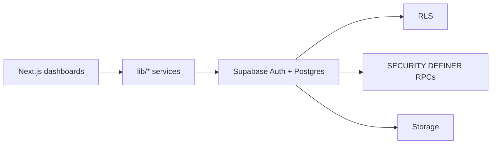

# Trade Grid Global

**Food Import / Export B2B Platform** — a trust-first marketplace for Food & FMCG trade (importers, exporters, manufacturers, distributors, wholesalers, and food brands).

Not a generic consumer marketplace. Focused on verification, structured RFQs, quotations, and auditable supplier selection.

|                             |                                                           |
| --------------------------- | --------------------------------------------------------- |
| **Current version**         | `0.4.0` (`package.json`)                                  |
| **Latest tagged milestone** | `v0.5.0-phase-a` (Fulfillment database/RPC foundation)    |
| **Full release target**     | `v0.5.0-order-lifecycle` — Fulfillment Phase B UI pending |
| **Branch**                  | `main`                                                    |

---

## Technology stack

| Layer        | Technology                                                        |
| ------------ | ----------------------------------------------------------------- |
| Frontend     | Next.js App Router, React 19, TypeScript, Tailwind CSS, shadcn/ui |
| Backend      | Supabase Auth, PostgreSQL, Row Level Security, Storage            |
| Domain logic | SECURITY DEFINER SQL RPCs + TypeScript services (`lib/`)          |
| Hosting      | Vercel-oriented Next.js deployment                                |

---

## Architecture overview



Full detail: [`docs/architecture/ARCHITECTURE_STATUS_v0.3.0.md`](./docs/architecture/ARCHITECTURE_STATUS_v0.3.0.md)

---

## Major features

- Buyer / supplier / admin roles with dashboard-first onboarding
- Company verification operations (admin command center)
- Product catalog with moderation lifecycle
- Persistent notifications
- RFQ lifecycle (draft → publish → close/cancel/award)
- Supplier quotations (draft / submit / revise / withdraw)
- Buyer compare & award; supplier award history
- Purchase Orders with immutable commercial snapshots
- Fulfillment database/RPC foundation with operational audit events

**Not implemented yet:** Fulfillment UI, first-class logistics/shipments, claims, invoices, payments, and production AI.

---

## Project structure

```
app/                  Next.js App Router
components/           UI by domain
contexts/             AuthProvider
lib/                  Services, types, Supabase clients
scripts/              Live verification scripts
supabase/migrations/  SQL migrations 001–022
docs/                 Product & engineering documentation
proxy.ts              Auth / dashboard gate
```

---

## Quick start

```bash
npm install
cp .env.example .env.local
# Fill NEXT_PUBLIC_SUPABASE_URL and NEXT_PUBLIC_SUPABASE_ANON_KEY
# Apply supabase/migrations/001–022 to your Supabase project
npm run dev
```

Quality checks:

```bash
npm run typecheck
npm run lint
npm run build
```

---

## Environment setup

See [`.env.example`](./.env.example) and [`docs/deployment/ENVIRONMENT.md`](./docs/deployment/ENVIRONMENT.md).

Required for the app:

- `NEXT_PUBLIC_SUPABASE_URL`
- `NEXT_PUBLIC_SUPABASE_ANON_KEY`

Optional for verification scripts:

- `SUPABASE_SERVICE_ROLE_KEY` (server/scripts only — never expose to the browser)

---

## Documentation

| Document              | Link                                                                             |
| --------------------- | -------------------------------------------------------------------------------- |
| Docs home             | [`docs/README.md`](./docs/README.md)                                             |
| Architecture index    | [`docs/architecture/README.md`](./docs/architecture/README.md)                   |
| Domain model          | [`docs/architecture/DOMAIN_MODEL.md`](./docs/architecture/DOMAIN_MODEL.md)       |
| Engineering standards | [`docs/STANDARDS.md`](./docs/STANDARDS.md)                                       |
| Verification matrix   | [`docs/VERIFICATION_MATRIX.md`](./docs/VERIFICATION_MATRIX.md)                   |
| Database schema       | [`docs/architecture/DATABASE_SCHEMA.md`](./docs/architecture/DATABASE_SCHEMA.md) |
| Security model        | [`docs/architecture/SECURITY_MODEL.md`](./docs/architecture/SECURITY_MODEL.md)   |
| API / RPC reference   | [`docs/architecture/API_REFERENCE.md`](./docs/architecture/API_REFERENCE.md)     |
| Current status        | [`docs/planning/CURRENT_STATUS.md`](./docs/planning/CURRENT_STATUS.md)           |
| Roadmap               | [`docs/planning/ROADMAP.md`](./docs/planning/ROADMAP.md)                         |
| Changelog             | [`docs/CHANGELOG.md`](./docs/CHANGELOG.md)                                       |
| Release notes         | [`docs/RELEASE_NOTES.md`](./docs/RELEASE_NOTES.md)                               |
| Deployment            | [`docs/deployment/DEPLOYMENT.md`](./docs/deployment/DEPLOYMENT.md)               |
| Contributing          | [`CONTRIBUTING.md`](./CONTRIBUTING.md)                                           |

---

## Current modules

| Module                                     | Status                                                                           |
| ------------------------------------------ | -------------------------------------------------------------------------------- |
| Foundation (auth, products, notifications) | Complete                                                                         |
| Trust & Verification                       | Hardened in code for v0.4.1; apply migrations `019`–`020` and certify on staging |
| Procurement (RFQ → quotation → award → PO) | Complete in code (`v0.4.0`; apply migration `017`)                               |
| Fulfillment (Module 3.2 Phase A)           | Database/RPC contract complete in code (apply migration `018`); UI pending       |

---

## Future modules

| Module                     | Focus                                                  |
| -------------------------- | ------------------------------------------------------ |
| Module 3 — Trade execution | Purchase orders, order lifecycle, logistics, documents |
| Module 4 — Finance         | Invoices, payments                                     |
| Module 5 — AI procurement  | Real recommendations (replace mock `/ai-sourcing`)     |
| Module 6 — Analytics       | Live reporting / admin intelligence                    |

See [`docs/planning/ROADMAP.md`](./docs/planning/ROADMAP.md).

---

## Roadmap

**Now:** Trust + procurement through PO plus Fulfillment Phase A.
**Next:** Fulfillment Phase B services/UI on accepted POs.
**Later:** Finance → AI → Analytics.

---

## Screenshots

> Placeholder — product screenshots to be added for marketing/GitHub social preview.

- Buyer RFQ compare & award — _TBD_
- Supplier quotation / award history — _TBD_
- Admin verification command center — _TBD_

---

## License

This repository is **proprietary**. See [`LICENSE.md`](./LICENSE.md).

---

## Contributing

Internal contribution guidelines: [`CONTRIBUTING.md`](./CONTRIBUTING.md).

Do not modify historical SQL migrations. Prefer additive migrations and verification scripts for database changes.
