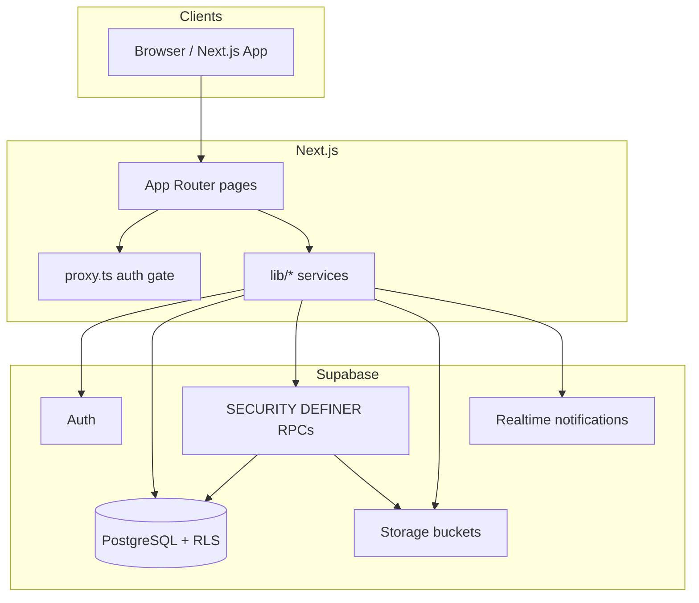
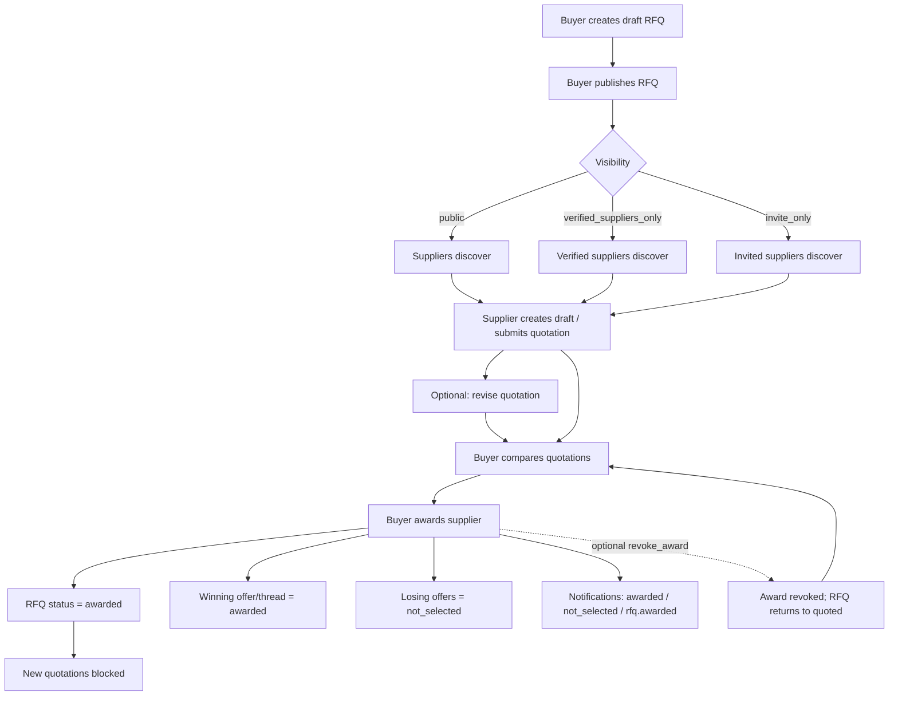

# Trade Grid Global — Architecture Status

**Document version:** `ARCHITECTURE_STATUS_v0.3.0`  
**Product version tag:** `v0.3.0-procurement-complete`  
**npm version:** `0.3.0`  
**Location:** [`docs/architecture/ARCHITECTURE_STATUS_v0.3.0.md`](./ARCHITECTURE_STATUS_v0.3.0.md)  
**Generated from:** repository source of truth (`app/`, `components/`, `lib/`, `scripts/`, `supabase/`, `docs/`)  
**Scope rule:** Describes the **current implementation only**. Features without code or migrations are marked **Not implemented.**

**Related docs:** [DATABASE_SCHEMA](./DATABASE_SCHEMA.md) · [SECURITY_MODEL](./SECURITY_MODEL.md) · [API_REFERENCE](./API_REFERENCE.md) · [SYSTEM_ARCHITECTURE](./SYSTEM_ARCHITECTURE.md) · [ER_DIAGRAM](./ER_DIAGRAM.md) · [DATA_FLOW](./DATA_FLOW.md) · [DECISION_LOG](./DECISION_LOG.md) · [ROADMAP](../planning/ROADMAP.md) · [PROCUREMENT_WORKFLOW](../product/PROCUREMENT_WORKFLOW.md)

### Table of contents

1. [Project Overview](#1-project-overview)
2. [Architecture Summary](#11-architecture-summary)
3. [Current Version](#2-current-version-v030-procurement-complete)
4. [Completed Modules](#3-completed-modules)
5. [Database Overview](#4-database-overview)
6. [RPC Overview](#5-rpc-overview)
7. [RLS Overview](#6-rls-overview)
8. [Storage Overview](#7-storage-overview)
9. [Notification Architecture](#8-notification-architecture)
10. [Dashboard Architecture](#9-dashboard-architecture)
11. [Service Layer](#10-service-layer)
12. [Verification Scripts](#11-verification-scripts)
13. [Procurement Workflow Diagram](#12-procurement-workflow-diagram)
14. [Remaining Modules](#13-remaining-modules)
15. [Technical Debt](#14-technical-debt--current-limitations)
16. [Security Summary](#15-security-summary)
17. [Future Architecture](#19-future-architecture)

---

## 1. Project Overview

Trade Grid Global is a B2B Food & FMCG trading platform (not a generic Alibaba-style marketplace). It connects importers, exporters, manufacturers, distributors, wholesalers, and food brands around trusted company verification, product moderation, RFQs, quotations, and supplier award.

### Tech stack (implemented)

| Layer | Technology |
|-------|------------|
| Frontend | Next.js App Router, TypeScript, React 19, Tailwind CSS, shadcn/ui (Radix) |
| Backend | Supabase (Auth, PostgreSQL, RLS, Storage, SECURITY DEFINER RPCs) |
| Hosting target | Vercel (project configured for Next.js) |
| Package name / npm version | `trade-grid-global` / **`0.3.0`** (`package.json`); product Git tag `v0.3.0-procurement-complete` |

### Roles

| Role | Implemented capabilities |
|------|--------------------------|
| **Buyer** | Signup/onboarding, company settings, create/publish/close/cancel RFQs, compare quotations, award supplier, notifications |
| **Supplier** | Signup/onboarding, products lifecycle, RFQ discovery, draft/submit/revise/withdraw quotations, award history, notifications |
| **Admin** | User list, verification command center (company + product cases), product management, notifications; several admin pages still use mock marketplace data |

### Design system (as enforced in product UI)

Premium enterprise aesthetic: black / white / gold accents; dashboard-first operational surfaces for procurement and trust workflows.

---

## 1.1 Architecture Summary

| Layer | Responsibility |
|-------|----------------|
| **Next.js App Router** | SSR/CSR dashboards, marketing pages, auth routes, thin API routes (`/auth/callback`, `/api/verify-document`) |
| **TypeScript service layer** (`lib/*`) | Domain clients calling Supabase RPCs/tables with typed models |
| **Supabase Auth** | Email/password sessions; SSR cookie bridge via `@supabase/ssr` |
| **PostgreSQL + RLS** | Canonical data + company isolation |
| **SECURITY DEFINER RPCs** | Privileged lifecycle transitions (publish RFQ, submit quote, award, verify) |
| **Storage buckets** | Private company/RFQ/quotation docs; public product images |
| **Notifications** | Trusted inserts only; client SELECT + mark-read RPCs |

Trust boundary: browsers never hold the service role key. Ordinary clients cannot forge notifications or self-publish products / self-verify companies.

---

## 1.2 Mermaid Architecture Diagram



---

## 2. Current Version (`v0.3.0-procurement-complete`)

This version marks completion of the **procurement path through award**:

```
Buyer creates RFQ → publishes
→ Supplier discovers → submits / revises quotation
→ Buyer compares → awards supplier
```

**In scope for v0.3.0**

- Auth, onboarding, settings identity guard
- Product catalog + moderation lifecycle
- Notification center
- Verification operations (cases / SLA / admin RPCs)
- RFQ foundation
- Quotation system (threads + versioned offers)
- Award & supplier selection

**Explicitly out of scope for v0.3.0 (Not implemented)**

- Purchase orders / orders / invoices / payments / escrow
- Negotiation chat / messaging threads
- Logistics / shipment visibility
- AI matching / AI trade assistant (public `/ai-sourcing` is mock-only)
- Subscription billing / premium listings

> Note: Planning docs under `docs/planning/` were refreshed for `v0.3.0-procurement-complete`. Prefer [CURRENT_STATUS.md](../planning/CURRENT_STATUS.md) over any older snapshots.

---

## 3. Completed Modules

| # | Module | Migrations | App status |
|---|--------|------------|------------|
| 1 | Auth & onboarding | 001–005, 007 | Implemented |
| 2 | Company docs storage | 003 | Implemented |
| 3 | Product system + media + structured trade data + lifecycle | 006–010 | Implemented |
| 4 | Notification foundation | 011 | Implemented |
| 5 | Settings verified-identity guard | 012 | Implemented |
| 6 | Verification operations | 013 | Implemented |
| 7 | RFQ foundation | 014 | Implemented (dashboard buyer/supplier; public `/rfq` still mock) |
| 8 | Quotation system | 015 | Implemented |
| 9 | Award & supplier selection | 016 | Implemented in code (apply migration to live DB before production use) |

### Module detail (current)

#### Auth / onboarding / settings

- Roles: `buyer` | `supplier` | `admin` on `profiles`
- Company onboarding (buyer/supplier), document upload to `company-docs`
- Dashboard-first redirects (`lib/auth/redirects.ts`)
- Password recovery routes (`/forgot-password`, `/reset-password`)
- Settings: account + company profile; verification status cannot be self-escalated (012)

#### Products

- Supplier CRUD drafts, submit for review, archive / restore / reopen
- Admin approve / reject via RPCs (also via verification cases in 013)
- Public marketplace product listing/detail via `public_products` view
- Product images bucket `product-images`

#### Notifications

- Persistent `notifications` table; client SELECT own rows only
- Trusted creation only via `_create_system_notification`
- UI: notification bell + `/dashboard/notifications`
- Mark read / mark all read RPCs

#### Verification operations

- `verification_cases`, `verification_case_events`, `verification_assessments`
- Admin Command Center + case detail
- Company approve/reject RPCs; product approve/reject still via product RPCs wired into cases
- SLA helpers present in SQL/lib

#### RFQ

- Draft → publish → open/quoted → close/cancel/award
- Visibility: `public` | `verified_suppliers_only` | `invite_only`
- Buyer My RFQs / create / detail; supplier discovery / detail
- Private `rfq-docs` bucket

#### Quotations

- One thread per (RFQ, supplier company)
- Versioned offers (`revision_no`), draft → submit → revise → withdraw
- Buyer compare list + thread detail; supplier list + detail
- Private `quotation-docs` bucket

#### Awards

- `quotation_awards` + `award_events`
- Exactly one **active** award per RFQ (partial unique index)
- `award_supplier` / `get_award` / `revoke_award`
- Buyer compare & award UI; supplier win/lose messaging; supplier awards page

---

## 4. Database Overview

> Full column-level detail: [DATABASE_SCHEMA.md](./DATABASE_SCHEMA.md)

Migrations present: `001` … `016` under `supabase/migrations/`.

### 4.1 Core identity

| Table | Purpose | Key fields |
|-------|---------|------------|
| `profiles` | Auth-linked user profile | `id` → `auth.users`, `email`, `role` (`buyer`/`supplier`/`admin`) |
| `companies` | One company per user | `user_id` unique, `company_name`, `country`, `verification_status`, onboarding fields, markets/certs arrays |
| `documents` | Company verification document metadata | `company_id`, `doc_type`, `storage_path`, `file_name` |

**Company `verification_status` (used in app/RPCs):** `pending`, `under_review`, `verified`, `rejected`  
(No Postgres ENUM; text + application/RPC enforcement.)

### 4.2 Products

| Table / view | Purpose |
|--------------|---------|
| `products` | Supplier catalog rows; status lifecycle |
| `public_products` | View of published products + public supplier badge fields |
| `public_suppliers` | View of public supplier identity for marketplace |

**Product `status`:** `draft` \| `pending` \| `published` \| `rejected` \| `archived`

Structured trade columns added in 009 (numeric MOQ/lead time/price, `incoterms_codes`, etc.) — see migration `009_structured_product_trade_data.sql`.

### 4.3 Notifications

| Table | Purpose |
|-------|---------|
| `notifications` | Per-user inbox; no client INSERT |

### 4.4 Verification operations

| Table | Purpose |
|-------|---------|
| `verification_cases` | Operational review queue (`company_verification` \| `product_review`) |
| `verification_case_events` | Immutable case audit trail |
| `verification_assessments` | Structured assessment payload storage |

**Case `status`:** `pending` \| `in_review` \| `approved` \| `rejected` \| `cancelled`  
**Case `priority`:** `low` \| `normal` \| `high` \| `urgent`

### 4.5 RFQ

| Table | Purpose |
|-------|---------|
| `rfqs` | Buyer demand documents |
| `rfq_attachments` | Attachment metadata |
| `rfq_events` | Immutable RFQ audit events |
| `rfq_invites` | Invite-only supplier invites |

**RFQ `status`:** `draft` \| `open` \| `quoted` \| `awarded` \| `closed` \| `cancelled` \| `expired`  
**RFQ `visibility`:** `public` \| `verified_suppliers_only` \| `invite_only`  
**Invite `status`:** `pending` \| `accepted` \| `declined` \| `revoked`

### 4.6 Quotations

| Table | Purpose |
|-------|---------|
| `quotation_threads` | One supplier conversation per RFQ |
| `quotation_offers` | Versioned commercial offers |
| `quotation_attachments` | Offer attachment metadata |
| `quotation_events` | Immutable quotation audit events |

**Thread `status`:** `draft` \| `active` \| `withdrawn` \| `awarded` \| `closed`  
**Offer `status`:** `draft` \| `submitted` \| `withdrawn` \| `rejected` \| `superseded` \| `awarded` \| `not_selected`  
**Offer `offered_by`:** `supplier` \| `buyer` (buyer counter-offers: schema ready; buyer counter-offer UX **Not implemented.**)

### 4.7 Awards

| Table | Purpose |
|-------|---------|
| `quotation_awards` | Award decisions (`active` \| `revoked`); history retained |
| `award_events` | Immutable award audit events |

Constraint: unique index on `quotation_awards(rfq_id)` **where `status = 'active'`**.

### 4.8 Tables / domains not present

| Domain | Status |
|--------|--------|
| Orders / purchase orders | **Not implemented.** |
| Invoices | **Not implemented.** |
| Payments / escrow | **Not implemented.** |
| Negotiation chat messages | **Not implemented.** |
| Shipments / logistics | **Not implemented.** |
| AI match / risk tables | **Not implemented.** |
| Subscriptions / billing | **Not implemented.** |

---

## 5. RPC Overview

> Full RPC reference: [API_REFERENCE.md](./API_REFERENCE.md)

Convention: client-callable RPCs are granted to `authenticated`. Underscore-prefixed helpers are internal (`SECURITY DEFINER`, typically revoked from clients).

### 5.1 Role / access helpers

| Function | Purpose |
|----------|---------|
| `is_admin()` | True if caller profile role is admin |
| `is_supplier()` | True if caller is supplier |
| `is_buyer()` | True if caller is buyer (014) |
| `user_owns_company(cid)` | Ownership check |
| `supplier_can_access_rfq(p_rfq_id)` | Discoverability + post-award participant read (replaced in 016) |
| `can_access_quotation_thread(p_thread_id)` | Buyer/owner/admin thread access |
| `verification_case_sla_state(...)` | SLA state helper (013) |

### 5.2 Company verification / products (client RPCs)

| Function | Purpose |
|----------|---------|
| `submit_company_for_verification(company_id)` | Owner → `under_review` + notifications + case sync |
| `approve_company_verification(...)` | Admin approve company (013) |
| `reject_company_verification(...)` | Admin reject company (013) |
| `start_verification_case_review(p_case_id)` | Admin starts review |
| `set_verification_case_priority(...)` | Admin priority change |
| `submit_product_for_review(product_id)` | Supplier submit |
| `approve_product(product_id)` | Admin approve |
| `reject_product(product_id, reason)` | Admin reject |
| `archive_product(product_id)` | Supplier archive |
| `restore_archived_product(product_id)` | Supplier restore → draft |
| `reopen_published_product_for_editing(product_id)` | Reopen published → draft |

### 5.3 Notifications

| Function | Purpose |
|----------|---------|
| `mark_notification_read(notification_id)` | Mark own notification read |
| `mark_all_notifications_read()` | Mark all own notifications read |
| `_create_system_notification(...)` | Internal trusted insert |
| `_notify_all_admins(...)` | Internal fan-out to admins |

### 5.4 RFQ

| Function | Purpose |
|----------|---------|
| `create_draft_rfq(...)` | Create draft RFQ (+ optional invites) |
| `update_draft_rfq(...)` | Update draft only |
| `publish_rfq(p_rfq_id)` | Publish → `open` |
| `close_rfq(p_rfq_id)` | Close RFQ |
| `cancel_rfq(p_rfq_id, p_reason?)` | Cancel RFQ |

### 5.5 Quotations

| Function | Purpose |
|----------|---------|
| `create_draft_quotation(...)` | Create draft offer on thread |
| `update_draft_quotation(...)` | Update draft offer |
| `submit_quotation(...)` | Submit new or existing draft |
| `create_quotation_revision(...)` | New submitted revision; supersede prior |
| `withdraw_quotation(p_thread_id)` | Withdraw thread |
| `get_quotation_thread(p_thread_id)` | Aggregated thread/offers/events/RFQ JSON |

### 5.6 Awards

| Function | Purpose |
|----------|---------|
| `award_supplier(p_rfq_id, p_thread_id, p_notes?)` | Buyer awards; locks RFQ; updates offers/threads; notifies |
| `get_award(p_rfq_id)` | Award payload (losers get existence without peer commercial award row) |
| `revoke_award(p_award_id, p_reason?)` | Buyer revoke; reopen RFQ to `quoted`; preserve history |

### 5.7 Internal helpers (selected)

`_append_rfq_event`, `_append_quotation_event`, `_append_award_event`, `_recompute_rfq_quote_status`, `_assert_supplier_can_quote`, `_ensure_quotation_thread`, `_notify_rfq_buyer_quotation`, verification case open/resolve helpers, storage path ownership helpers for RFQ/quotation/product buckets.

---

## 6. RLS Overview

> Full security model: [SECURITY_MODEL.md](./SECURITY_MODEL.md)

**Pattern:** Tables enable RLS. Mutations for RFQ/quotation/award lifecycle are **RPC-only** (no direct client INSERT/UPDATE on those core rows). Clients typically have **SELECT** (scoped) only.

### 6.1 Identity

- Users read/update/insert **own** profile and company
- Admins read all profiles/companies/documents; admins update companies
- Direct client `verification_status` privilege escalation blocked by trigger (012) except allowed identity-reset paths

### 6.2 Products

- Public/anon can read **published** products
- Suppliers read/edit own editable products; insert own drafts
- Admins read all products
- Status transitions to published via admin RPC, not client self-publish

### 6.3 Notifications

- Users SELECT own notifications only
- No client INSERT/UPDATE/DELETE policies (trusted RPC/triggers only)

### 6.4 Verification cases

- Admins SELECT cases/events/assessments
- Non-admins: no general case table write path from client (admin RPCs)

### 6.5 RFQ

- Buyers SELECT own RFQs
- Suppliers SELECT via `supplier_can_access_rfq`
- Admins SELECT all
- Attachments/events/invites: party-scoped SELECT; draft invite/attachment manage by buyer
- RFQ row create/update via RPCs

### 6.6 Quotations

- Buyers SELECT threads/offers for own RFQs (non-draft offers for buyers)
- Suppliers SELECT own threads/offers
- Admins SELECT all
- Draft offer privacy: buyers cannot see supplier drafts
- Attachments: parties read; suppliers manage draft attachments

### 6.7 Awards

- Buyers SELECT awards/events for own RFQs
- Suppliers SELECT awards/events where `supplier_company_id` is own company (winners)
- Admins SELECT all
- No client INSERT (award via `award_supplier` only)

### 6.8 Storage RLS

Scoped policies on `storage.objects` for buckets listed in §7 (owner upload/read; party read where applicable; admin read for company-docs).

---

## 7. Storage Overview

| Bucket | Public? | Max size | Allowed MIME (summary) | Path convention |
|--------|---------|----------|------------------------|-----------------|
| `company-docs` | Private | 5 MB | PDF, PNG, JPEG | Company document uploads |
| `product-images` | Public | 5 MB | PNG, JPEG, WEBP | Supplier product media |
| `rfq-docs` | Private | 10 MB | PDF, images, etc. | `rfqs/<buyer_company_id>/<rfq_id>/…` |
| `quotation-docs` | Private | 10 MB | PDF, images, etc. | `quotations/<supplier_company_id>/<thread_id>/…` |

---

## 8. Notification Architecture

### 8.1 Emitted in production paths (trusted SQL)

| Type | When |
|------|------|
| `account.welcome` | New profile |
| `verification.submitted` | Company submitted for verification |
| `verification.admin_review_required` | Admins notified of verification work |
| `verification.approved` / `verification.rejected` | Company decision |
| `verification.reverification_required` | Verified identity change → pending |
| `verification.review_invalidated` | Under-review identity change → pending |
| `product.submitted` | Product submitted |
| `product.admin_review_required` | Admins notified |
| `product.approved` / `product.rejected` | Product decision |
| `rfq.published` | Buyer published RFQ |
| `rfq.invited` | Invite-only supplier invited |
| `rfq.closed` / `rfq.cancelled` | RFQ closed/cancelled (buyer + relevant suppliers) |
| `quotation.submitted` / `quotation.updated` / `quotation.withdrawn` | Quotation lifecycle → buyer |
| `quotation.awarded` | Winning supplier |
| `quotation.not_selected` | Losing quoting suppliers |
| `rfq.awarded` | Buyer confirmation of award |

### 8.2 Typed in app but not implemented as emitters

| Type | Status |
|------|--------|
| `verification.ai_started` | **Not implemented.** (type reserved) |
| `verification.ai_completed` | **Not implemented.** |
| `verification.ai_flagged` | **Not implemented.** |
| `verification.sla_warning` | **Not implemented.** (SLA helpers exist; warning notifications not wired) |
| `verification.auto_approved` | **Not implemented.** |

### 8.3 Audit event types (not notification inbox)

RFQ / quotation / award / verification **event tables** also store types such as `rfq.created`, `offer.submitted`, `award.created`, `case.submitted`, etc. These are audit trails, distinct from `notifications.type`.

---

## 9. Dashboard Architecture

### 9.1 Buyer (`/dashboard/buyer/…`)

| Route | Status |
|-------|--------|
| `/dashboard/buyer` | Implemented overview shell |
| `/dashboard/buyer/rfqs` | Implemented (live RFQs) |
| `/dashboard/buyer/rfqs/new` | Implemented |
| `/dashboard/buyer/rfqs/[id]` | Implemented (detail, compare & award) |
| `/dashboard/buyer/rfqs/[id]/quotations/[threadId]` | Implemented |
| `/dashboard/buyer/quotations` | Implemented (compare list) |
| `/dashboard/buyer/settings` | Implemented |
| `/dashboard/buyer/suppliers` | Placeholder UI using `lib/marketplace/data` mock suppliers |
| `/dashboard/buyer/inquiries` | Placeholder UI using mock inquiries |
| `/dashboard/buyer/orders` | Placeholder UI using mock orders — **Orders domain Not implemented.** |

### 9.2 Supplier (`/dashboard/supplier/…`)

| Route | Status |
|-------|--------|
| `/dashboard/supplier` | Implemented overview shell |
| `/dashboard/supplier/products` | Implemented |
| `/dashboard/supplier/products/new` | Implemented |
| `/dashboard/supplier/products/[id]/edit` | Implemented |
| `/dashboard/supplier/rfqs` | Implemented discovery |
| `/dashboard/supplier/rfqs/[id]` | Implemented |
| `/dashboard/supplier/quotations` | Implemented |
| `/dashboard/supplier/quotations/[id]` | Implemented (win/lose messaging) |
| `/dashboard/supplier/awards` | Implemented |
| `/dashboard/supplier/settings` | Implemented |
| `/dashboard/supplier/certifications` | Placeholder static cert cards (upload links to onboarding verification) |

### 9.3 Admin (`/dashboard/admin/…`)

| Route | Status |
|-------|--------|
| `/dashboard/admin` | Implemented overview shell |
| `/dashboard/admin/users` | Implemented (live `fetchAdminUsers`) |
| `/dashboard/admin/verification` | Implemented Command Center |
| `/dashboard/admin/verification/[id]` | Implemented case detail |
| `/dashboard/admin/products` | Implemented Admin Product Management |
| `/dashboard/admin/rfqs` | Placeholder using mock `lib/marketplace/data` RFQs |
| `/dashboard/admin/analytics` | Placeholder using mock marketplace metrics |

### 9.4 Shared

| Route | Status |
|-------|--------|
| `/dashboard` | Role router |
| `/dashboard/notifications` | Implemented |

### 9.5 Public / marketing / auth (selected)

| Route | Status |
|-------|--------|
| `/`, `/about`, `/contact`, `/pricing`, `/categories`, `/countries`, `/help-center` | Marketing pages |
| `/login`, `/signup`, `/auth`, `/forgot-password`, `/reset-password`, `/admin-login` | Auth |
| `/onboarding/*` | Buyer/supplier/verification onboarding |
| `/marketplace`, `/products`, `/products/[id]`, `/suppliers`, `/suppliers/[id]` | Marketplace (products/suppliers use live views where wired) |
| `/buyers`, `/buyers/[id]` | Public buyer listing/detail (marketplace data mix) |
| `/rfq`, `/rfq/[id]` | **Public RFQ UI uses mock data** — live RFQ engine is dashboard-based |
| `/ai-sourcing` | Mock AI recommendations only |
| `/verification` | Public verification marketing/page |

---

## 10. Service Layer

Primary TypeScript services (client → Supabase):

### `lib/auth/`

- `signup.ts` — marketplace account registration
- `onboarding.ts` — buyer/supplier onboarding save, document upload, submit verification, admin user list
- `redirects.ts` — post-auth / onboarding path resolution

### `lib/settings/`

- Account settings, email change request, supplier/buyer company settings
- `policy.ts` — client-side settings policy helpers aligned with 012

### `lib/products/`

- Own product list/create/update
- Submit / archive / restore / reopen
- Admin list/approve/reject
- Public product list/get
- `storage.ts` — product image uploads
- `trade-data.ts` / `trade-constants.ts` — structured trade field helpers

### `lib/notifications/`

- Fetch page/unread, mark read/all, realtime subscribe
- `safe-url.ts` — action URL sanitization
- `types.ts` — notification type catalog + arrival toasts

### `lib/verification/`

- List cases, case detail, queue stats
- Start review, set priority, approve/reject company, product approve/reject via case
- `sla.ts` — SLA presentation helpers

### `lib/rfq/`

- List buyer RFQs, discoverable RFQs, get detail
- Create/update draft, publish, close, cancel
- Form helpers / status tones

### `lib/quotation/`

- Supplier/buyer thread lists, thread detail
- Draft/update/submit/revise/withdraw
- `awardSupplier`, `getAwardForRfq`, `revokeAward`, `listSupplierAwards`

### `lib/supabase/`

- Browser client, server client, proxy helpers

### `lib/marketplace/`

- Categories, countries, certifications constants
- **`data.ts` mock datasets** still power several public and placeholder dashboard pages

### `lib/dashboard/`

- Role-based navigation (`navigation.ts`), role formatting helpers

---

## 11. Verification Scripts

All under `scripts/`. Run against live Supabase after corresponding migration(s):

| Script | Migration focus |
|--------|-----------------|
| `verify-auth-flow.mjs` | Auth flows |
| `verify-dashboard-first-auth.mjs` | Dashboard-first auth redirects |
| `verify-password-recovery.mjs` | Password recovery |
| `verify-onboarding-completion.mjs` | Onboarding completion |
| `verify-product-system.mjs` | Product system (006) |
| `verify-product-phase2.mjs` | Product media / public supplier (008) |
| `verify-product-phase2-5.mjs` | Structured trade data (009) |
| `verify-product-lifecycle.mjs` | Archive/restore/reopen (010) |
| `verify-notification-foundation.mjs` | Notifications security + events (011) |
| `verify-settings-security.mjs` | Identity guard (012) |
| `verify-verification-operations.mjs` | Verification ops (013) |
| `verify-rfq-foundation.mjs` | RFQ foundation (014) |
| `verify-quotation-system.mjs` | Quotation system (015) |
| `verify-award-system.mjs` | Award system (016) |

Typical invocation:

```bash
node --use-system-ca scripts/verify-award-system.mjs
```

Optional `SUPABASE_SERVICE_ROLE_KEY` enables notification count assertions; without it, those checks **SKIP**.

---

## 12. Procurement Workflow Diagram



**End state of v0.3.0:** Award complete. Purchase order creation after award is **Not implemented.**

---

## 13. Remaining Modules

| Module | Status |
|--------|--------|
| Purchase Orders / Orders | **Not implemented.** (buyer Orders page is mock data) |
| Invoices | **Not implemented.** |
| Payments / Escrow / Trade financing | **Not implemented.** |
| Negotiation / messaging chat | **Not implemented.** |
| Logistics / shipment visibility | **Not implemented.** |
| AI supplier matching / trade assistant / risk | **Not implemented.** (`/ai-sourcing` mock only) |
| Live admin RFQ moderation console | **Not implemented.** (mock table) |
| Live analytics | **Not implemented.** (mock metrics) |
| Saved suppliers (persisted) | **Not implemented.** (mock shortlist UI) |
| Inquiries domain | **Not implemented.** (mock table) |
| Supplier certifications management (CRUD) | **Not implemented.** (static placeholder) |
| Public RFQ board wired to live `rfqs` | **Not implemented.** (dashboard RFQ is live; `/rfq` is mock) |
| Buyer counter-offers on quotation threads | **Not implemented.** (`offered_by = buyer` exists in schema only) |
| Subscription billing / premium suppliers | **Not implemented.** |
| RFQ `expired` status automation | Schema allows `expired`; automated expiry job **Not implemented.** |

---

## 14. Technical Debt / Current Limitations

### Technical debt

1. **Stale planning docs (addressed in this docs restructure):** older status files previously understated quotations/awards.
2. **Mock data leakage:** `lib/marketplace/data.ts` still feeds public RFQ pages and several dashboard placeholders (orders, inquiries, admin RFQs/analytics, saved suppliers).
3. **Dual RFQ surfaces:** Live RFQ engine is dashboard-only; marketing `/rfq` is disconnected mock UI.
4. **Offer commercial model gaps:** No dedicated payment-terms or supplier-certification columns on `quotation_offers`; award compare UI shows payment as "—" and certifications from RFQ requirements.
5. **Admin award capability:** Admin has SELECT on awards; `award_supplier` requires `is_buyer()` — admin-as-operator award path **Not implemented.**
6. **Version alignment:** npm `package.json` is `0.3.0`; product Git tag remains `v0.3.0-procurement-complete` (keep both referenced consistently in docs).
7. **AI notification type reservations** exist without emitters.
8. **Certification dashboard** is decorative static content, not wired to `documents` / verification.
9. **Migration apply process** is manual (SQL Editor); repo has no linked Supabase CLI project config checked in.
10. **Public buyers/suppliers pages** may still mix marketing mock data with live views depending on route — verify route-by-route before treating as production trust surfaces.

---

## 15. Security Summary

> Detail: [SECURITY_MODEL.md](./SECURITY_MODEL.md)

### Strengths (current)

- RLS enabled on sensitive tables; fail-closed patterns on notifications and lifecycle tables
- Privileged transitions via `SECURITY DEFINER` RPCs with `search_path = public`
- Admin role self-promotion hardened (007)
- Company verification status self-assignment blocked (012)
- Product self-publish blocked
- Quotation draft privacy from buyers
- Award writes only via RPC; history never deleted (`active`/`revoked`)
- Cross-company isolation validated by verification scripts (RFQ/quotation/award)
- Storage buckets private where required (`company-docs`, `rfq-docs`, `quotation-docs`)
- Notification forging blocked (no client insert)

### Residual risks / caveats

- Live DB must have migrations **001–016 applied**; code alone does not secure an unmigrated project
- Service role key required for some verify script notification assertions
- Mock dashboard pages could confuse operators (not a privilege bypass, but operational risk)
- Losing suppliers learn award existence via `get_award` / RFQ status without winner commercial payload — intentional; ensure UI never leaks winner pricing through other queries
- Public marketplace views must continue to expose only published/public fields

### Pre-delivery SQL practice (014–016)

- Multi-table RLS/SQL qualifies common columns (`status`, `id`, `*_id`, timestamps)
- DEFINER functions set `search_path = public`
- PL/pgSQL variables use `v_` prefixes to reduce shadowing

---

## 16. Version History

| Tag / era | What landed |
|-----------|-------------|
| Foundation | Auth, profiles, companies, documents, storage, admin RLS fixes (001–005, 007) |
| Product system | Products, media, public views, structured trade data, archive/restore/reopen (006–010) |
| Trust ops | Notifications (011), settings identity guard (012), verification command center (013) |
| Procurement A | RFQ foundation (014) |
| Procurement B | Quotation threads/offers (015) |
| **v0.3.0-procurement-complete** | Award & supplier selection (016) + buyer compare/award UI + supplier award surfaces |

Earlier planning docs live under [`docs/planning/`](../planning/). This architecture document is authoritative for v0.3.0 implementation status.

---

## 17. Overall Architecture Assessment

Trade Grid Global’s backend architecture is **coherent and production-oriented** for the trust + procurement slice:

- Clear domain boundaries (company → product → RFQ → quotation → award)
- Auditability via immutable `*_events` tables
- Trusted notification bus
- Role-aware dashboards with real services for completed modules

The main architectural gap is **post-award commercial execution** (orders/payments) and **cleanup of mock marketing/dashboard shells** so every nav item either is live or clearly labeled unavailable.

The platform is **not** yet a full trade OS; it **is** a credible V1 foundation for verified Food/FMCG RFQ procurement through supplier selection.

---

## 18. Estimated Project Completion

Estimates are relative to a V1 “trusted Food/FMCG RFQ marketplace with procurement execution,” not the full long-term AI/financing vision.

| Slice | Approx. complete |
|-------|------------------|
| Auth / onboarding / settings | ~95% |
| Products + public catalog | ~90% |
| Notifications | ~85% |
| Verification operations | ~85% |
| RFQ + quotation + award (procurement to selection) | ~90% |
| Orders / payments / logistics | ~0% |
| AI / intelligence | ~5% (mock UI only) |
| Admin ops polish (live RFQ/analytics) | ~40% |
| **Overall V1 platform** | **~55%** |
| **Procurement-to-award path specifically** | **~95%** (pending live apply/verify of 016 where not yet applied) |

---

## 19. Future Architecture

| Horizon | Direction | Status |
|---------|-----------|--------|
| Near-term | Purchase orders / order management after award | **Not implemented.** See [ROADMAP](../planning/ROADMAP.md) Module 3 |
| Mid-term | Invoices + payments/escrow | **Not implemented.** |
| Mid-term | Logistics / shipment visibility | **Not implemented.** |
| Later | AI matching / risk / sourcing assistant (replace mock `/ai-sourcing`) | **Not implemented.** |
| Later | Live admin analytics & RFQ ops consoles | Partial placeholders only |
| Later | Negotiation messaging | **Not implemented.** |

Recommended next build: **Purchase Orders** after `award_supplier`, reusing `quotation_awards.offer_id` without redesigning RFQ/quotation tables.

---

## 20. Recommended Next Module

**Recommended: Purchase Order (PO) / Order Management after award**

Rationale:

1. Completes the business conversion path after `award_supplier`
2. Highest trust and revenue leverage for serious importers
3. Natural extension of existing `quotation_awards` / winning `offer_id` without redesigning RFQ/quotation tables
4. Aligns with deferred-but-adjacent domains (invoices/payments can follow as Module 3B)

**Suggested sequencing after POs**

1. Buyer/supplier order dashboards (replace mock Orders page)
2. Invoice primitives
3. Payments/escrow (only after order state machine is stable)
4. Wire public `/rfq` to live data **or** remove mock submit CTA
5. Negotiation messaging (optional; only if buyers demand post-quote clarification before award)

**Do not prioritize next:** broad AI features — keep deferred until procurement execution is real.

---

## Component map (reference)

| Folder | Domain |
|--------|--------|
| `components/auth` | Password input |
| `components/dashboard` | Shell, nav, notifications, tables |
| `components/settings` | Account/company/verification settings |
| `components/products` | Product form |
| `components/admin/verification` | Verification Command Center |
| `components/admin/products` | Admin product management |
| `components/rfq` | Buyer/supplier RFQ UI |
| `components/quotation` | Quotation + award UI |
| `components/marketplace` | Public marketplace cards/filters |
| `components/layout` | Navbar/Footer |
| `components/ui` | shadcn primitives |

---

## Quality Gate (documentation deliverable)

| Gate | Result |
|------|--------|
| Architecture | Documented from current repo (this file) |
| Typecheck | Not required for docs-only change (app code unmodified) |
| Lint | Not required for docs-only change |
| Build | Not required for docs-only change |
| Migration | Code includes `016_award_system.sql`; live apply is an ops step |
| Verification Scripts | Present through `verify-award-system.mjs` |
| Security Review | Captured in §15 |
| Browser Test Checklist | See below |
| Known Limitations | Captured in §13–§14 |
| **Ready for Commit?** | **Yes** (documentation-only: `docs/ARCHITECTURE_STATUS_v0.3.0.md`) |

### Browser Test Checklist (procurement path)

1. Buyer creates + publishes RFQ  
2. Supplier discovers and submits quotation  
3. Buyer opens RFQ compare & award table  
4. Confirm award dialog → RFQ awarded  
5. Winner sees congratulations + awards page  
6. Loser sees awarded-to-another-supplier message  
7. Post-award quotation submit fails  
8. Notifications arrive for award / not_selected / rfq.awarded  

### Known Limitations (summary)

- No PO/order/payment after award  
- Mock pages remain in nav (orders, inquiries, admin analytics/RFQs, certifications)  
- Public `/rfq` not wired to live schema  
- Offer-level payment terms / cert columns absent  
- Live DB must apply 016 for award RPCs to function  

---

*End of ARCHITECTURE_STATUS_v0.3.0*
