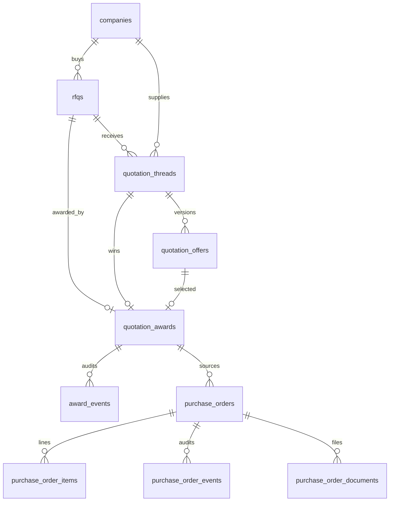

# Database Schema

Complete schema reference for Trade Grid Global as defined in `supabase/migrations/001`–`016`.

Related: [ARCHITECTURE_STATUS_v0.3.0.md](./ARCHITECTURE_STATUS_v0.3.0.md) · [API_REFERENCE.md](./API_REFERENCE.md) · [SECURITY_MODEL.md](./SECURITY_MODEL.md)

**Convention:** Text CHECKs unless noted. No Postgres ENUMs for domain statuses.

### Table of contents

- [Migration index](#migration-index)
- [profiles](#profiles)
- [companies](#companies)
- [documents](#documents)
- [products](#products)
- [notifications](#notifications)
- [verification_cases](#verification_cases)
- [RFQ / quotation / award tables](#rfqs)
- [Domains without tables](#domains-without-tables)

---

## Migration index

| Migration | Introduces / focuses |
|-----------|----------------------|
| `001_auth_onboarding.sql` | `profiles`, `companies`, `documents` + base RLS |
| `002_normalize_roles_and_company_fields.sql` | Role/account_type/onboarding columns |
| `003_company_docs_storage.sql` | Bucket `company-docs` + storage policies |
| `004_fix_admin_rls_recursion.sql` | `is_admin()` + admin policies |
| `005_align_live_auth_schema.sql` | Company profile fields alignment |
| `006_product_system.sql` | `products` + product RPCs |
| `007_admin_role_hardening.sql` | Admin role mutation guard |
| `008_product_media_and_public_supplier.sql` | `product-images`, `public_products`, `public_suppliers` |
| `009_structured_product_trade_data.sql` | Structured trade columns + view refresh |
| `010_product_lifecycle_restore_reopen.sql` | Restore / reopen RPCs |
| `011_notification_foundation.sql` | `notifications` + notif RPCs/triggers |
| `012_settings_verified_identity_guard.sql` | Verification status guards |
| `013_verification_operations_foundation.sql` | Verification cases/events/assessments |
| `014_rfq_foundation.sql` | RFQ tables + `rfq-docs` |
| `015_quotation_system.sql` | Quotation tables + `quotation-docs` |
| `016_award_system.sql` | Awards + award events |
| `017_purchase_order_system.sql` | Purchase orders, items, events, documents, `purchase-order-docs` |

---

## `profiles`

| | |
|--|--|
| **Purpose** | Auth-linked user profile and role |
| **Migration** | `001` (normalized in `002`) |

### Columns

| Column | Type | Notes |
|--------|------|-------|
| `id` | uuid PK | → `auth.users(id)` |
| `email` | text | |
| `full_name` | text | nullable |
| `role` | text | `buyer` \| `supplier` \| `admin` |
| `created_at` | timestamptz | |

### Indexes

- `profiles_role_idx` on `role`

### RLS

- Users: SELECT/INSERT/UPDATE own profile
- Admins: SELECT all profiles

### Associated RPCs / helpers

`is_admin`, `is_buyer`, `is_supplier`; welcome notification trigger on insert (011)

---

## `companies`

| | |
|--|--|
| **Purpose** | One company per user; verification + onboarding state |
| **Migration** | `001`; extended `002`, `005` |

### Columns (current)

| Column | Type | Notes |
|--------|------|-------|
| `id` | uuid PK | |
| `user_id` | uuid unique | → `auth.users` |
| `company_name` | text | |
| `country` | text | |
| `business_type` | text | |
| `company_structure` | text | |
| `verification_status` | text | App uses `pending` \| `under_review` \| `verified` \| `rejected` |
| `risk_score` | integer | default 50 |
| `employee_count` | text | |
| `annual_purchase_volume` | text | |
| `year_established` | text | |
| `categories` | text[] | |
| `export_markets` | text[] | |
| `target_markets` | text[] | |
| `required_certifications` | text[] | |
| `certifications` | text[] | |
| `onboarding_completed` | boolean | |
| `onboarding_step` | text | |
| `account_type` | text | `buyer` \| `supplier` |
| `created_at` / `updated_at` | timestamptz | |

### Indexes

- `companies_user_id_idx`

### RLS

- Users: SELECT/INSERT/UPDATE own company (status changes constrained by triggers 012)
- Admins: SELECT/UPDATE all companies

### Associated RPCs

`submit_company_for_verification`, `approve_company_verification`, `reject_company_verification`, `user_owns_company`

---

## `documents`

| | |
|--|--|
| **Purpose** | Company verification document metadata |
| **Migration** | `001` |

### Columns

| Column | Type |
|--------|------|
| `id` | uuid PK |
| `company_id` | uuid → `companies` |
| `doc_type` | text |
| `document_name` | text |
| `storage_path` | text |
| `file_size` / mime fields as defined in migration | |
| `created_at` | timestamptz |

### Indexes

- `documents_company_id_idx`

### RLS

- Users read/insert own company documents
- Admins read all

### Storage

Bucket `company-docs` (`003`)

---

## `products`

| | |
|--|--|
| **Purpose** | Supplier product catalog |
| **Migration** | `006`; media `008`; structured fields `009`; lifecycle RPCs `010` |

### Columns (core + structured)

| Column | Type | Notes |
|--------|------|-------|
| `id` | uuid PK | |
| `company_id` | uuid → `companies` | |
| `created_by` | uuid | |
| `name`, `category`, `description` | text | |
| `country_of_origin` | text | |
| `moq`, `packaging`, `lead_time`, `incoterms`, `hs_code`, `price` | text | legacy string fields |
| `moq_quantity`, `moq_unit` | numeric/text | 009 |
| `lead_time_min/max/unit` | int/text | 009 |
| `incoterms_codes` | text[] | 009 |
| `price_amount/currency/unit/incoterm` | structured | 009 |
| `certifications` | text[] | |
| `specifications` | jsonb | |
| `image_url`, `gallery` | text / text[] | |
| `status` | text | `draft`\|`pending`\|`published`\|`rejected`\|`archived` |
| `rejection_reason` | text | |
| `published_at`, `created_at`, `updated_at` | timestamptz | |

### Indexes

`products_company_id_idx`, `products_status_idx`, `products_category_idx`, `products_published_idx`, plus 009 trade indexes

### RLS

- Public/anon: SELECT published
- Suppliers: read own; insert drafts; update editable
- Admins: read all

### Associated RPCs

`submit_product_for_review`, `approve_product`, `reject_product`, `archive_product`, `restore_archived_product`, `reopen_published_product_for_editing`

### Views

- `public_products` (008/009)
- `public_suppliers` (008)

---

## `notifications`

| | |
|--|--|
| **Purpose** | Persistent user inbox |
| **Migration** | `011` |

### Columns

| Column | Type |
|--------|------|
| `id` | uuid PK |
| `recipient_user_id` | uuid → `auth.users` |
| `type`, `title`, `message` | text |
| `entity_type`, `entity_id` | text/uuid |
| `action_url` | text |
| `metadata` | jsonb |
| `priority` | `low`\|`normal`\|`high`\|`urgent` |
| `is_read`, `read_at` | bool/timestamptz |
| `created_at` | timestamptz |

### Indexes

Recipient, unread partial, created_at desc

### RLS / grants

- SELECT own only
- No client INSERT/UPDATE/DELETE policies; table privileges revoked except SELECT
- Mutations via `mark_notification_read`, `mark_all_notifications_read`
- Inserts via `_create_system_notification` only

---

## `verification_cases`

| | |
|--|--|
| **Purpose** | Admin review queue for company/product |
| **Migration** | `013` |

### Columns

| Column | Type | Notes |
|--------|------|-------|
| `id` | uuid PK | |
| `case_type` | text | `company_verification` \| `product_review` |
| `entity_id` | uuid | |
| `subject_user_id`, `company_id` | uuid | |
| `status` | text | `pending`\|`in_review`\|`approved`\|`rejected`\|`cancelled` |
| `priority` | text | `low`\|`normal`\|`high`\|`urgent` |
| `submitted_at`, `review_started_at`, `decided_at` | timestamptz | |
| `assigned_admin_id` | uuid | |
| `decision_reason` | text | |
| `sla_due_at`, `sla_breached_at` | timestamptz | |
| `source` | text | `user_submission`\|`system`\|`ai_assisted`\|`automation` |
| `created_at`, `updated_at` | timestamptz | |

### Indexes / constraints

- Unique active case per `(case_type, entity_id)` where status in (`pending`,`in_review`)
- Status + SLA indexes

### RLS

Admins SELECT only (writes via admin/trusted RPCs)

### Associated RPCs

`start_verification_case_review`, `set_verification_case_priority`, `approve_company_verification`, `reject_company_verification`, product approve/reject (case sync)

---

## `verification_case_events`

| | |
|--|--|
| **Purpose** | Immutable case audit trail |
| **Migration** | `013` |

Columns: `id`, `case_id` → cases, `event_type`, `actor_type` (`user`\|`admin`\|`system`\|`ai`), `actor_user_id`, `from_status`, `to_status`, `message`, `metadata`, `created_at`

RLS: Admins SELECT

---

## `verification_assessments`

| | |
|--|--|
| **Purpose** | Structured assessment records on a case |
| **Migration** | `013` |

Columns: `id`, `case_id`, `assessor_type` (`rule`\|`ai`\|`admin`), `assessor_name`, `assessment_type`, `result` (`pass`\|`fail`\|`warning`\|`unknown`), `confidence`, `summary`, `findings`, `created_at`

RLS: Admins SELECT

---

## `rfqs`

| | |
|--|--|
| **Purpose** | Buyer demand documents |
| **Migration** | `014` |

### Key columns

`id`, `buyer_company_id`, `created_by`, `title`, `product_name`, `category`, `description`, quantity fields, packaging, target country/port, `required_certifications[]`, `preferred_incoterms[]`, `quote_deadline_at`, `notes`, `linked_product_id`,  
`visibility` (`public`\|`verified_suppliers_only`\|`invite_only`),  
`status` (`draft`\|`open`\|`quoted`\|`awarded`\|`closed`\|`cancelled`\|`expired`),  
`published_at`, `closed_at`, `cancelled_at`, `cancellation_reason`, timestamps

### Indexes

Buyer company, status/deadline, category/status, target country, visibility/status

### RLS

Buyers own; suppliers via `supplier_can_access_rfq`; admins all. Row mutations via RFQ RPCs.

### Associated RPCs

`create_draft_rfq`, `update_draft_rfq`, `publish_rfq`, `close_rfq`, `cancel_rfq`

---

## `rfq_attachments` / `rfq_events` / `rfq_invites`

| Table | Purpose | Migration |
|-------|---------|-----------|
| `rfq_attachments` | Attachment metadata | 014 |
| `rfq_events` | Immutable RFQ audit | 014 |
| `rfq_invites` | Invite-only suppliers (`pending`\|`accepted`\|`declined`\|`revoked`) | 014 |

RLS: party-scoped SELECT; draft invite/attachment manage by buyer. Storage: `rfq-docs`.

---

## `quotation_threads`

| | |
|--|--|
| **Purpose** | One supplier thread per RFQ |
| **Migration** | `015` |

Columns: `id`, `rfq_id`, `supplier_company_id`, `status` (`draft`\|`active`\|`withdrawn`\|`awarded`\|`closed`), `current_offer_id`, `awarded_offer_id`, `created_by`, timestamps  
Unique `(rfq_id, supplier_company_id)`

RLS: buyer (own RFQs), supplier (own), admin. Mutations via quotation RPCs.

---

## `quotation_offers`

| | |
|--|--|
| **Purpose** | Versioned commercial offers |
| **Migration** | `015` |

Columns: `id`, `thread_id`, `revision_no`, `offered_by` (`supplier`\|`buyer`), `supersedes_offer_id`, currency/price/incoterm/lead time/MOQ/validity/notes/`linked_product_id`,  
`status` (`draft`\|`submitted`\|`withdrawn`\|`rejected`\|`superseded`\|`awarded`\|`not_selected`), timestamps

Unique `(thread_id, revision_no)`; unique one draft per thread (partial index)

RLS: buyers see non-draft offers on own RFQs; suppliers own offers; admins all

---

## `quotation_attachments` / `quotation_events`

Attachment metadata + immutable events (`015`). Storage: `quotation-docs`.

---

## `quotation_awards`

| | |
|--|--|
| **Purpose** | Award decisions (history retained) |
| **Migration** | `016` |

Columns: `id`, `rfq_id`, `thread_id`, `offer_id`, `supplier_company_id`, `awarded_by`, `status` (`active`\|`revoked`), `notes`, `awarded_at`, `revoked_at`, `revoke_reason`, timestamps

**Constraint:** unique `rfq_id` where `status = 'active'`

RLS: buyers (own RFQs), suppliers (own company awards), admins — SELECT only

RPCs: `award_supplier`, `get_award`, `revoke_award`

---

## `award_events`

| | |
|--|--|
| **Purpose** | Immutable award audit |
| **Migration** | `016` |

Columns: `id`, `award_id`, `event_type`, `actor_type`, `actor_user_id`, `from_status`, `to_status`, `message`, `metadata`, `created_at`

RLS: mirrors award visibility (buyer/supplier/admin SELECT)

---

## `purchase_orders`

| | |
|--|--|
| **Purpose** | Buyer-issued commercial commitment after award (Module 3.1) |
| **Migration** | `017` |

Key columns: `po_number` (`TGG-PO-YYYY-######`), `revision_no`, party FKs + snapshots, `award_id` / `rfq_id` / `thread_id` / `source_offer_id`, `status` (`draft`\|`issued`\|`accepted`\|`rejected`\|`cancelled`), commercial snapshot (prices, qty, Incoterm, payment terms, lead time, destination), lifecycle timestamps

**Constraint:** unique `award_id` where status in (`draft`,`issued`,`accepted`)

RLS: buyer SELECT own; supplier SELECT when status ≠ `draft`; admin SELECT — mutations RPC-only

RPCs: `create_purchase_order_draft`, `update_purchase_order_draft`, `issue_purchase_order`, `accept_purchase_order`, `reject_purchase_order`, `cancel_purchase_order`, `get_purchase_order`, `list_purchase_orders`

Storage: private bucket `purchase-order-docs` path `pos/<buyer_company_id>/<po_id>/…`

---

## `purchase_order_items` / `purchase_order_events` / `purchase_order_documents`

| Table | Purpose |
|-------|---------|
| `purchase_order_items` | Line items (v1 typically one line from award snapshot) |
| `purchase_order_events` | Append-only audit (UPDATE/DELETE forbidden by trigger) |
| `purchase_order_documents` | File metadata for PO attachments |

---

## Domains without tables

Fulfillment lifecycle beyond PO accept, invoices, payments, negotiation messages, shipments, AI match stores, subscriptions — **Not implemented.**

---

## Entity relationship (procurement)

