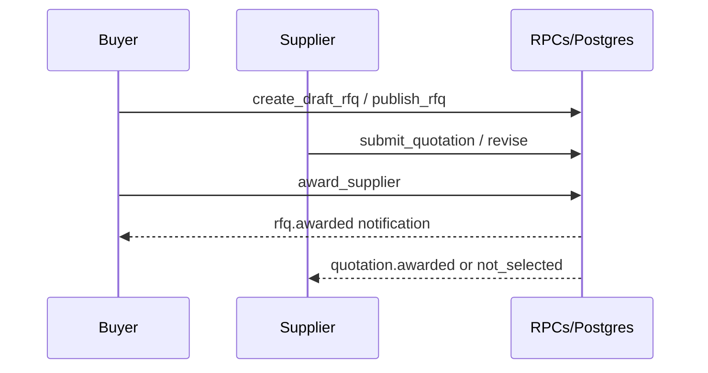
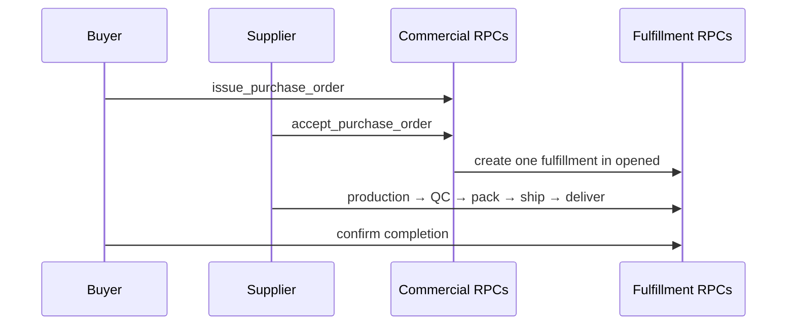

# Data Flow

## Purpose

Describe how data moves through major implemented workflows.

## Scope

Implemented flows through Fulfillment Phase A. Product detail → [../product/ORDER_LIFECYCLE.md](../product/ORDER_LIFECYCLE.md).

## Table of contents

1. [Current Status](#current-status)
2. [Auth & onboarding](#auth--onboarding)
3. [Product moderation](#product-moderation)
4. [Verification ops](#verification-ops)
5. [Procurement](#procurement)
6. [Notifications](#notifications)
7. [Commercial to operational](#commercial-to-operational)
8. [References](#references)
9. [Future notes](#future-notes)

## Current Status

| Flow                                                | Status                                   |
| --------------------------------------------------- | ---------------------------------------- |
| Auth → company → product → RFQ → quote → award → PO | Implemented in code                      |
| Accepted PO → Fulfillment lifecycle                 | Phase A database/RPC implemented in code |
| Payment and first-class logistics                   | **Not implemented.**                     |

## Auth & onboarding

0. A visitor may create a two-hour authenticated-encrypted guest browsing
   session. This records no Auth user, profile, company, role, or verification
   data. Guests can read public marketplace pages only.
1. User submits Buyer/Supplier identity metadata to Supabase Auth. Migration
   `021` validates it and creates owner `profiles` plus initial `companies`
   inside the Auth insert transaction (+ welcome notification). Any failure
   rolls back all three records.
2. A legacy authenticated user with no company can invoke the one-time recovery
   RPC; complete accounts and administrators are rejected.
3. Buyer and Supplier routes render the same role-configured onboarding
   workspace. Only one section is visible: Business Information → Product
   Categories → Markets → Certifications → Documents → Review → Verification
   Submission.
4. The Documents section is the single company-evidence collection workflow.
   Owners preview through short-lived signed URLs, may replace/delete only
   pending unsubmitted evidence, and add replacement evidence after rejection.
   Trade License and Company Registration are mandatory for baseline submission.
5. `submit_company_for_verification` freezes evidence on a new case, moves the
   company to `under_review`, emits trusted notifications, and returns the user
   to the role Workspace Overview. Under-review users may browse their workspace
   and public marketplace. Private drafts remain available; the workspace
   presents verification gates on public or commercially binding publish,
   submit, award, and issue actions.

## Product moderation

1. Supplier creates/updates draft `products` (+ optional `product-images`).
2. `submit_product_for_review` → pending + case/notifications.
3. Admin `approve_product` / `reject_product` → published or rejected.

## Verification ops

Admin Command Center reads `verification_cases`, case-scoped documents, and
events. RPCs start review, set priority, and approve or reject with an auditable
decision.

## Procurement

Detail: [../product/PROCUREMENT_WORKFLOW.md](../product/PROCUREMENT_WORKFLOW.md).

## Notifications

Trusted SQL (`_create_system_notification`) inserts rows; clients SELECT own inbox and mark read via RPC. No client INSERT.

## Commercial to operational

The accepted PO remains commercial truth; Fulfillment events and milestones are operational truth.

## References

- [ARCHITECTURE_STATUS_v0.3.0.md](./ARCHITECTURE_STATUS_v0.3.0.md)
- [API_REFERENCE.md](./API_REFERENCE.md)
- [SECURITY_MODEL.md](./SECURITY_MODEL.md)
- [DOMAIN_MODEL.md](./DOMAIN_MODEL.md)
- [../domains/fulfillment/README.md](../domains/fulfillment/README.md)

## Future notes

Document payment/settlement flows only after Module 4 exists.

---

**Last Updated:** 2026-07-19
