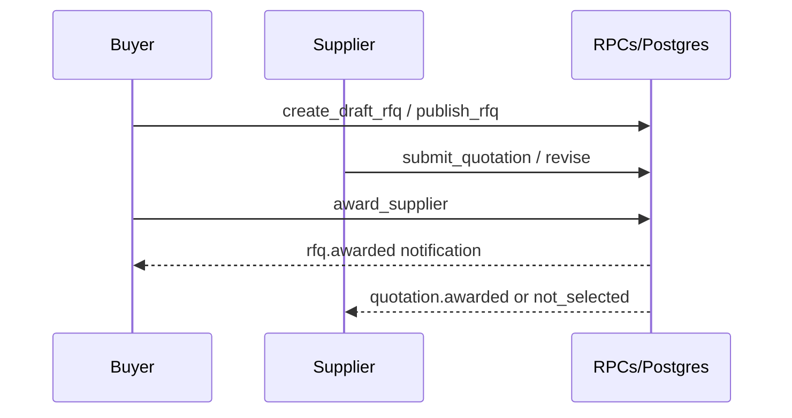

# Data Flow

## Purpose

Describe how data moves through major implemented workflows.

## Scope

Implemented flows only. Planned post-award flows → [../product/ORDER_LIFECYCLE.md](../product/ORDER_LIFECYCLE.md) (**Not implemented.**).

## Table of contents

1. [Current Status](#current-status)
2. [Auth & onboarding](#auth--onboarding)
3. [Product moderation](#product-moderation)
4. [Verification ops](#verification-ops)
5. [Procurement](#procurement)
6. [Notifications](#notifications)
7. [References](#references)
8. [Future notes](#future-notes)

## Current Status

| Flow | Status |
|------|--------|
| Auth → company → product → RFQ → quote → award | Implemented |
| Award → PO → payment → logistics | **Not implemented.** |

## Auth & onboarding

1. User signs up via Supabase Auth → `profiles` (+ welcome notification).
2. Buyer/supplier onboarding writes `companies` (+ optional `documents` / `company-docs`).
3. `submit_company_for_verification` → `under_review` + verification case + notifications.

## Product moderation

1. Supplier creates/updates draft `products` (+ optional `product-images`).
2. `submit_product_for_review` → pending + case/notifications.
3. Admin `approve_product` / `reject_product` → published or rejected.

## Verification ops

Admin Command Center reads `verification_cases` / events; RPCs start review, set priority, approve/reject company.

## Procurement

Detail: [../product/PROCUREMENT_WORKFLOW.md](../product/PROCUREMENT_WORKFLOW.md).

## Notifications

Trusted SQL (`_create_system_notification`) inserts rows; clients SELECT own inbox and mark read via RPC. No client INSERT.

## References

- [ARCHITECTURE_STATUS_v0.3.0.md](./ARCHITECTURE_STATUS_v0.3.0.md)
- [API_REFERENCE.md](./API_REFERENCE.md)
- [SECURITY_MODEL.md](./SECURITY_MODEL.md)

## Future notes

Document payment/settlement flows only after Module 4 exists.

---

**Last Updated:** 2026-07-18
