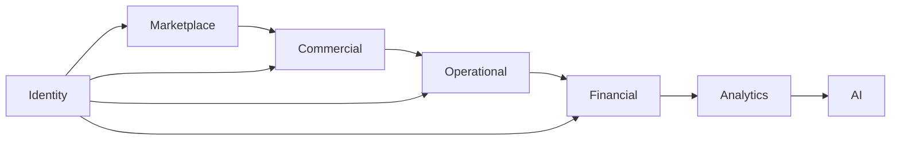
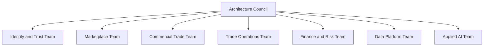
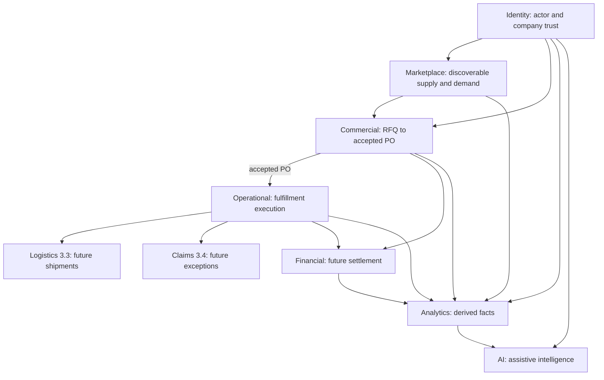
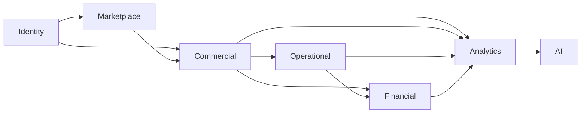

# Domain Model

Highest-level domain architecture for Trade Grid Global. It defines ownership boundaries, sources of truth, dependencies, and extension points; implementation detail remains in domain, schema, API, and security documents.

## Architectural intent

Trade Grid Global is a Food/FMCG trade operating platform, not a generic marketplace. Its architecture follows the trade lifecycle while keeping three concerns independent:

- **Eligibility and discovery:** who may trade and what supply or demand is visible.
- **Commercial truth:** what the parties offered, selected, issued, and accepted.
- **Operational truth:** how the accepted commitment is executed and evidenced.

Finance, Analytics, and AI consume those truths. They do not redefine them.

The sequence expresses the primary maturity and evidence flow. Analytics may read any domain, and AI may assist any domain, but neither may bypass transactional ownership.

## Ownership model

“Owner” means the engineering capability accountable for invariants and documentation, not a single person.

Until dedicated teams exist, these labels remain responsibility boundaries for review and knowledge transfer.

## Marketplace Domain

- **Purpose:** Publish trusted Food/FMCG supply and expose structured buyer demand for discovery.
- **Owner:** Marketplace Team.
- **Responsibilities:** Product catalog, public supplier/product views, category metadata, RFQ discoverability and visibility policy.
- **Primary entities:** `products`, `public_products`, `public_suppliers`, and discoverable projections of `rfqs`.
- **Events:** Product submission/moderation events and RFQ publication/visibility events.
- **Dependencies:** Identity for company ownership and verification; Commercial for RFQ lifecycle authority.
- **Consumers:** Buyers, suppliers, public discovery pages, Commercial sourcing flows, Analytics, AI.
- **Future extension points:** Saved suppliers, live public RFQ board, category-specific compliance filters, marketplace ranking.

Marketplace owns discovery, not price agreement or execution.

## Identity Domain

- **Purpose:** Establish authenticated actors, company identity, role, verification, and trust eligibility.
- **Owner:** Identity and Trust Team.
- **Responsibilities:** Authentication, profiles, companies, onboarding, company documents, verification cases, role and ownership predicates.
- **Primary entities:** Supabase Auth users, `profiles`, `companies`, `documents`, `verification_cases`, `verification_case_documents`, `verification_case_events`, `verification_assessments`.
- **Events:** Account, onboarding, verification, reassessment, and moderation audit events.
- **Dependencies:** Supabase Auth, PostgreSQL RLS, private document storage.
- **Consumers:** Every transactional domain, administration, Analytics, and AI risk assistance.
- **Future extension points:** Multi-user company membership, delegated roles, auditor identity, stronger compliance and beneficial-owner records.

Identity is a policy provider. Other domains reference stable company/user identifiers and must not copy identity authorization logic into client code.

Company identity and verification attempts are intentionally separate.
`companies` exposes current trust eligibility, while each `verification_cases`
row owns one review attempt and `verification_case_documents` freezes the
evidence considered for that attempt. See
[Trust & Verification](../domains/trust-verification/README.md).

## Commercial Domain

- **Purpose:** Convert buyer demand and supplier offers into an auditable, mutually acknowledged commercial baseline.
- **Owner:** Commercial Trade Team.
- **Responsibilities:** RFQ lifecycle, quotation threads and revisions, supplier award, Purchase Order snapshot, issue/accept/reject/cancel rules.
- **Primary entities:** `rfqs`, `quotation_threads`, `quotation_offers`, `quotation_awards`, `purchase_orders`, `purchase_order_items`, and their event/document records.
- **Events:** `rfq.*`, quotation/offer events, award events, and `purchase_order.*`.
- **Dependencies:** Identity for parties and authorization; Marketplace for optional product context; trusted notifications.
- **Consumers:** Operational Fulfillment, Financial settlement, Analytics, AI.
- **Future extension points:** PO amendments, split awards, multi-line sourcing, structured payment terms, electronic signatures.

An accepted Purchase Order is the immutable commercial truth: parties, quantities, prices, Incoterms, terms, and source lineage. See AD-3.1-023 and AD-3.2-002.

## Operational Domain

- **Purpose:** Execute an accepted commercial commitment without mutating it.
- **Owner:** Trade Operations Team.
- **Responsibilities:** Production, mandatory quality control, packaging, readiness, dispatch, transit indication, delivery, completion, operational holds, documents, and audit.
- **Primary entities:** `fulfillment_orders`, `fulfillment_order_events`, `fulfillment_order_documents`.
- **Events:** `fulfillment.opened`, production/QC/packing/shipping/delivery/completion, cancellation, failure, and dispute events.
- **Dependencies:** Accepted Purchase Order, Identity authorization, notifications, private storage.
- **Consumers:** Buyers, suppliers, Logistics, Claims, Financial, Analytics, AI.
- **Future extension points:** First-class shipments and carrier legs (3.3), claims/returns/splits (3.4), site allocation, compliance document gates, ERP/webhooks.

Fulfillment is a one-to-one child of an accepted PO in Module 3.2. Operational status exists only on Fulfillment.

## Financial Domain

- **Purpose:** Invoice, settle, reconcile, finance, and audit monetary obligations arising from trade.
- **Owner:** Finance and Risk Team.
- **Responsibilities:** Future invoices, payment schedules, escrow, payouts, reconciliation, refunds, and financing decisions.
- **Primary entities:** None implemented. Future entities must reference stable PO and Fulfillment identifiers.
- **Events:** Planned invoice, payment, settlement, refund, and financing events.
- **Dependencies:** Commercial amounts and terms; Operational delivery/completion evidence; Identity and compliance.
- **Consumers:** Buyers, suppliers, finance operations, Analytics, AI risk models.
- **Future extension points:** Provider adapters, ledger, escrow, trade finance, tax and FX handling.

Financial status must not be stored on Fulfillment merely for convenience.

## Analytics Domain

- **Purpose:** Produce governed measurements from transactional facts without becoming a write path for them.
- **Owner:** Data Platform Team.
- **Responsibilities:** Funnel, cycle-time, SLA, volume, trust, and operational performance models.
- **Primary entities:** No production analytics store implemented; current live analytics are limited and mock surfaces remain.
- **Events:** Consumes append-only domain events and milestone timestamps.
- **Dependencies:** All source domains, especially stable identifiers and event semantics.
- **Consumers:** Admins, buyers, suppliers, leadership, AI.
- **Future extension points:** Warehouse/lakehouse, semantic metrics, event export, retention and lineage controls.

Analytics projections are derived and rebuildable; they never replace transactional records.

## AI Domain

- **Purpose:** Assist human decisions using governed marketplace and trade evidence.
- **Owner:** Applied AI Team.
- **Responsibilities:** Future supplier matching, RFQ assistance, anomaly/delay indicators, risk assistance, and trade support.
- **Primary entities:** No production AI domain store implemented; `/ai-sourcing` is mock-only.
- **Events:** Consumes approved domain events and may emit clearly identified assessments, never silent transactional mutations.
- **Dependencies:** Identity trust data, Marketplace supply/demand, Commercial outcomes, Operational events, Analytics features.
- **Consumers:** Buyers, suppliers, admins, and risk operations.
- **Future extension points:** Explainable recommendations, human feedback, model/version audit, evaluation and drift monitoring.

AI must not auto-verify, auto-award, alter a PO, or advance Fulfillment without an explicit future decision and trusted control path.

## Domain relationships

## Dependency rules

1. Dependencies point toward authoritative upstream facts; no circular mutation ownership.
2. Cross-domain references use identifiers and documented contracts.
3. A downstream domain may project upstream data for display, but cannot become its source of truth.
4. Lifecycle writes remain trusted RPC transactions with RLS-scoped reads until a superseding ADR changes the platform pattern.
5. Events are audit records today, not a claim that an external message bus exists.

## Commercial truth versus operational truth

| Concern              | Commercial truth                                                    | Operational truth                                                       |
| -------------------- | ------------------------------------------------------------------- | ----------------------------------------------------------------------- |
| Authoritative entity | Accepted `purchase_orders`                                          | `fulfillment_orders`                                                    |
| Answers              | What was agreed?                                                    | How is it being executed?                                               |
| Core data            | Parties, items, quantity, price, currency, Incoterms, payment terms | Production, QC, packing, dispatch, transit, delivery, completion, holds |
| Mutation boundary    | Commercial fields lock after issue; acceptance establishes baseline | State transitions occur after acceptance                                |
| Future children      | Amendments, invoices                                                | Shipments, claims, stage evidence                                       |
| Prohibited coupling  | Fulfillment cannot reprice or rewrite parties/items                 | PO status cannot impersonate production or delivery status              |

This separation protects auditability, keeps authorization understandable, and permits Logistics, Claims, and Finance to evolve independently.

## References

- [Architecture index](./README.md)
- [Locked decisions](./ARCHITECTURE_DECISIONS.md)
- [Database schema](./DATABASE_SCHEMA.md)
- [Security model](./SECURITY_MODEL.md)
- [Engineering standards](../STANDARDS.md)
- [Fulfillment domain](../domains/fulfillment/README.md)
- [Current status](../planning/CURRENT_STATUS.md)

---

**Owner:** Architecture / Staff Engineering  
**Last Updated:** 2026-07-18
