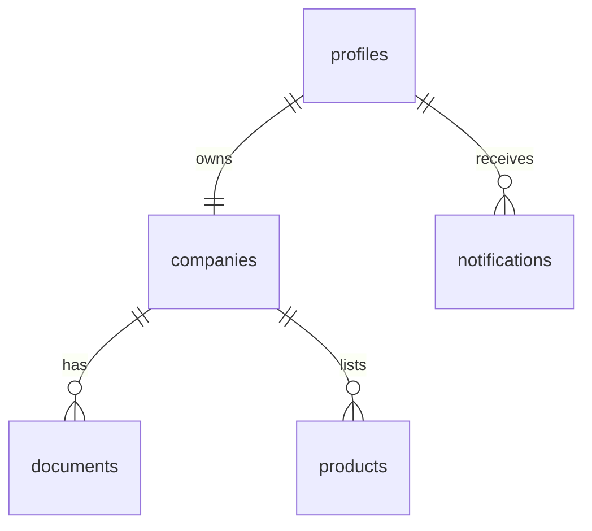
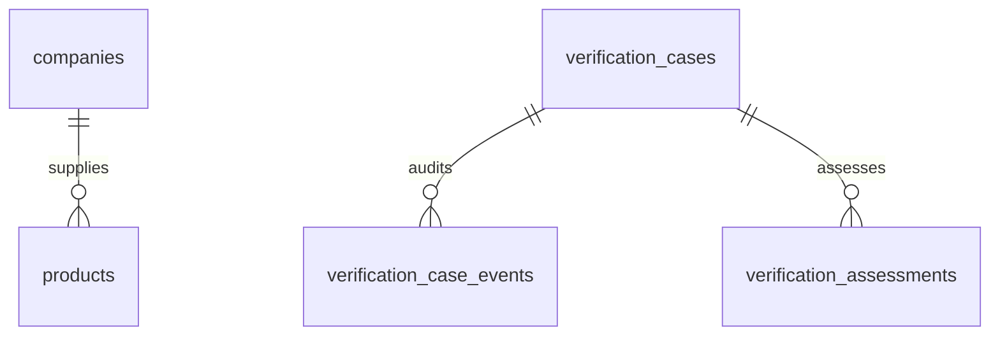
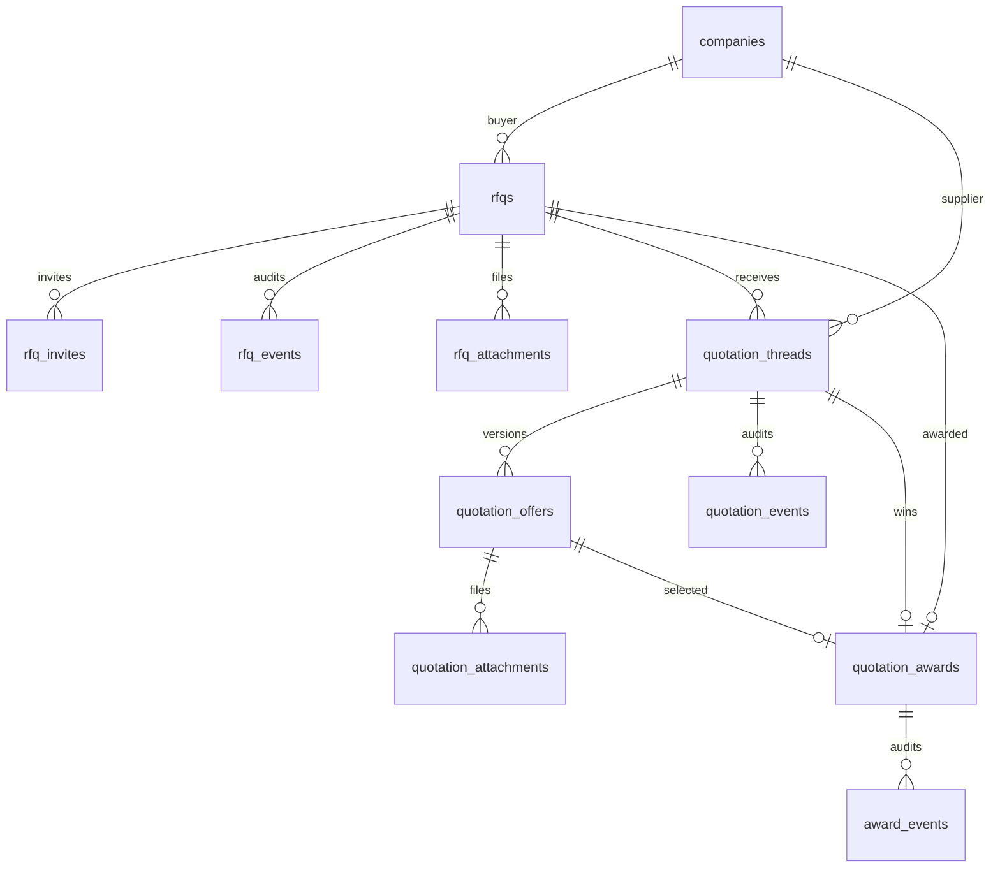

# ER Diagram

## Purpose

Entity-relationship overview of implemented database domains.

## Scope

Tables from migrations `001`–`016`. Column-level detail → [DATABASE_SCHEMA.md](./DATABASE_SCHEMA.md).

## Table of contents

1. [Current Status](#current-status)
2. [Core identity](#core-identity)
3. [Products & verification](#products--verification)
4. [Procurement](#procurement)
5. [Not modeled](#not-modeled)
6. [References](#references)
7. [Future notes](#future-notes)

## Current Status

| Domain | Status |
|--------|--------|
| Auth / companies / products / notifications / verification / RFQ / quotation / award | Implemented |
| Orders / invoices / payments / shipments | **Not implemented.** |

## Core identity

## Products & verification

Cases reference company or product entities by `case_type` + `entity_id` (see schema).

## Procurement

## Not modeled

Orders, POs, invoices, payments, negotiation messages, shipments — **Not implemented.**

## References

- [DATABASE_SCHEMA.md](./DATABASE_SCHEMA.md)
- [SYSTEM_ARCHITECTURE.md](./SYSTEM_ARCHITECTURE.md)
- [../product/PROCUREMENT_WORKFLOW.md](../product/PROCUREMENT_WORKFLOW.md)

## Future notes

Extend ER when Module 3 introduces `purchase_orders` / `orders` (planned only).

---

**Last Updated:** 2026-07-18
