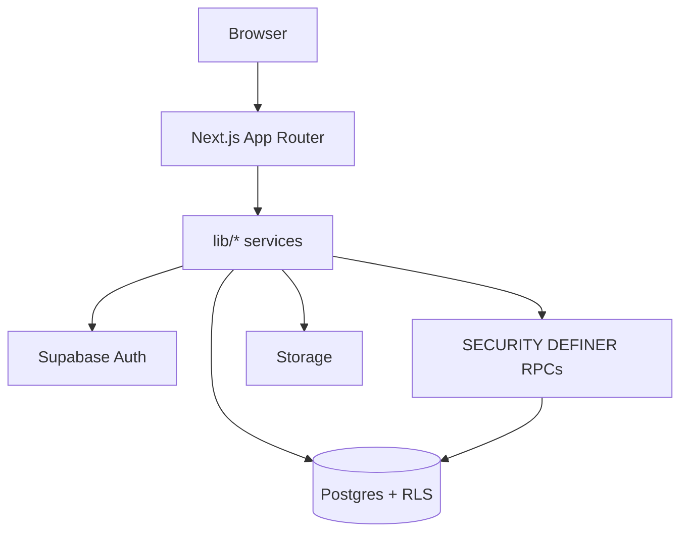

# System Architecture

## Purpose

High-level view of how Trade Grid Global layers fit together (clients, Next.js, Supabase, storage).

## Scope

Runtime architecture only. Schema detail → [DATABASE_SCHEMA.md](./DATABASE_SCHEMA.md). Security → [SECURITY_MODEL.md](./SECURITY_MODEL.md). Status → [ARCHITECTURE_STATUS_v0.3.0.md](./ARCHITECTURE_STATUS_v0.3.0.md).

## Table of contents

1. [Current Status](#current-status)
2. [Logical layers](#logical-layers)
3. [Diagram](#diagram)
4. [Trust boundaries](#trust-boundaries)
5. [References](#references)
6. [Future notes](#future-notes)

## Current Status

| Item                                      | Status                               |
| ----------------------------------------- | ------------------------------------ |
| Canonical domain architecture             | [DOMAIN_MODEL.md](./DOMAIN_MODEL.md) |
| Purchase Orders / Fulfillment Phase A     | Implemented in code (`017`/`018`)    |
| Payments / first-class logistics services | **Not implemented.**                 |
| Dedicated API gateway                     | **Not implemented.**                 |

## Logical layers

| Layer            | Responsibility                          | Location                                                             |
| ---------------- | --------------------------------------- | -------------------------------------------------------------------- |
| Presentation     | App Router pages, dashboards, marketing | `app/`, `components/`                                                |
| Domain clients   | Typed Supabase calls                    | `lib/*`                                                              |
| Auth gate        | Session / role routing                  | `proxy.ts`, `lib/auth/`                                              |
| Auth             | Supabase Auth                           | Hosted Supabase                                                      |
| Data + RLS       | PostgreSQL                              | Migrations `001`–`022`                                               |
| Privileged logic | SECURITY DEFINER RPCs                   | Same migrations                                                      |
| Files            | Storage buckets                         | Domain-private/public buckets including PO and Fulfillment documents |

## Diagram

Canonical diagram also in [ARCHITECTURE_STATUS_v0.3.0.md](./ARCHITECTURE_STATUS_v0.3.0.md).

## Trust boundaries

- Browser holds anon key only; RLS must enforce isolation.
- Service role is scripts/ops only — never `NEXT_PUBLIC_*`.
- Commercial lifecycle writes prefer RPCs over direct table updates.

## References

- [ARCHITECTURE_STATUS_v0.3.0.md](./ARCHITECTURE_STATUS_v0.3.0.md)
- [DOMAIN_MODEL.md](./DOMAIN_MODEL.md)
- [../domains/fulfillment/README.md](../domains/fulfillment/README.md)
- [DATA_FLOW.md](./DATA_FLOW.md)
- [ER_DIAGRAM.md](./ER_DIAGRAM.md)
- [../deployment/DEPLOYMENT.md](../deployment/DEPLOYMENT.md)

## Future notes

Add service mesh / queue / worker diagrams when Module 3–4 introduce async jobs. **Not implemented.**

---

**Last Updated:** 2026-07-18
