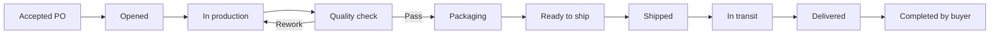

# Fulfillment Domain Contract

## Purpose

Fulfillment provides shared operational truth after supplier acceptance of a Purchase Order. It reduces off-platform status chasing and preserves evidence for Food/FMCG production, quality, packing, shipment, delivery, and close.

## Architectural decision

`fulfillment_orders` is a one-to-one child of an accepted `purchase_orders` record. The split is permanent:

- Purchase Order owns the immutable commercial baseline.
- Fulfillment owns operational execution and status.

Extending `purchase_orders.status` was rejected because it combines different lifecycles, actors, authorization rules, terminal states, and downstream consumers. An event-only model was rejected because it weakens current-state invariants. See AD-3.2-001 through AD-3.2-004.

## Owner and responsibilities

**Owner:** Trade Operations.

Responsibilities:

- Auto-open execution for each newly accepted PO.
- Enforce ordered production → QC → packing → dispatch → delivery transitions.
- Require QC on the happy path.
- Record pause, rework, cancellation, failure, and dispute facts.
- Preserve operational milestone timestamps and append-only events.
- Provide party-scoped reads and trusted notifications.

## Business workflow

Cancellation and failure are explicit terminal outcomes. A dispute is a hold flag/event and blocks completion; full claims resolution is Module 3.4.

## Entry and exit conditions

- Entry requires `purchase_orders.status = accepted`.
- The normal trusted path auto-creates exactly one Fulfillment during PO acceptance.
- Success exits at buyer-confirmed `completed`.
- `cancelled` and `failed` are terminal exceptions.
- No product workflow physically deletes or reopens completed Fulfillment records.

## Dependencies

| Dependency | Contract |
|---|---|
| Identity | Buyer/supplier company ownership and admin read support |
| Purchase Orders | Accepted PO identifier and parties; commercial truth remains upstream |
| Notifications | Trusted `_create_system_notification` path |
| Storage | Private `fulfillment-docs` bucket |

## Consumers

- Buyer and supplier operational dashboards (Phase B).
- Logistics 3.3 for shipment/carrier detail.
- Claims 3.4 for dispute resolution.
- Financial domain for delivery/completion evidence.
- Analytics and AI for cycle-time and anomaly signals.

## Invariants

1. One Fulfillment per accepted PO in Module 3.2.
2. Operational transitions never modify PO commercial fields.
3. QC cannot be skipped.
4. Supplier controls production and dispatch stages; buyer controls completion.
5. Cancellation is forbidden after shipment.
6. Material actions create append-only events.
7. Client table mutations are forbidden; lifecycle writes are RPC-only.
8. All persisted operational timestamps use UTC `timestamptz`.

## Future extensions

- Module 3.3: `shipments`, carriers, legs, tracking feeds, customs hooks.
- Module 3.4: claims, returns, partial/split fulfillment, dispute resolution.
- Module 4: invoice/payment policies consuming delivery and completion.
- Later: sites/warehouses, category-based document gates, ERP events, delay prediction.

These extensions attach to Fulfillment or its PO; they must not create a second commercial price source.

## References

- [Domain index](./README.md)
- [Entity map](./ENTITY_MAP.md)
- [State machine](./STATE_MACHINE.md)
- [Architecture domain model](../../architecture/DOMAIN_MODEL.md)
- [Engineering handbook](../../STANDARDS.md)

---

**Last Updated:** 2026-07-18
