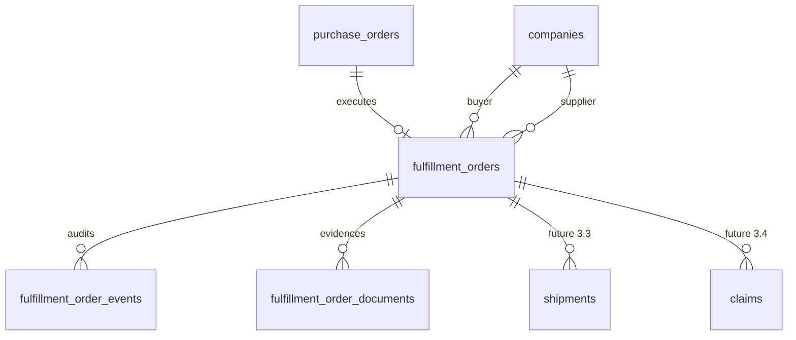

# Fulfillment Entity Map

Entity-level view of the Fulfillment domain. Column-level authority remains [DATABASE_SCHEMA.md](../../architecture/DATABASE_SCHEMA.md).

## Relationships

## `fulfillment_orders`

- **Purpose:** Current operational header and milestone record.
- **Owner:** Fulfillment domain.
- **Identity:** UUID plus unique `TGG-FF-YYYY-######` number.
- **Parent:** Unique `purchase_order_id`; accepted PO is required.
- **Parties:** Buyer and supplier company IDs copied for authorization and indexed listing, not as replacement commercial identity.
- **State:** Canonical operational status plus pause/dispute flags.
- **Operational data:** Production location, lightweight tracking reference, reasons, and UTC milestone timestamps.
- **Retention:** No product hard delete; terminal states preserve history.
- **Scale:** Indexed by buyer/status, supplier/status, status/update time, and PO.

Commercial prices, quantities, currency, Incoterms, payment terms, and line items do not belong here.

## `fulfillment_order_events`

- **Purpose:** Immutable audit history for material actions and transitions.
- **Parent:** `fulfillment_order_id`.
- **Data:** Event type, actor type/user, from/to state, message, metadata, timestamp.
- **Mutation:** Trusted append helper only; update/delete blocked by trigger.
- **Consumers:** Detail timeline, support, Analytics, future event export.

## `fulfillment_order_documents`

- **Purpose:** Metadata for operational evidence.
- **Parent:** `fulfillment_order_id`.
- **Data:** Uploader, document type, stage, filename, storage path, MIME type, size, timestamp.
- **Storage:** Private `fulfillment-docs`, path `fulfillment/<buyer_company_id>/<fulfillment_id>/…`.
- **Status:** Table and storage foundation exist, but clients have no INSERT grant/policy or registration RPC for document metadata; rich Phase B upload workflow is not implemented.

Typical evidence includes production plans, QC/CoA reports, packing lists, dispatch documents, and proof of delivery. Commercial PO files stay in the PO document domain.

## Upstream references

| Entity | Why referenced | Ownership |
|---|---|---|
| `purchase_orders` | Entry condition, commercial baseline, source parties | Commercial |
| `companies` | Tenant authorization and list filtering | Identity |
| `auth.users` | Actor/uploader attribution | Identity |

## Future entities

| Entity | Module | Boundary |
|---|---|---|
| `shipments` and legs | Logistics 3.3 | Carrier movement, tracking, customs; may be one-to-many |
| Claims/returns | Claims 3.4 | Exception resolution, evidence, remedies |
| Sites/warehouses | Later Operations | Structured production/allocation locations |
| Invoices/payments | Finance 4.x | Monetary obligations and settlement |

Future entities must reference stable IDs and preserve Fulfillment as current operational execution truth.

## References

- [Domain contract](./DOMAIN.md)
- [State machine](./STATE_MACHINE.md)
- [Security](./SECURITY.md)
- [Database schema](../../architecture/DATABASE_SCHEMA.md)

---

**Last Updated:** 2026-07-18
