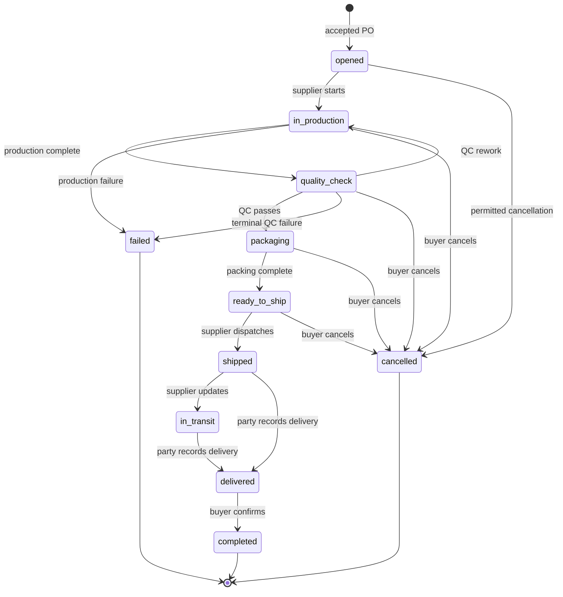

# Fulfillment State Machine

Canonical operational states and actor rules for Module 3.2.

## State diagram

## States

| State | Meaning | Primary next actor |
|---|---|---|
| `opened` | Operational record created, production not started | Supplier |
| `in_production` | Manufacturing/processing underway | Supplier |
| `quality_check` | Mandatory inspection stage | Supplier |
| `packaging` | Goods being packed to PO requirements | Supplier |
| `ready_to_ship` | Packed and cleared for dispatch | Supplier |
| `shipped` | Handed off/left supplier control | Supplier |
| `in_transit` | En route; lightweight until Logistics 3.3 | Supplier/system later |
| `delivered` | Arrival asserted by buyer or supplier | Buyer |
| `completed` | Buyer-confirmed operational close | Terminal |
| `cancelled` | Permitted pre-shipment abort | Terminal |
| `failed` | Explicit terminal operational failure | Terminal |

## Transition contract

| Action | From → To / effect | Actor | Guard |
|---|---|---|---|
| Start production | `opened` → `in_production` | Supplier | Own Fulfillment |
| Pause/resume | Flag while `in_production` | Supplier | No status change |
| Complete production | `in_production` → `quality_check` | Supplier | Not paused |
| Pass QC | `quality_check` → `packaging` | Supplier | QC cannot be skipped |
| Fail QC for rework | `quality_check` → `in_production` | Supplier | Reason required |
| Terminal QC fail | `quality_check` → `failed` | Supplier | Reason required |
| Pack | `packaging` → `ready_to_ship` | Supplier | Ordered path |
| Mark shipped | `ready_to_ship` → `shipped` | Supplier | Ordered path |
| Mark in transit | `shipped` → `in_transit` | Supplier | Ordered path |
| Mark delivered | `shipped`/`in_transit` → `delivered` | Buyer or supplier | Own party |
| Complete | `delivered` → `completed` | Buyer | No dispute hold |
| Cancel | Pre-ship → `cancelled` | Buyer | Not shipped; policy expects a reason, current RPC permits omission |
| Cancel | `opened` → `cancelled` | Supplier | Policy expects a reason, current RPC permits omission |
| Production failure | `in_production` → `failed` | Supplier | Reason |
| Raise dispute | Flag/event | Buyer | Post-shipment only; blocks completion |

## Forbidden behavior

- Creating Fulfillment for an unaccepted PO.
- More than one Fulfillment for the same PO.
- Skipping from production to packing or shipping.
- Supplier completing on behalf of buyer.
- Cancellation after `shipped`.
- Reopening a terminal state.
- Mutating PO commercial data during any transition.
- Client-side direct status update.

## Concurrency and audit

Transition RPCs lock/read the current record, validate expected state and actor, update timestamps, append an event, and emit applicable notifications in one trusted transaction. Repeated or racing invalid transitions fail rather than silently changing history.

## References

- [RPC reference](./RPC_REFERENCE.md)
- [Events](./EVENTS.md)
- [Security](./SECURITY.md)
- [Locked decisions](../../architecture/ARCHITECTURE_DECISIONS.md)

---

**Last Updated:** 2026-07-18
