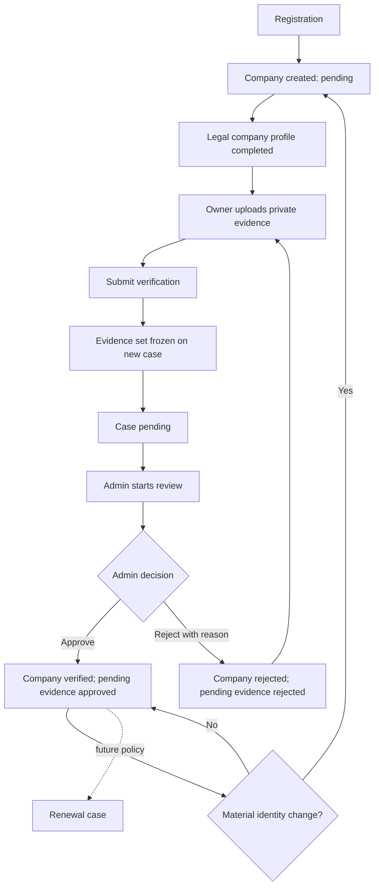

# Trust & Verification Domain

Production architecture contract and v0.4.1 release audit for company verification.

Related: [Domain Model](../../architecture/DOMAIN_MODEL.md) ·
[Architecture Decisions](../../architecture/ARCHITECTURE_DECISIONS.md) ·
[Security Model](../../architecture/SECURITY_MODEL.md) ·
[Verification Matrix](../../VERIFICATION_MATRIX.md)

## Why this domain exists

Company identity and verification have different lifecycles. `companies` is the
durable organization record and exposes the current trust projection.
`verification_cases` owns each review attempt, reviewer assignment, decision,
reason, SLA, and audit history. `verification_case_documents` freezes the
evidence considered for one attempt, while `verification_case_events` records
the immutable process trail.

Extending `companies` with more review columns would overwrite history and
cannot safely represent rejection, resubmission, renewal, or independent
evidence sets. Extending `documents` into a workflow entity would conflate an
uploaded artifact with the human decision made from it.

## Verification lifecycle

Evidence upload occurs before submission because the submission transaction
must validate and freeze the evidence set.

## State contract

### Company projection

- `pending → under_review`: owner submission only after onboarding and baseline
  evidence checks.
- `under_review → verified`: admin decision after case enters `in_review`.
- `under_review → rejected`: admin decision with a non-blank reason after case
  enters `in_review`.
- `rejected → under_review`: owner replaces rejected evidence and submits a new
  case.
- `verified|under_review → pending`: material identity change.
- Direct owner assignment of verification status is forbidden.

### Verification case

- `pending → in_review → approved|rejected`.
- `pending|in_review → cancelled` when material identity changes invalidate the
  submission.
- `approved`, `rejected`, and `cancelled` are terminal.
- Resubmission creates a new case; terminal history is never reopened.

### Evidence

- Owner uploads start as `pending`.
- A case decision changes only its case-scoped pending evidence to `approved`
  or `rejected`.
- Rejected evidence may be replaced; approved evidence may be reused in a later
  case.
- Pending evidence that has never been case-linked may be replaced or deleted
  by its owner. Storage is removed before metadata.
- Rejected, approved, and case-linked evidence remains immutable.

## Evidence policy for v0.4.1

### Mandatory baseline

- Trade License
- Company Registration

### Optional supporting evidence

- Tax/VAT certificate
- Export license
- Halal, ISO, HACCP, health, phytosanitary, and origin certificates
- Product catalog and laboratory reports

### Future conditional policy

- Import license
- Organic certification
- Country-specific tax, beneficial-owner, and government registry evidence
- Category-specific food, meat, dairy, seafood, or plant-health evidence

Optional evidence must not become globally mandatory without a governed matrix
covering jurisdiction, company activity, trade direction, and product category.

## Security contract

- Private `company-docs` bucket; 5 MB PDF/PNG/JPEG limit.
- Storage paths are owner-scoped under `documents/<company-id>/`; owner uploads
  are allowed only while company status is `pending` or `rejected`.
- Metadata insertion validates ownership, controlled type, matching storage
  object, and company state.
- Owner previews use five-minute signed URLs. Pending deletion uses
  security-definer ownership/case-link predicates so hidden RLS rows cannot
  authorize removal of submitted evidence.
- Submission and decisions use `SECURITY DEFINER` RPCs with explicit actor,
  ownership, state, and evidence checks.
- Each case references an immutable evidence set.
- Admin document access uses five-minute signed URLs under storage RLS.
- Marketplace role, company owner/account type, risk score, and verification
  status are protected from owner tampering.
- Owner-created company rows are forced to `pending` with baseline risk `50`,
  and their account type must match the registered profile role.
- Admin verification-status changes are accepted only from the trusted decision
  RPC path; broad admin table access cannot bypass the case state machine.
- Verification cases/events/assessments are admin-readable and RPC-written;
  clients cannot forge lifecycle or audit rows.

## Migration assessment

Migration `019_verification_submission_hardening.sql` correctly adds:

- storage-backed baseline evidence gates;
- owner document metadata normalization;
- owner role/account/risk protection;
- owner-readable rejection feedback.

It does not, by itself, freeze evidence per case, transition document status,
require review start/rejection reason, constrain canonical statuses, enforce
profile completion, or keep risk assessment independent from approval.

Migration `020_verification_case_evidence_lock.sql` closes those release
blockers. Migration `022_pending_company_document_management.sql` adds the
narrow pre-submission deletion contract used by the shared onboarding Documents
section. Migrations must be deployed and verified in order.

## Future extension points

- Annual or event-driven renewal cases with expiry/grace-period policy.
- Certificate effective/expiry dates and reminder jobs.
- Country/category evidence applicability rules.
- Government registry and licensing API adapters with provenance.
- KYC, beneficial ownership, sanctions/AML checks.
- Third-party verifier identities and attestations.
- Explainable risk scoring with versioned inputs and immutable assessments.
- AI fraud indicators as advisory assessments; human admins retain decisions.
- Malware scanning, OCR provenance, content hashes, legal hold, retention, and
  privacy-erasure workflows.

None of these extensions is implemented in v0.4.1.

## Release gate

Release requires migrations `019`, `020`, `021`, and `022`, static gates, Trust verification
scripts including admin approval/rejection/resubmission, cross-domain
regressions, security review, and browser checks against an approved disposable
staging project.

---

**Owner:** Identity and Trust Team  
**Decision status:** Locked for v0.4.1  
**Last updated:** 2026-07-19
