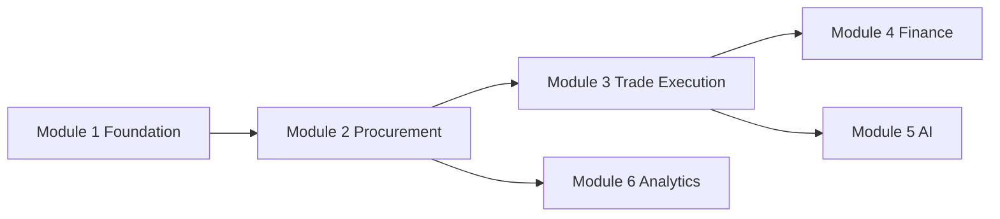

# Roadmap

Long-term product roadmap for Trade Grid Global.

Authoritative implementation status: [CURRENT_STATUS.md](./CURRENT_STATUS.md)  
Architecture: [ARCHITECTURE_STATUS_v0.3.0.md](../architecture/ARCHITECTURE_STATUS_v0.3.0.md)  
Milestones: [MILESTONES.md](./MILESTONES.md) · Backlog: [BACKLOG.md](./BACKLOG.md) · Future: [FUTURE_FEATURES.md](./FUTURE_FEATURES.md)

---

## Current Position

| Field | Value |
|-------|-------|
| **Product / Git tag** | `v0.3.0-procurement-complete` |
| **npm version** | `0.3.0` |
| **Completed** | Module 1 Foundation + Module 2 Procurement (through award) |
| **Next build** | Module 3 — Trade Execution (Purchase Orders first) |
| **Explicitly deferred** | Finance, production AI, live analytics |

Procurement path live today:

`RFQ → Quotation → Award`  
**Not implemented:** Purchase Orders onward.

---

## Module 1 — Foundation

**Status:** Largely complete (v0.1–v0.2)

### Objectives

Establish identity, company trust primitives, product catalog, and operational notifications.

### Major features

- Auth, roles, onboarding, password recovery
- Company profiles + document storage
- Product moderation lifecycle
- Notification center
- Verification operations command center
- Settings identity guard

### Dependencies

Supabase Auth + Postgres RLS baseline.

### Estimated complexity

**High** (security-sensitive). Largely delivered via migrations `001`–`013`.

---

## Module 2 — Procurement

**Status:** Complete through award (`v0.3.0-procurement-complete`)

### Objectives

Enable structured buyer demand and supplier commercial response through auditable award.

### Major features

- RFQ lifecycle + visibility model
- Quotation threads + versioned offers
- Buyer compare
- Supplier award / not-selected outcomes
- Award audit + notifications

### Dependencies

Module 1 (companies, products optional link, notifications).

### Estimated complexity

**High**. Delivered via migrations `014`–`016`.

### Optional polish (still Not implemented)

- Wire public `/rfq` to live data
- Buyer counter-offers
- Offer payment-terms / certification columns

---

## Module 3 — Trade Execution

**Status:** **Not implemented.**

### Objectives

Convert awards into executable trade instruments and operational fulfillment visibility.

### Major features

| Feature | Status |
|---------|--------|
| Purchase Orders | **Not implemented.** |
| Order Lifecycle / Order Management | **Not implemented.** (buyer Orders page is mock data) |
| Logistics | **Not implemented.** |
| Shipping | **Not implemented.** |
| Trade documents (packing list, CoO, etc. as order artifacts) | **Not implemented.** |

### Dependencies

Module 2 awards (`quotation_awards`, winning `offer_id` / commercial snapshot).

### Estimated complexity

**High** (new tables, RLS, state machines, dual-party dashboards).

### Recommended first slice

1. Purchase Order creation from an active award  
2. Buyer/supplier order views + status timeline  
3. Document attachments on the order  
4. Logistics/shipping events later in the same module

---

## Module 4 — Finance

**Status:** **Not implemented.**

### Objectives

Settle commercial terms with invoices and payments while preserving auditability.

### Major features

| Feature | Status |
|---------|--------|
| Invoices | **Not implemented.** |
| Payments | **Not implemented.** |
| Escrow / trade financing | **Not implemented.** |

### Dependencies

Module 3 orders (stable order IDs and amounts).

### Estimated complexity

**Very high** (compliance, payment providers, reconciliation).

---

## Module 5 — AI Procurement

**Status:** **Not implemented** for production AI.  
Mock UI exists at `/ai-sourcing` using `mockSourcingResponse`.

### Objectives

Assist sourcing with recommendations grounded in platform data and verification signals.

### Major features

| Feature | Status |
|---------|--------|
| AI supplier matching | **Not implemented.** |
| AI recommendations | Mock only |
| AI trade assistant / risk / RFQ generator | **Not implemented.** |

### Dependencies

Clean product + RFQ + verification datasets; preferably post Module 3 for outcome labels.

### Estimated complexity

**High**. Reserved notification types exist but emitters are **Not implemented.**

---

## Module 6 — Analytics

**Status:** **Not implemented** for live analytics.  
Admin analytics page uses mock marketplace metrics.

### Objectives

Provide reporting for admins (and later buyers/suppliers) on funnel health, SLA, and trade volume.

### Major features

| Feature | Status |
|---------|--------|
| Reporting dashboards | Mock placeholder |
| Admin intelligence | Partial via verification queue only |
| Marketplace KPIs from live tables | **Not implemented.** |

### Dependencies

Modules 1–3 data maturity.

### Estimated complexity

**Medium–high**.

---

## Suggested sequencing

**Do not prioritize Module 5 before Module 3** — AI without execution data adds noise without conversion.
