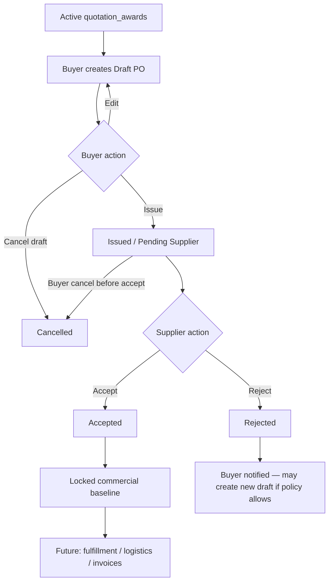
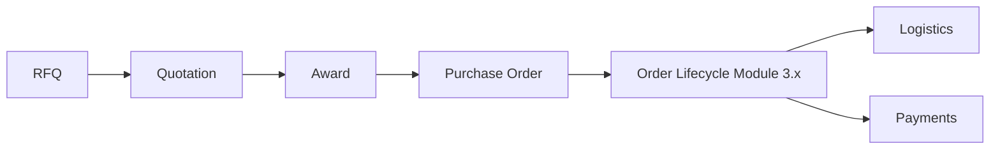
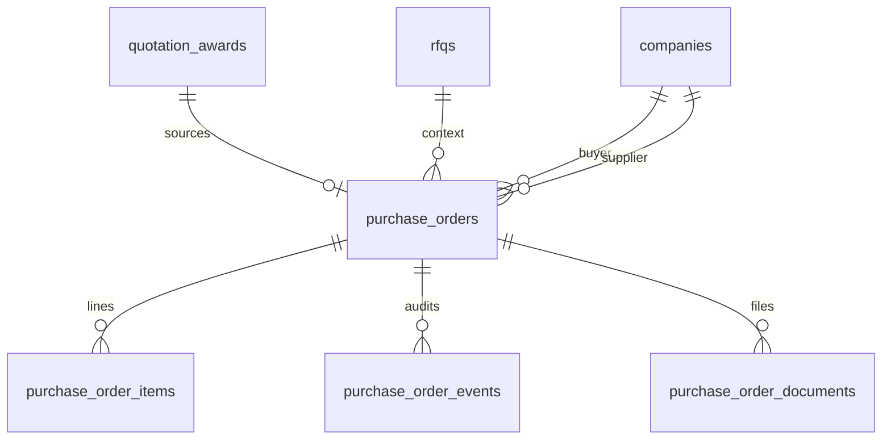
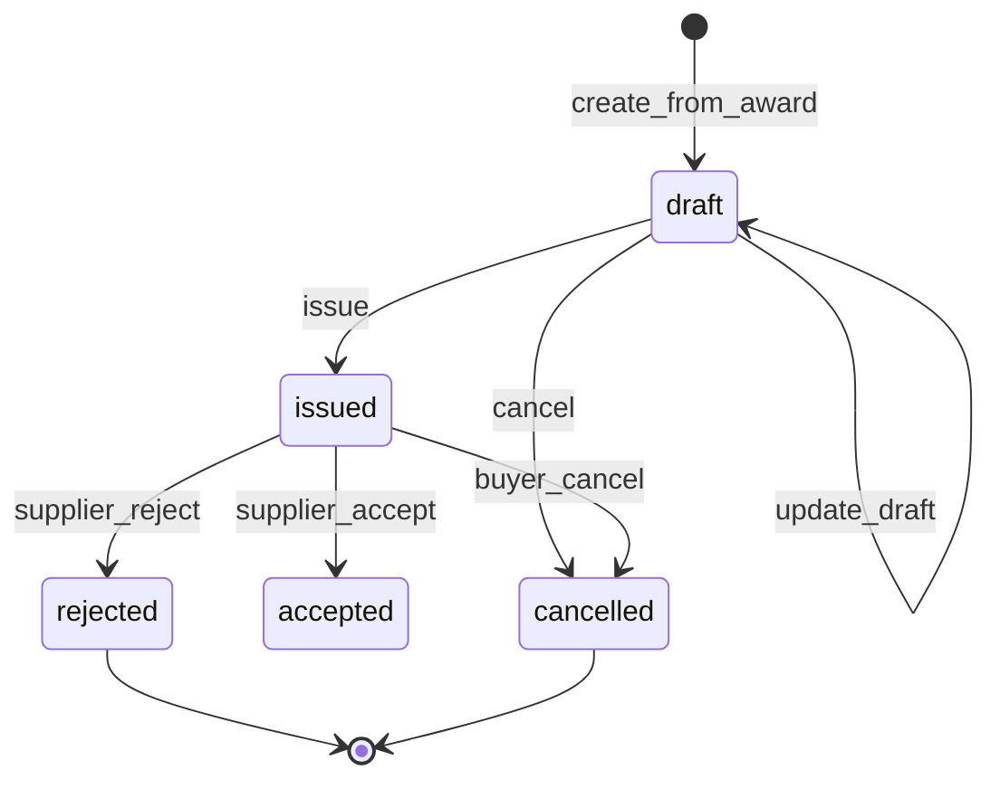
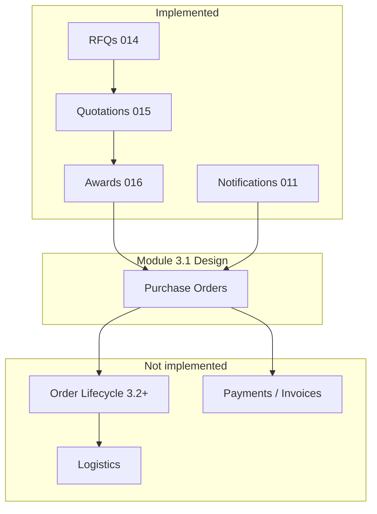

# Module 3.1 — Purchase Order Design

**Document type:** Architecture & business design (blueprint)  
**Module:** 3.1 Purchase Order System  
**Status:** Design locked + **Implemented** in repo (`017`, `lib/purchase-orders`, Orders UI). Apply migration `017` on each environment.  
**Product baseline:** `v0.4.0-purchase-orders`  
**Constraint:** Extend existing architecture. Do **not** redesign RFQ, quotation, or award tables.

**Related reading**

- [../CURRENT_STATUS.md](../CURRENT_STATUS.md)
- [../ROADMAP.md](../ROADMAP.md)
- [../../architecture/ARCHITECTURE_STATUS_v0.3.0.md](../../architecture/ARCHITECTURE_STATUS_v0.3.0.md)
- [../../architecture/DATABASE_SCHEMA.md](../../architecture/DATABASE_SCHEMA.md)
- [../../architecture/SECURITY_MODEL.md](../../architecture/SECURITY_MODEL.md)
- [../../architecture/API_REFERENCE.md](../../architecture/API_REFERENCE.md)
- [../../architecture/DECISION_LOG.md](../../architecture/DECISION_LOG.md) (D003, D006, D007)
- [../../architecture/ARCHITECTURE_DECISIONS.md](../../architecture/ARCHITECTURE_DECISIONS.md) (AD-3.1-* — Phase 0 lock)
- [../../product/PROCUREMENT_WORKFLOW.md](../../product/PROCUREMENT_WORKFLOW.md)
- [../../product/ORDER_LIFECYCLE.md](../../product/ORDER_LIFECYCLE.md)

---

## Table of contents

1. [Business Purpose](#1-business-purpose)
2. [Business Workflow](#2-business-workflow)
3. [Database Design](#3-database-design)
4. [State Machine](#4-state-machine)
5. [User Permissions](#5-user-permissions)
6. [Security Model](#6-security-model)
7. [Notifications](#7-notifications)
8. [UI / UX](#8-ui--ux)
9. [Edge Cases](#9-edge-cases)
10. [Future Extensions](#10-future-extensions)
11. [Dependencies](#11-dependencies)
12. [Implementation Plan](#12-implementation-plan)
13. [Risks](#13-risks)
14. [Phase 0 Decision Lock](#14-phase-0-decision-lock)

---

## 1. Business Purpose

### What is a Purchase Order?

A **Purchase Order (PO)** is the buyer’s formal commercial instrument that commits to buy specific goods under agreed terms from a selected supplier. In Trade Grid Global, the PO is created **after** an award and freezes the commercial snapshot that both parties will execute against.

### Why it exists

| Need | How PO helps |
|------|----------------|
| Convert selection into commitment | Award picks a winner; PO makes the buy actionable |
| Shared commercial record | Both parties see the same quantities, prices, Incoterms, lead times |
| Audit & dispute readiness | Immutable events document issue / accept / reject |
| Bridge to execution | Foundation for future logistics, documents, invoices, payments |

Without POs, the platform stops at “supplier selected” and cannot support trade execution (Module 3+).

### How PO differs from upstream artifacts

| Artifact | Intent | Mutability | Parties bound? |
|----------|--------|------------|----------------|
| **RFQ** | Buyer demand / request for quotes | Editable in draft; locked after publish (Phase A rules) | No — invitation to quote |
| **Quotation (offer)** | Supplier commercial proposal (versioned) | Revisions create new versions; submitted heads are the commercial basis | No — offer until accepted via award+PO |
| **Award** | Buyer selection of winning quotation | Active or revoked; history retained | Selection yes; fulfillment not yet |
| **Purchase Order** | Buyer-issued commitment based on award snapshot | Draft editable; issued PO locked for commercial fields (amendments = future) | Yes — after supplier acceptance (proposed) |

### PO as the commercial agreement

**Proposed business rule (Module 3.1):**

1. An **active** `quotation_awards` row identifies the winning RFQ / thread / offer / supplier.
2. Creating a PO **copies** commercial fields from the awarded offer (and RFQ context) into a PO snapshot so later offer edits or revoke paths cannot silently rewrite history.
3. Buyer **issues** the PO to the supplier.
4. Supplier **accepts** → PO becomes the mutually acknowledged commercial baseline for fulfillment.
5. Supplier **rejects** → buyer is notified; PO does not proceed to fulfillment; buyer may revise draft or cancel (rules below).

**Legal note:** Acceptance is a durable audited state transition subject to Platform Terms of Service (AD-3.1-019). Exact counsel wording is Future Review, not an open architecture fork.

| Layer | Status |
|-------|--------|
| RFQ / Quotation / Award | **Current implementation** |
| Purchase Order system | **Not implemented** (this design) |

---

## 2. Business Workflow

### Happy path (Module 3.1)

```
Active Award
    ↓
Buyer creates Draft PO (from award)
    ↓
Buyer reviews / edits draft (within policy)
    ↓
Buyer Issues PO
    ↓
Supplier receives notification + can open PO
    ↓
Supplier Reviews
    ↓
Supplier Accepts  ──►  PO Accepted (locked commercial baseline)
        OR
Supplier Rejects  ──►  Buyer notified; PO Rejected
```

Optional buyer paths:

- Cancel **draft** before issue.
- Cancel **issued / pending supplier** before accept (with reason) — recommended for v1.
- After **accepted**, cancel is **not** available in Module 3.1 (AD-3.1-005 / AD-3.1-018); break-glass is Future Review.

### Mermaid — end-to-end workflow



### Relationship to existing procurement path



Upstream through Award: **Implemented.**  
PO onward: **Not implemented.**

---

## 3. Database Design

> Architecture only — **no SQL** in this document. Naming aligns with existing conventions (`snake_case`, text status CHECKs, immutable `*_events`, SECURITY DEFINER RPCs).

### Design principles

1. **Do not alter** `rfqs`, `quotation_*`, or `quotation_awards` schemas except optional **non-breaking** back-references later if required (prefer PO → award FK only).
2. **Snapshot commercial terms** onto the PO at create/issue time from the awarded offer.
3. **One active PO per award** (recommended) to prevent duplicate commercial commitments.
4. Mirror audit pattern: `purchase_order_events` like `award_events` / `rfq_events`.
5. Private storage bucket for PO documents (pattern of `rfq-docs` / `quotation-docs`).

### Proposed entities

#### `purchase_orders`

| Aspect | Design |
|--------|--------|
| **Purpose** | Header for a PO: parties, linkage to award/RFQ/thread/offer, status, commercial snapshot, issue/accept metadata |
| **Relationships** | `buyer_company_id` → `companies`; `supplier_company_id` → `companies`; `award_id` → `quotation_awards`; `rfq_id` → `rfqs`; `thread_id` → `quotation_threads`; `source_offer_id` → `quotation_offers` (snapshot source) |
| **Ownership** | Buyer company owns (creates/issues); supplier is counterparty |
| **Indexes (expected)** | `(buyer_company_id, created_at desc)`; `(supplier_company_id, status)`; `(award_id)` unique where not cancelled/rejected (or unique active); `(status, issued_at)` |
| **Expected growth** | Roughly ≤ awards × (1–few drafts); medium volume vs quotations |
| **Extensibility** | Header-level Incoterms, currency, payment terms text, delivery port/country, notes; leave room for `incoterm`, `currency`, `payment_terms`, `delivery_terms` without waiting for Module 4 |

**Recommended snapshot fields (conceptual):** currency, unit price, price unit, total/extended, quantity, quantity unit, MOQ context, Incoterm, lead time min/max/unit, product name/category from RFQ, validity reference, free-text notes at issue time.

#### `purchase_order_items`

| Aspect | Design |
|--------|--------|
| **Purpose** | Line items. v1 may be **single line** cloned from RFQ/offer; table exists for multi-line extensibility |
| **Relationships** | `purchase_order_id` → `purchase_orders`; optional `linked_product_id` → `products` |
| **Ownership** | Inherited from parent PO |
| **Indexes** | `(purchase_order_id, line_no)` unique |
| **Expected growth** | Low lines per PO initially (1); grows with multi-SKU POs |
| **Extensibility** | HS code, packaging, tolerances, split shipments later |

#### `purchase_order_events`

| Aspect | Design |
|--------|--------|
| **Purpose** | Immutable audit trail (`event_type`, actor, from/to status, message, metadata) |
| **Relationships** | `purchase_order_id` → `purchase_orders` |
| **Ownership** | Insert via trusted helpers only (like `_append_award_event`) |
| **Indexes** | `(purchase_order_id, created_at desc)` |
| **Expected growth** | Several events per PO lifecycle; retain forever |
| **Extensibility** | Amendment / shipment / invoice cross-links in `metadata` |

#### `purchase_order_documents`

| Aspect | Design |
|--------|--------|
| **Purpose** | Metadata for files (signed PDF, specs, CoA requests) attached to a PO |
| **Relationships** | `purchase_order_id` → `purchase_orders`; `uploaded_by` → auth user |
| **Ownership** | Upload rules by status/role (buyer on draft/issued; both after accept — policy) |
| **Indexes** | `(purchase_order_id, created_at desc)` |
| **Expected growth** | Few files per PO |
| **Extensibility** | Document type enum (`po_pdf`, `spec`, `other`) |

#### `purchase_order_versions` (**Future**)

| Aspect | Design |
|--------|--------|
| **Purpose** | Full version history for amendments after accept |
| **Status** | **Not implemented** in Module 3.1 — out of scope |
| **Note** | v1 locks commercial fields after issue/accept; amendments deferred to §10 |

### Entity relationship (conceptual)



### Storage (conceptual)

| Bucket | Visibility | Path sketch |
|--------|------------|-------------|
| `purchase-order-docs` | Private | `pos/<buyer_company_id>/<po_id>/…` |

Pattern matches existing private buckets; exact policies deferred to implementation.

---

## 4. State Machine

### States (Module 3.1)

| Status | Meaning |
|--------|---------|
| `draft` | Buyer preparing PO; **hidden from supplier** (AD-3.1-010) |
| `issued` | Buyer issued to supplier; awaiting response (**Pending Supplier**) |
| `accepted` | Supplier accepted; commercial baseline locked |
| `rejected` | Supplier rejected |
| `cancelled` | Buyer (or policy) cancelled before acceptance completed |
| `completed` | **Out of scope for 3.1** (AD-3.1-012) — deferred to Module 3.2 |

**Naming note:** UI may show “Pending Supplier” as the label for `issued`. Persist one canonical status string (`issued`) for simplicity, consistent with RFQ/award text CHECKs.

### Allowed transitions

| From | To | Actor | Notes |
|------|----|-------|-------|
| — | `draft` | Buyer | Create from **active** award |
| `draft` | `draft` | Buyer | Update draft |
| `draft` | `issued` | Buyer | Issue PO |
| `draft` | `cancelled` | Buyer | Cancel draft |
| `issued` | `accepted` | Supplier | Accept |
| `issued` | `rejected` | Supplier | Reject (reason required) |
| `issued` | `cancelled` | Buyer | Cancel before accept (reason recommended) |
| `accepted` | `completed` | — | **Not in 3.1** (AD-3.1-012) |
| `rejected` | — | — | Terminal for that PO row |
| `cancelled` | — | — | Terminal |

**Disallowed (examples):** supplier cannot issue; buyer cannot accept; no transition from `accepted` → `draft`; no second `issued` without going through draft (idempotent issue must no-op or error).

### Mermaid — state diagram



### Award interaction rule

| Award status | PO create allowed? |
|--------------|-------------------|
| `active` | Yes (if no non-terminal PO — AD-3.1-002 / AD-3.1-011) |
| `revoked` | No. Revoke itself blocked while PO is `issued` or `accepted` (AD-3.1-013) |

---

## 5. User Permissions

### Buyer

| Action | Module 3.1 |
|--------|------------|
| Create draft PO from own active award | Allowed |
| Edit own draft | Allowed |
| Issue own draft | Allowed |
| Cancel own draft / issued (pre-accept) | Allowed |
| View own POs + events + docs | Allowed |
| Accept / reject as supplier | **Forbidden** |
| Create PO on another buyer’s award | **Forbidden** |
| Edit commercial fields after issue | **Forbidden** (amendments = future) |
| Mark completed | **Forbidden in 3.1** (AD-3.1-012) |

### Supplier

| Action | Module 3.1 |
|--------|------------|
| List/view POs where `supplier_company_id` is own | Allowed (for `issued`+) |
| Accept / reject issued PO | Allowed |
| View events/docs per policy | Allowed |
| Create / issue / cancel buyer PO | **Forbidden** |
| See other suppliers’ POs | **Forbidden** |
| Edit commercial snapshot | **Forbidden** |

**Draft visibility to supplier:** **Hidden until issued** (AD-3.1-010).

### Admin

| Action | Module 3.1 |
|--------|------------|
| Read all POs / events (support) | Allowed |
| Force-cancel / force-complete | Future (break-glass) — **Not in MVP unless required** |
| Create PO as buyer | **Forbidden** unless admin also owns buyer company (unusual) |

### System

| Action | Module 3.1 |
|--------|------------|
| Append audit events | Allowed (trusted helpers) |
| Emit notifications | Allowed (`_create_system_notification`) |
| Auto-expire issued POs | Future — **Not implemented** in 3.1 unless product sets SLA |

---

## 6. Security Model

> Align with [SECURITY_MODEL.md](../../architecture/SECURITY_MODEL.md). **Do not implement** here.

### Ownership

- Buyer company = `purchase_orders.buyer_company_id` must match RFQ buyer via award chain.
- Supplier company must match `quotation_awards.supplier_company_id`.
- Verify on every RPC: award active, parties consistent, RFQ still `awarded` (or explicitly allow post-revoke policy).

### RLS expectations

| Table | Buyer | Supplier | Admin |
|-------|-------|----------|-------|
| `purchase_orders` | SELECT own buyer rows | SELECT own supplier rows (`issued`+ recommended) | SELECT all |
| Items / events / documents | Via parent PO access | Via parent PO access | SELECT all |
| INSERT/UPDATE/DELETE | **No direct client writes** | **No** | **No** |

Mutations via SECURITY DEFINER RPCs only (D003).

### RPC requirements (conceptual)

| RPC | Purpose |
|-----|---------|
| `create_draft_purchase_order(p_award_id, …)` | Snapshot + draft |
| `update_draft_purchase_order(p_po_id, …)` | Draft-only edits |
| `issue_purchase_order(p_po_id)` | draft → issued |
| `accept_purchase_order(p_po_id)` | supplier accept |
| `reject_purchase_order(p_po_id, p_reason)` | supplier reject |
| `cancel_purchase_order(p_po_id, p_reason)` | buyer cancel where allowed |
| `get_purchase_order(p_po_id)` | Aggregated detail JSON |
| `list_purchase_orders` | Optional; or plain SELECT under RLS |

All: `search_path = public`, ownership checks, status guards, audit + notifications.

### Audit requirements

Every transition writes `purchase_order_events`. Never delete events. Metadata should include `award_id`, `offer_id`, actor ids.

### Document storage

Private bucket; path ownership helpers analogous to RFQ/quotation; no public listing.

### Authorization summary

Fail closed. Cross-company isolation must be covered by a new `scripts/verify-purchase-order-system.mjs` at implementation time.

---

## 7. Notifications

Reuse trusted notification framework ([ARCHITECTURE_STATUS](../../architecture/ARCHITECTURE_STATUS_v0.3.0.md) § Notification Architecture). Clients never INSERT.

| Event type | When | Recipients |
|------------|------|------------|
| `purchase_order.created` | Draft created | Buyer (confirmation) — optional |
| `purchase_order.issued` | Buyer issues | **Supplier** (primary); buyer copy optional |
| `purchase_order.accepted` | Supplier accepts | **Buyer** (primary); supplier copy optional |
| `purchase_order.rejected` | Supplier rejects | **Buyer** |
| `purchase_order.cancelled` | Buyer cancels | Supplier if previously issued; else buyer-only |
| `purchase_order.completed` | — | **Not in 3.1** (AD-3.1-012) |

| Field | Guidance |
|-------|----------|
| `entity_type` | `purchase_order` (extend app notification union at implement time) |
| `entity_id` | PO id |
| `action_url` | `/dashboard/buyer/orders/[id]` or `/dashboard/supplier/orders/[id]` |
| Priority | `issued` / `rejected` → high; accept → high/normal |

**Sender:** System (trusted RPC), not end-user forged messages.

---

## 8. UI / UX

Replace mock buyer Orders page ([CURRENT_STATUS](../CURRENT_STATUS.md) known debt).

### Navigation

| Role | Nav item | Notes |
|------|----------|-------|
| Buyer | **Orders** (existing href `/dashboard/buyer/orders`) | Replace mock with live list |
| Supplier | **Orders** or **Purchase Orders** | **New** nav item (today absent) |
| Admin | Optional later | Support view — future |

### Buyer pages

| Page | Purpose |
|------|---------|
| Orders list | Filter by status; link from awarded RFQs (“Create PO”) |
| PO detail | Snapshot, lines, timeline, actions (issue/cancel), documents |
| Create/edit draft | Prefill from award; confirm before issue |

### Supplier pages

| Page | Purpose |
|------|---------|
| Incoming POs list | Issued / accepted / rejected |
| PO detail | Review snapshot; Accept / Reject with reason; timeline |

### UI elements

| Element | Guidance |
|---------|----------|
| Status indicators | Text badges aligned to dashboard design system (black/white/gold) |
| Cards | List rows or cards for mobile; avoid hero clutter |
| Timeline | Event list like RFQ/quotation audit panels |
| Action buttons | Issue, Cancel, Accept, Reject — confirm dialogs for irreversible actions |
| Empty states | “No purchase orders yet — create one from an awarded RFQ” / “No POs awaiting response” |

### Entry points

- Buyer RFQ detail (awarded): CTA **Create purchase order**
- Buyer award history context: same CTA
- Notification deep links

### Mobile

Mobile-first tables → stacked cards; sticky primary actions on detail; full-width confirm dialogs.

---

## 9. Edge Cases

| Case | Expected behavior |
|------|-------------------|
| Supplier rejects PO | Status `rejected`; notify buyer; award remains active unless product says otherwise; buyer may open new draft if “one PO per award” allows after rejection |
| Buyer cancels draft | `cancelled`; no supplier notify |
| Duplicate issue attempts | Idempotent: second issue errors “already issued” |
| Concurrent issue + accept | Row lock in RPC (`FOR UPDATE`); single winner transition |
| Award revoked while draft | Block issue; cancel or invalidate draft |
| Award revoked while issued (before accept) | **Blocked** — buyer must cancel PO first (AD-3.1-013) |
| Award revoked after accepted | **Blocked** — no silent unwind; admin break-glass is Future Review (AD-3.1-013 / AD-3.1-018) |
| Expired quotation / validity_until | Snapshot at create; warn if source validity passed; product choice: block create vs warn-only |
| Missing/deleted attachment | Document row soft-fail; storage delete restricted; events note failure |
| Unauthorized access | RLS + RPC deny; verify script asserts isolation |
| Create PO without active award | Hard fail |
| Two drafts for same award | Prevent via unique constraint / RPC guard |
| RFQ not `awarded` | Hard fail create |
| Supplier tries accept on draft | Hard fail |

---

## 10. Future Extensions

| Extension | Module hint | Notes |
|-----------|-------------|-------|
| Partial shipments | 3.x Logistics | Shipment lines against PO items |
| PO amendments / versions | 3.x | `purchase_order_versions` |
| Split orders / multi-supplier | Later | Conflicts with single-award model — product change |
| Recurring contracts | Later | Templates, not one-shot PO |
| ERP integrations | Later | Export/webhooks |
| Electronic signatures | Later | Doc provider; keep audit |
| Version history UI | With amendments | |
| Invoices / payments | Module 4 | Reference `purchase_order_id` |
| Logistics milestones | Module 3 logistics | |

All of the above: **Not implemented** in Module 3.1.

---

## 11. Dependencies



| Dependency | Relationship |
|------------|--------------|
| **RFQs** | Context (title, product, destination); must be `awarded` |
| **Quotations** | Source offer snapshot via award |
| **Awards** | **Required** active award; do not redesign awards |
| **Notifications** | Trusted emit on transitions |
| **Order Lifecycle** | Accepted PO is commercial baseline (AD-3.1-023); 3.2 may add fulfillment entity/states without a second commercial truth |
| **Logistics** | Consumes accepted PO |
| **Payments** | Invoices reference PO/order |

**Non-goals for 3.1:** payments capture, carrier tracking, negotiation chat, AI.

---

## 12. Implementation Plan

Phased delivery (implementation later — this section is sequencing only).

| Phase | Work | Exit criteria |
|-------|------|----------------|
| **0 — Design lock** | Resolve §14 Open Questions | **Done** — AD-3.1-* in [ARCHITECTURE_DECISIONS.md](../../architecture/ARCHITECTURE_DECISIONS.md) |
| **1 — Migration** | Additive `017_purchase_order_system.sql` (name TBD) | Tables, indexes, bucket, RLS SELECT |
| **2 — RPCs** | create/update/issue/accept/reject/cancel/get | Status machine enforced; audits+notifs |
| **3 — RLS / storage** | Policies + path helpers | Cross-company isolation |
| **4 — Backend services** | `lib/purchase-order/*` | Typed clients |
| **5 — UI** | Buyer+supplier lists/detail; RFQ CTA; nav | Mock Orders replaced |
| **6 — Verification** | `verify-purchase-order-system.mjs` | Security/lifecycle asserts |
| **7 — Testing** | typecheck/lint/build + browser checklist | Quality gate |
| **8 — Documentation** | Schema, API, product ORDER_LIFECYCLE update | Docs match code |

Suggested RPC order inside Phase 2: create draft → update → issue → accept/reject → cancel → get.

---

## 13. Risks

### Technical risks

| Risk | Mitigation |
|------|------------|
| Snapshot drift vs live offer | Immutable snapshot columns; never join live offer for commercial display after issue |
| Race on issue/accept | `SELECT … FOR UPDATE` on PO (and award) in RPCs |
| Award revoke vs accepted PO | Explicit policy (block revoke if accepted PO exists, or require admin) |
| RLS ambiguity bugs | Fully qualify columns; follow 015/016 review discipline |
| Over-scoping 3.1 (shipments/payments) | Hard cutline: issue/accept/reject only |

### Business risks

| Risk | Mitigation |
|------|------------|
| Acceptance treated as legal contract without counsel | Product/legal review; UI copy “subject to platform terms” |
| Suppliers ignore POs | Notifications + dashboard badge; optional expiry later |
| Buyers issue without reviewing snapshot | Confirm dialog showing key commercial fields |

### Scalability concerns

| Concern | Mitigation |
|---------|------------|
| List performance | Indexes by company+status; paginate |
| Event table growth | Append-only; partition later if needed |
| Document storage cost | Size limits like other private buckets |

---

## 14. Phase 0 Decision Lock

**Status:** Phase 0 complete — all former Open Questions are **LOCKED**.  
**Registry:** [ARCHITECTURE_DECISIONS.md](../../architecture/ARCHITECTURE_DECISIONS.md) (AD-3.1-001 … AD-3.1-025).  
**Rule:** Implementation MUST follow these decisions. Do not re-open without a superseding ADR.

### Q1 — Supplier visibility of draft POs

| Field | Content |
|-------|---------|
| **Options** | (A) Hidden until issued · (B) Read-only preview for supplier · (C) Collaborative draft |
| **Pros / cons** | (A) clean inbox, no premature signaling / no early supplier feedback · (B) early alignment / leaks incomplete terms · (C) rich collaboration / out of scope complexity |
| **Recommendation** | (A) |
| **Decision** | Suppliers cannot see draft POs; access starts at `issued`. |
| **Status** | **LOCKED** (AD-3.1-010) |
| **Reason** | Matches buyer-controlled issue moment; avoids incomplete commercial instruments in supplier inbox. |
| **Future review** | Optional preview feature flag if enterprise buyers demand it. |

### Q2 — One PO per award vs recovery after reject/cancel

| Field | Content |
|-------|---------|
| **Options** | (A) One PO row forever · (B) New draft if no `accepted` and no other non-terminal PO · (C) Unlimited concurrent POs |
| **Pros / cons** | (A) simple / blocks recovery · (B) one commitment at a time + recovery · (C) flexible / duplicate commitments |
| **Recommendation** | (B) |
| **Decision** | At most one of `draft`\|`issued`\|`accepted` per award; new draft allowed after `rejected`/`cancelled`; `accepted` consumes award for new POs. |
| **Status** | **LOCKED** (AD-3.1-002, AD-3.1-011) |
| **Reason** | Prevents dual commitments while allowing commercial recovery without re-award. |
| **Future review** | Replacement PO / change order after accept (amendments). |

### Q3 — Include `completed` in Module 3.1?

| Field | Content |
|-------|---------|
| **Options** | (A) Full complete transition in 3.1 · (B) Status value unused · (C) Omit until 3.2 |
| **Pros / cons** | (A) early closure UX / fake fulfillment · (B) dead state · (C) sharp cutline |
| **Recommendation** | (C) |
| **Decision** | No `completed` state or Complete action in 3.1. |
| **Status** | **LOCKED** (AD-3.1-012) |
| **Reason** | Completion is fulfillment/lifecycle (3.2+), not issue/accept. |
| **Future review** | Module 3.2 defines completion. |

### Q4 — Award revoke vs issued/accepted PO

| Field | Content |
|-------|---------|
| **Options** | (A) Allow revoke anytime and unwind PO · (B) Block revoke if `issued` or `accepted` · (C) Auto-cancel issued on revoke |
| **Pros / cons** | (A) flexible / destroys trust · (B) consistent instruments · (C) surprises supplier mid-review |
| **Recommendation** | (B) (+ auto-cancel drafts on revoke) |
| **Decision** | `revoke_award` fails if any PO is `issued` or `accepted`; drafts auto-cancelled on revoke; issued requires buyer cancel first. |
| **Status** | **LOCKED** (AD-3.1-013) |
| **Reason** | Selection cannot contradict an in-flight or accepted commercial instrument. |
| **Future review** | Admin/legal break-glass unwind. |

### Q5 — Nav naming: Orders vs Purchase Orders

| Field | Content |
|-------|---------|
| **Options** | (A) Use **Orders** for PO lists · (B) Separate “Purchase Orders” nav · (C) RFQ-only entry points |
| **Pros / cons** | (A) replaces mock, simple · (B) clearer later split / dual nav now · (C) poor discoverability |
| **Recommendation** | (A) |
| **Decision** | Buyer + supplier **Orders** nav hosts PO list/detail in 3.1. |
| **Status** | **LOCKED** (AD-3.1-014) |
| **Reason** | One nav until fulfillment needs a distinct entity name. |
| **Future review** | Rename/split when 3.2 introduces fulfillment Orders. |

### Q6 — Multi-line items in 3.1 UI?

| Field | Content |
|-------|---------|
| **Options** | (A) Header-only, no items table · (B) Items table + list UI; populate from award (usually 1 line); no multi-SKU picker · (C) Full multi-SKU PO builder |
| **Pros / cons** | (A) simple / poor extensibility · (B) ready for growth, honest UX · (C) powerful / out of scope |
| **Recommendation** | (B) |
| **Decision** | Always use `purchase_order_items`; UI renders lines; no marketplace multi-SKU picker in 3.1. |
| **Status** | **LOCKED** (AD-3.1-015) |
| **Reason** | Extensible schema without overbuilding PO creation UX. |
| **Future review** | Multi-line editing / multi-SKU POs. |

### Q7 — Payment terms on PO header?

| Field | Content |
|-------|---------|
| **Options** | (A) Omit until Module 4 · (B) Optional free-text on header · (C) Structured payment engine |
| **Pros / cons** | (A) clean cut / weaker instrument · (B) trade-realistic · (C) payments scope creep |
| **Recommendation** | (B) |
| **Decision** | Optional payment-terms text (not payment capture). |
| **Status** | **LOCKED** (AD-3.1-016) |
| **Reason** | Commercial wording without Module 4. |
| **Future review** | Structured terms in Payments. |

### Q8 — Auto-expire issued POs?

| Field | Content |
|-------|---------|
| **Options** | (A) TTL auto-cancel · (B) Reminders only · (C) None in 3.1 |
| **Pros / cons** | (A) clears inbox / silent commercial risk · (B) helpful / incomplete alone · (C) explicit exits only |
| **Recommendation** | (C) |
| **Decision** | No auto-expiry in 3.1. |
| **Status** | **LOCKED** (AD-3.1-017) |
| **Reason** | No silent commercial timeouts without SLA product design. |
| **Future review** | Optional SLA/expiry later. |

### Q9 — Admin force actions?

| Field | Content |
|-------|---------|
| **Options** | (A) Force-cancel/accept in MVP · (B) Read-only admin support · (C) Dual-control break-glass |
| **Pros / cons** | (A) support speed / abuse risk · (B) safe MVP · (C) correct long-term / not needed yet |
| **Recommendation** | (B) |
| **Decision** | Admin SELECT for support; no force mutation RPCs in 3.1. |
| **Status** | **LOCKED** (AD-3.1-018) |
| **Reason** | Privilege without process is a security debt. |
| **Future review** | Dual-control break-glass RPCs. |

### Q10 — Electronic acceptance legal framing

| Field | Content |
|-------|---------|
| **Options** | (A) Block until unique counsel contract · (B) Durable accept + Platform ToS disclosure in UI · (C) Require third-party e-sign |
| **Pros / cons** | (A) safest legal / blocks engineering · (B) auditable + clear posture · (C) strong evidence / scope & cost |
| **Recommendation** | (B) |
| **Decision** | Accept = audited state transition; UI states subject to Platform ToS; no e-sign vendor in 3.1. |
| **Status** | **LOCKED** (AD-3.1-019) |
| **Reason** | Unblocks implementation with fail-closed audit; counsel wordsmiths copy later without forking architecture. |
| **Future review** | Legal counsel review of exact ToS/UI wording; optional e-sign. |

### Locked architectural contract (summary)

| Topic | Decision | ID |
|-------|----------|-----|
| Origin | Active award only | AD-3.1-001 |
| Cardinality | One non-terminal PO per award | AD-3.1-002 |
| Snapshot | Commercial + party identity | AD-3.1-003, AD-3.1-004 |
| Immutability | Commercial locked from `issued` | AD-3.1-005 |
| Retention | No physical deletes; append-only events | AD-3.1-006, AD-3.1-007 |
| Writes | RPC-only; UTC timestamps | AD-3.1-008, AD-3.1-009 |
| Scope cuts | No logistics, payments, amendments, completed | AD-3.1-012, AD-3.1-020–022 |
| Notifications | Trusted only | AD-3.1-025 |
| Migrations | Additive only | AD-3.1-024 |
| Fulfillment baseline | Accepted PO | AD-3.1-023 |

### Assumptions (still binding)

1. Food/FMCG focus unchanged (D001).
2. Buyer counter-offers remain out of scope.
3. Upstream RFQ / quotation / award tables are not redesigned.

### Unresolved architectural questions for Module 3.1

**None.** Non-blocking Future Review items (ToS copy, break-glass, 3.2 entity naming) are listed in [ARCHITECTURE_DECISIONS.md](../../architecture/ARCHITECTURE_DECISIONS.md).

---

## Appendix A — Suggested status labels (UI)

| Stored status | Buyer label | Supplier label |
|---------------|-------------|----------------|
| `draft` | Draft | — |
| `issued` | Awaiting supplier | Action required |
| `accepted` | Accepted | Accepted |
| `rejected` | Rejected by supplier | Rejected |
| `cancelled` | Cancelled | Cancelled |
| `completed` | — (not in 3.1) | — (not in 3.1) |

## Appendix B — Production acceptance criteria (mandatory before “Ready for Commit” on implementation)

> **Scope note:** This document is **design only**. There is **no** Purchase Order migration, RPC, service, UI, or verification script in the codebase today. The gates below apply when Module 3.1 is **implemented**. Do not report PO implementation complete until every row passes.

### Self-audit (must all be YES at implementation time)

| # | Criterion | Design mandate |
|---|-----------|----------------|
| 1 | No accidental breakage of RFQ / quotation / award | Additive migration only; consume `quotation_awards`; do not rewrite upstream tables |
| 2 | No edits to previous migrations (`001`–`016`) | New file only (e.g. `017_purchase_order_system.sql`) |
| 3 | No duplicate logic | Reuse trusted notifications, company membership helpers, award patterns from `016` |
| 4 | Scale to 100k companies / 1M RFQs / 1M POs / millions of events | Indexes on `(buyer_company_id, status)`, `(supplier_company_id, status)`, `award_id`, `created_at`; paginated lists; no N+1 in detail RPCs |
| 5 | Every DB write through secure RPC | Client has **no** INSERT/UPDATE/DELETE on PO tables |
| 6 | Every RPC enforces ownership + auth | Buyer/supplier company checks + award chain consistency |
| 7 | Every user action protected by RLS | SELECT policies; mutations RPC-only |
| 8 | Appropriate indexes | See §3 + scale row above |
| 9 | Qualified SQL columns | No ambiguous joins in RPCs/triggers |
| 10 | SECURITY DEFINER reviewed | Follow `016` award RPC review discipline |
| 11 | `search_path` set on every SECURITY DEFINER fn | Explicit `SET search_path = public` (or project standard) |
| 12 | No SQL injection | Parameterized args only; no dynamic SQL from user text |
| 13 | No PL/pgSQL variable shadowing | Distinct `v_` / `p_` naming |
| 14 | Race-safe concurrent actions | `SELECT … FOR UPDATE` on PO (+ award where needed); unique constraints |
| 15 | Invalid state transitions rejected | Hard fail outside §4 transition table |
| 16 | Workflow cannot be bypassed | No direct table writes; status guards in every mutator |
| 17 | Cross-company isolation | RLS + RPC; verify script asserts deny |
| 18 | Important actions create audit events | Every create/issue/accept/reject/cancel → `purchase_order_events` |
| 19 | Audit events append-only | No UPDATE/DELETE policies on events |
| 20 | Historical commercial records immutable | Snapshot columns locked after `issued` |
| 21 | Commercial snapshots preserved | Copy from awarded offer at draft create; display from PO not live offer after issue |
| 22 | Affected services updated | `lib/purchase-order/*` + award/RFQ CTAs |
| 23 | Affected types updated | DB types + domain types |
| 24 | Notification types updated | `purchase_order.*` in app unions + RPC emits |
| 25 | Documentation updated | Schema, API, ORDER_LIFECYCLE, CHANGELOG, CURRENT_STATUS, ARCHITECTURE_STATUS |
| 26 | Verification scripts updated | `scripts/verify-purchase-order-system.mjs` |
| 27 | No TODO comments in ship path | Production-ready only |
| 28 | No placeholders | Replace mock buyer Orders page |
| 29 | No commented-out code | Clean diff |
| 30 | Lead Architect would approve PR | After all gates below |

### Performance review (implementation)

- Single aggregated `get_purchase_order` RPC (avoid N+1 item/event fetches).
- List queries filter by company + status with supporting indexes.
- No full-table scans on events; always constrain by `purchase_order_id`.
- UI: server components where possible; paginate lists.

### Security review (implementation)

- Auth required; company membership required.
- RLS SELECT + RPC ownership; no privilege escalation via admin unless explicitly designed.
- Private document bucket; signed URLs only; path helpers.
- Cross-company isolation proven by verify script.

### Database review (implementation)

- Tables, CHECKs, FKs, indexes, RLS, SECURITY DEFINER RPCs, private storage, notification enums/types as needed — all additive.
- Never modify applied migrations `001`–`016`.

### Documentation review (implementation)

Update: CHANGELOG, RELEASE_NOTES, DATABASE_SCHEMA, API_REFERENCE, CURRENT_STATUS, ARCHITECTURE_STATUS, ORDER_LIFECYCLE, ROADMAP; no broken links; mark shipped vs Not implemented accurately.

### Quality gate (implementation)

| Gate | Pass when |
|------|-----------|
| Architecture | Matches this design + AD-3.1-* in ARCHITECTURE_DECISIONS.md |
| Typecheck | `npm run typecheck` clean |
| Lint | `npm run lint` errors = 0 |
| Build | `npm run build` success |
| Migration | Additive `017+` applies cleanly on fresh + upgrade path |
| Verification | New PO verify script passes |
| Security | RLS + RPC + isolation reviewed |
| Browser checklist | Create → issue → accept / reject → cancel; unauthorized deny |
| Known limitations | Documented: no payments / logistics / amendments |
| Ready for Commit | **Yes** only when all above true |

### Design-phase quality gate (this document)

| Gate | Status |
|------|--------|
| Architecture blueprint complete | Pass |
| Extends award; does not redesign RFQ/quotation/award | Pass |
| Phase 0 Decision Lock (§14) | **Pass — LOCKED** |
| Typecheck / Lint / Build (repo regression) | N/A to PO code; existing app must remain green |
| Migration / Verification / Browser (PO) | **Not started** — Not implemented |
| Ready for Commit (Phase 0 docs) | **Yes** |
| Ready for Commit (PO production module) | **No** — implementation not started |
| Ready for Implementation (Phase 1+) | **Yes** — architectural questions closed |

---

## Appendix C — Lessons learned (Phase 0)

1. **Biggest challenge:** Locking revoke-vs-PO and recovery-after-reject without inventing 3.2 fulfillment tables.
2. **Biggest architectural decision:** One non-terminal PO per award + commercial immutability from `issued` + block revoke when issued/accepted (AD-3.1-002/005/013).
3. **Technical debt (accepted until implement):** Mock buyer Orders page; counsel ToS copy polish (non-blocking).
4. **Future improvements:** Amendments, expiry SLA, admin break-glass, logistics/payments, 3.2 completion.
5. **Reusable patterns:** AD registry in ARCHITECTURE_DECISIONS.md; Phase 0 lock before migrations; options → LOCKED with Future Review.
6. **Build-upon for 3.2+:** Accepted PO is the commercial baseline (AD-3.1-023); do not invent a conflicting truth source.

---

**Last Updated:** 2026-07-18  
**Document owner:** Product Architecture / Staff Engineering  
**Phase 0:** Complete — decisions LOCKED in [ARCHITECTURE_DECISIONS.md](../../architecture/ARCHITECTURE_DECISIONS.md).  
**Next step:** Implementation Plan Phase 1 (additive migration) — **documentation lock only; code not started.**
