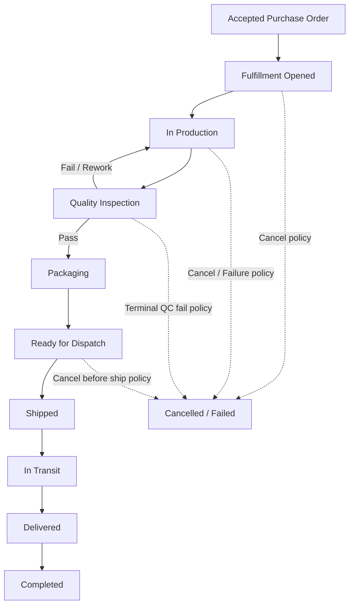
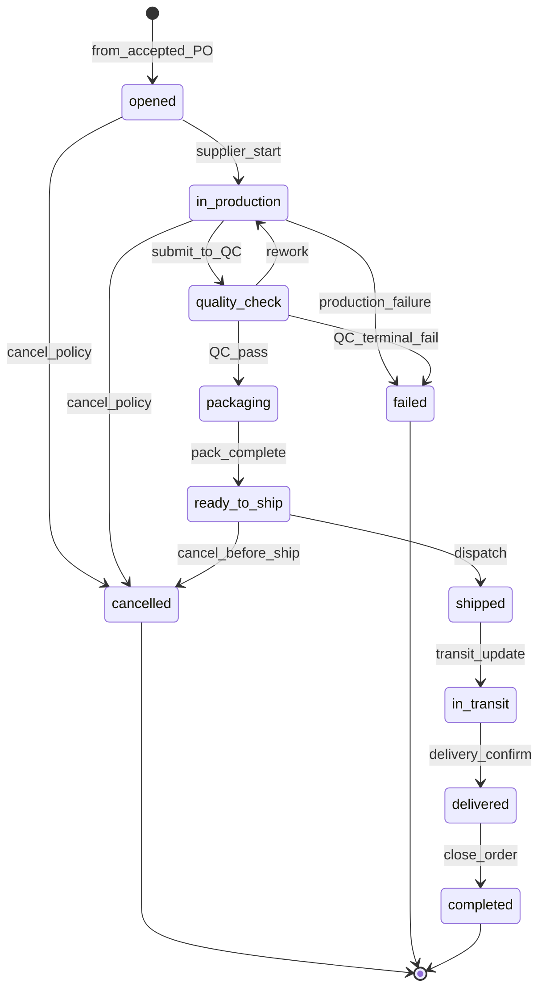
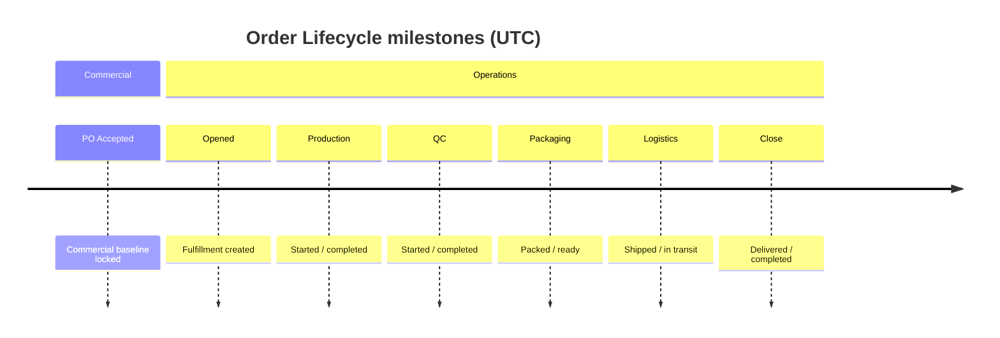
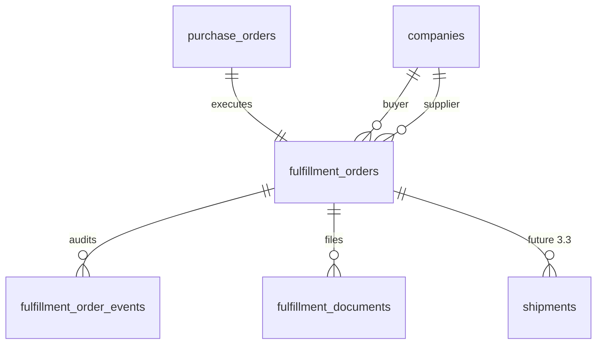
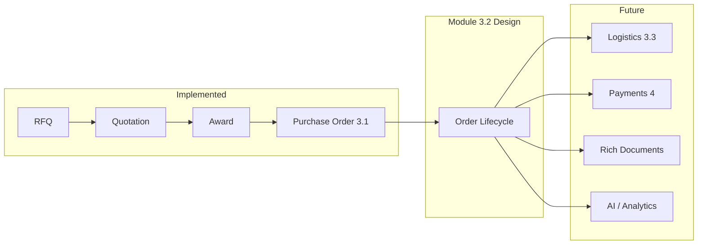

# Module 3.2 — Order Lifecycle Design

**Document type:** Architecture & business design (blueprint)  
**Module:** 3.2 Order Lifecycle / Operational Execution  
**Status:** Design + Phase 0 **LOCKED**; Phase A database/RPC contract **implemented** (`018`); Phase B operations/UI **implemented in code** (`023`).
**Release target:** `v0.5.0-order-lifecycle`  
**Product baseline:** `v0.4.0-purchase-orders` (RFQ → Quotation → Award → Purchase Order)  
**Constraint:** Extend Module 3.1. Do **not** redesign RFQ, quotation, award, or PO commercial snapshots. Accepted PO remains the commercial baseline (**AD-3.1-023** / **AD-3.2-002**).  
**Contract:** [ARCHITECTURE_DECISIONS.md](../../architecture/ARCHITECTURE_DECISIONS.md) (**AD-3.2-001** … **AD-3.2-029**).

**Related reading**

- [../CURRENT_STATUS.md](../CURRENT_STATUS.md)
- [../ROADMAP.md](../ROADMAP.md)
- [MODULE_3_1_PURCHASE_ORDER_DESIGN.md](./MODULE_3_1_PURCHASE_ORDER_DESIGN.md)
- [../../architecture/ARCHITECTURE_DECISIONS.md](../../architecture/ARCHITECTURE_DECISIONS.md) (AD-3.1-\*)
- [../../architecture/ARCHITECTURE_STATUS_v0.3.0.md](../../architecture/ARCHITECTURE_STATUS_v0.3.0.md)
- [../../architecture/DATABASE_SCHEMA.md](../../architecture/DATABASE_SCHEMA.md)
- [../../architecture/SECURITY_MODEL.md](../../architecture/SECURITY_MODEL.md)
- [../../product/ORDER_LIFECYCLE.md](../../product/ORDER_LIFECYCLE.md)
- [../../product/PROCUREMENT_WORKFLOW.md](../../product/PROCUREMENT_WORKFLOW.md)
- [../../../releases/v0.4.0-purchase-orders/release-notes.md](../../../releases/v0.4.0-purchase-orders/release-notes.md)
- [../../../releases/v0.4.0-purchase-orders/known-limitations.md](../../../releases/v0.4.0-purchase-orders/known-limitations.md)

---

## Table of contents

1. [Business Purpose](#1-business-purpose)
2. [Industry Research](#2-industry-research)
3. [Business Workflow](#3-business-workflow)
4. [State Machine](#4-state-machine)
5. [Roles & Permissions](#5-roles--permissions)
6. [Business Rules](#6-business-rules)
7. [Operational Timeline](#7-operational-timeline)
8. [Future Integrations](#8-future-integrations)
9. [High-Level Data Model](#9-high-level-data-model)
10. [Notifications](#10-notifications)
11. [Documents](#11-documents)
12. [Edge Cases](#12-edge-cases)
13. [Security Considerations](#13-security-considerations)
14. [Performance & Scalability](#14-performance--scalability)
15. [UI / UX Planning](#15-ui--ux-planning)
16. [Dependencies](#16-dependencies)
17. [Phase 0 Decision Lock](#17-phase-0-decision-lock)
18. [Future Module Planning](#18-future-module-planning)
19. [Engineering Review](#19-engineering-review)
20. [Appendix — Quality Gate](#20-appendix--quality-gate)

---

## 1. Business Purpose

### Why Order Lifecycle exists

Module 3.1 ends when the supplier **accepts** a Purchase Order. At that moment the platform has a mutual commercial baseline, but **no operational execution record**. Serious Food/FMCG importers and exporters need visibility into production, quality, packing, dispatch, transit, and delivery before they trust the platform with real volume.

Order Lifecycle is the **operational execution layer**: it tracks how an accepted commercial commitment is fulfilled without rewriting prices, quantities, or parties on the PO.

### Business goals

| Goal          | Outcome                                                |
| ------------- | ------------------------------------------------------ |
| Trust         | Both parties see the same operational truth with audit |
| Efficiency    | Reduce WhatsApp / email status chasing                 |
| Conversion    | Award → PO → execution becomes a complete trade loop   |
| Scale         | Support high order volume across regions and factories |
| Extensibility | Payments, logistics carriers, ERP, AI plug in later    |

### Buyer goals

- Know when production started and when goods are ready
- See QC outcomes before shipment
- Track shipment / delivery without leaving the platform
- Close the order when delivery is acknowledged
- Preserve dispute-ready history

### Supplier goals

- Update fulfillment progress without renegotiating commercial terms
- Signal delays, QC issues, and dispatch readiness
- Share stage documents (CoA, packing list photos) securely
- Avoid duplicate “orders” that conflict with the accepted PO

### Platform goals

- Keep **one commercial truth** (accepted PO snapshot — AD-3.1-023)
- Keep **one operational truth** (lifecycle record)
- Maintain Food/FMCG focus and enterprise trust posture
- Enable Module 4 payments and logistics modules without redesign

### Success metrics (design-time)

| Metric                                         | Intent                      |
| ---------------------------------------------- | --------------------------- |
| % accepted POs with an active lifecycle record | Adoption of execution layer |
| Median time accepted → shipped / delivered     | Operational cycle time      |
| Dispute rate with complete event timeline      | Audit quality               |
| Notification engagement on stage changes       | Communication effectiveness |

| Layer                 | Status                                        |
| --------------------- | --------------------------------------------- |
| Purchase Order (3.1)  | **Implemented**                               |
| Order Lifecycle (3.2) | Phase B operations and UI implemented in code |

---

## 2. Industry Research

### Patterns observed

| Domain                 | Pattern                                                                     | Relevance                                     |
| ---------------------- | --------------------------------------------------------------------------- | --------------------------------------------- |
| Global B2B procurement | Separate “PO / contract” from “fulfillment / ASN / delivery”                | Matches AD-3.1-023                            |
| ERP (SAP/Oracle-class) | Sales order / production order / delivery / goods receipt as linked objects | Favors child fulfillment entity               |
| Manufacturing MES      | Production → QC → pack → ship with hold/rework loops                        | Needs pause/rework without destroying history |
| Supply-chain TMS       | Shipment as first-class object with multi-leg transit                       | Defer deep TMS to logistics module            |
| International trade    | Incoterms already on PO; ops track readiness + docs + delivery confirmation | Platform should not re-price mid-fulfillment  |

### Alternatives considered

| Approach                                                                     | Pros                                                                        | Cons                                                                                                   | Verdict                  |
| ---------------------------------------------------------------------------- | --------------------------------------------------------------------------- | ------------------------------------------------------------------------------------------------------ | ------------------------ |
| **A. Expand `purchase_orders.status`** with production/ship/deliver/complete | Simple                                                                      | Mixes commercial and operational semantics; conflicts with “accepted = locked commercial” mental model | Reject for primary model |
| **B. Child fulfillment order 1:1 with accepted PO**                          | Clear separation; PO snapshot untouched; extensible to multi-shipment later | Extra entity                                                                                           | **Recommended**          |
| **C. Full WMS/TMS in 3.2** (warehouses, carriers, legs, customs filings)     | Powerful                                                                    | Scope explosion; delays payments readiness                                                             | Defer to 3.3+            |
| **D. Event-only timeline without statuses**                                  | Flexible                                                                    | Hard UI; weak invariants                                                                               | Reject as sole model     |

### Chosen approach (design recommendation)

**Child operational record** (conceptual name: `fulfillment_order` / trade order) **1:1 with an accepted PO**, owning the operational state machine and timeline. Commercial fields remain on the PO and stay immutable.

Deep carrier integration, multi-warehouse allocation, and customs brokerage are **extension points**, not Module 3.2 MVP requirements.

**Open Question Q1** confirms whether the child entity is mandatory vs statuses-on-PO.

---

## 3. Business Workflow

### Entry condition

Lifecycle begins **only** when `purchase_orders.status = accepted`.

```
Accepted Purchase Order (commercial baseline — immutable)
    ↓
Fulfillment record created (operational baseline)
    ↓
… operational stages …
    ↓
Completed (terminal operational success)
```

### Recommended Module 3.2 happy path

```
Accepted PO
  → Fulfillment Opened (awaiting production)
  → In Production
  → Quality Inspection
  → Packaging
  → Ready for Dispatch
  → Shipped
  → In Transit
  → Delivered
  → Completed
```

### Optional / deferred states

| State / concept          | In 3.2 MVP?                       | Rationale                                        |
| ------------------------ | --------------------------------- | ------------------------------------------------ |
| Production Planned       | Optional label / milestone        | Can fold into “Opened” + planned_start timestamp |
| Production Paused        | Event + flag, not always a status | Avoid state explosion                            |
| Rework                   | Transition QC → In Production     | Needed for Food QC reality                       |
| Awaiting Pickup          | Optional                          | Useful for EXW; may wait for logistics module    |
| Customs                  | **Defer to 3.3**                  | Complex international filings                    |
| Partial / split shipment | **Defer**                         | Schema hooks only                                |
| Payment pending          | **Defer to Module 4**             | Not operational fulfillment                      |

### Alternatives for workflow shape

1. **Thin 3.2:** Opened → In Progress → Shipped → Delivered → Completed (too coarse for Food QC).
2. **Recommended 3.2:** Production → QC → Pack → Ready → Ship → Transit → Deliver → Complete.
3. **Thick 3.2:** Include customs, multi-leg, warehouses (too broad).

**Recommendation:** (2) for `v0.5.0-order-lifecycle`.

### Mermaid — overall workflow



---

## 4. State Machine

### Canonical operational statuses (recommended)

| Status          | Purpose                                                             |
| --------------- | ------------------------------------------------------------------- |
| `opened`        | Fulfillment created; waiting to start production                    |
| `in_production` | Manufacturing / processing underway                                 |
| `quality_check` | Inspection / CoA / lab checks                                       |
| `packaging`     | Packing to PO packaging requirements                                |
| `ready_to_ship` | Packed and cleared for dispatch                                     |
| `shipped`       | Handed to carrier / left supplier control                           |
| `in_transit`    | En route (may be supplier-asserted until logistics module)          |
| `delivered`     | Goods arrived / buyer-confirmable                                   |
| `completed`     | Operationally closed (**AD-3.1-012** fulfilled here)                |
| `cancelled`     | Terminal abort before completion                                    |
| `failed`        | Terminal operational failure (e.g. irreversible QC/production loss) |

### Allowed transitions (MVP)

| From                   | To                     | Actor                                | Notes                                                         |
| ---------------------- | ---------------------- | ------------------------------------ | ------------------------------------------------------------- |
| —                      | `opened`               | System                               | On accepted PO (auto) or buyer/supplier start action — **Q2** |
| `opened`               | `in_production`        | Supplier                             |                                                               |
| `opened`               | `cancelled`            | Buyer and/or Supplier                | Policy — **Q3**                                               |
| `in_production`        | `quality_check`        | Supplier                             |                                                               |
| `in_production`        | `opened`               | Supplier                             | Pause/resume modeled as reverse or event — **Q4**             |
| `in_production`        | `cancelled` / `failed` | Per policy                           |                                                               |
| `quality_check`        | `packaging`            | Supplier                             | QC pass                                                       |
| `quality_check`        | `in_production`        | Supplier                             | Rework                                                        |
| `quality_check`        | `failed`               | Supplier (+ buyer notify)            | Terminal QC failure                                           |
| `packaging`            | `ready_to_ship`        | Supplier                             |                                                               |
| `ready_to_ship`        | `shipped`              | Supplier                             |                                                               |
| `ready_to_ship`        | `cancelled`            | Policy                               | Before carrier handoff                                        |
| `shipped`              | `in_transit`           | Supplier or System                   | May collapse with shipped — **Q5**                            |
| `in_transit`           | `delivered`            | Supplier assert and/or Buyer confirm | **Q6**                                                        |
| `delivered`            | `completed`            | Buyer and/or System                  | **Q7**                                                        |
| `completed`            | —                      | —                                    | Terminal                                                      |
| `cancelled` / `failed` | —                      | —                                    | Terminal                                                      |

### Forbidden transitions (examples)

- Skip QC when QC is required for category/cert path (**Q8**)
- `shipped` before `ready_to_ship` / packaging complete
- Any transition that mutates PO commercial snapshot fields
- Reopen `completed` to `in_production` without formal reopen policy (**Q9**)
- Buyer cannot mark `in_production` as supplier
- Supplier cannot mark `completed` without buyer/system rules

### Rollback policy

| Kind              | Policy                                                                                |
| ----------------- | ------------------------------------------------------------------------------------- |
| Soft rollback     | Limited reverse transitions (e.g. QC → production for rework) with append-only events |
| Hard rollback     | Not silent; create compensating event; never delete history                           |
| After `shipped`   | No return to packaging; use exception states / claims (**Q10**)                       |
| After `completed` | Immutable operational close; reopen only via future break-glass                       |

### System transitions

- Auto-create fulfillment when PO accepted (recommended)
- Optional auto `opened` → reminders (not status change)
- Optional auto `delivered` → `completed` after SLA quiet period (**Q7**)

### Admin transitions

Not in MVP unless product locks break-glass (align with AD-3.1-018 spirit). **Q11**.

### Mermaid — state diagram



---

## 5. Roles & Permissions

### Actor definitions

| Actor    | Meaning                                             |
| -------- | --------------------------------------------------- |
| Buyer    | Owning buyer company of the PO                      |
| Supplier | Counterparty supplier company on the PO             |
| Admin    | Platform support                                    |
| System   | Trusted RPC / jobs                                  |
| Auditor  | Future read-only compliance role (not in app today) |

### Matrix (recommended)

| Status                   | Buyer view | Supplier view | Buyer transition      | Supplier transition              | Admin |
| ------------------------ | ---------- | ------------- | --------------------- | -------------------------------- | ----- |
| `opened`                 | Yes        | Yes           | Cancel? **Q3**        | Start production; cancel?        | Read  |
| `in_production`          | Yes        | Yes           | Limited cancel **Q3** | Advance / fail / pause event     | Read  |
| `quality_check`          | Yes        | Yes           | No skip               | Pass / rework / fail             | Read  |
| `packaging`              | Yes        | Yes           | No                    | Advance                          | Read  |
| `ready_to_ship`          | Yes        | Yes           | Cancel? **Q3**        | Ship                             | Read  |
| `shipped` / `in_transit` | Yes        | Yes           | Dispute flag **Q12**  | Update transit / mark delivered? | Read  |
| `delivered`              | Yes        | Yes           | Confirm complete      | Assert delivered                 | Read  |
| `completed`              | Yes        | Yes           | None                  | None                             | Read  |
| `cancelled` / `failed`   | Yes        | Yes           | None                  | None                             | Read  |

**Cannot:** any party edit PO commercial snapshot; forge notifications; cross-company read.

---

## 6. Business Rules

| #   | Rule                                         | Recommended default                                                                       | Needs lock? |
| --- | -------------------------------------------- | ----------------------------------------------------------------------------------------- | ----------- |
| R1  | Lifecycle requires accepted PO               | Hard require                                                                              | No          |
| R2  | One active fulfillment per accepted PO       | 1:1                                                                                       | Q1          |
| R3  | Commercial fields never change via lifecycle | Absolute                                                                                  | No          |
| R4  | Can production pause?                        | Yes via event/flag; status may stay `in_production`                                       | Q4          |
| R5  | Can production restart after pause?          | Yes                                                                                       | Q4          |
| R6  | Can shipment begin before QC?                | **No** on MVP path                                                                        | Q8          |
| R7  | Can supplier skip states?                    | **No** except documented shortcuts                                                        | Q8          |
| R8  | Can buyer cancel after production starts?    | Policy — likely allowed until `shipped` with reason                                       | Q3          |
| R9  | Can supplier cancel?                         | Limited; usually buyer-led after production                                               | Q3          |
| R10 | Can completed orders change?                 | **No**                                                                                    | No          |
| R11 | Can completed reopen?                        | Future only                                                                               | Q9          |
| R12 | Can orders expire?                           | Optional SLA later; not required in 3.2 MVP                                               | Q13         |
| R13 | QC failure                                   | Rework loop or terminal `failed`                                                          | Partial     |
| R14 | Shipment before packaging                    | **Forbidden**                                                                             | No          |
| R15 | Delivery dispute                             | Flag + hold completion; no silent rewrite                                                 | Q12         |
| R16 | Partial shipment                             | Out of 3.2 MVP                                                                            | Future      |
| R17 | Award revoke                                 | Remains blocked while accepted PO exists (AD-3.1-013); fulfillment does not unlock revoke | No          |
| R18 | Physical deletes                             | Forbidden; terminal statuses + events                                                     | No          |
| R19 | Append-only operational events               | Required                                                                                  | No          |
| R20 | UTC timestamps                               | Required (AD-3.1-009 pattern)                                                             | No          |

---

## 7. Operational Timeline

All timestamps persist as `timestamptz` in **UTC**. UI localizes for display.

| Milestone                  | Suggested field              | Set when                     |
| -------------------------- | ---------------------------- | ---------------------------- |
| Fulfillment created        | `opened_at`                  | Record created               |
| Production started         | `production_started_at`      | → `in_production`            |
| Production completed       | `production_completed_at`    | Leaving production toward QC |
| QC started                 | `qc_started_at`              | → `quality_check`            |
| QC completed               | `qc_completed_at`            | Pass/fail decision           |
| Packing started            | `packaging_started_at`       | → `packaging` (optional)     |
| Packing finished           | `packaging_completed_at`     | → `ready_to_ship`            |
| Ready                      | `ready_to_ship_at`           | Ready status                 |
| Shipment created / shipped | `shipped_at`                 | → `shipped`                  |
| In transit updates         | event timestamps             | Transit events               |
| Delivered                  | `delivered_at`               | → `delivered`                |
| Completed                  | `completed_at`               | → `completed`                |
| Cancelled / failed         | `cancelled_at` / `failed_at` | Terminal                     |

### Mermaid — timeline



---

## 8. Future Integrations

Design extension points **without implementing**.

| Integration          | Hook                                                                                            | Module           |
| -------------------- | ----------------------------------------------------------------------------------------------- | ---------------- |
| Payments             | Reference `fulfillment_order_id` + `purchase_order_id`; gate payouts on `delivered`/`completed` | 4                |
| Invoices             | Emit after `ready_to_ship` or `delivered` (policy)                                              | 4                |
| Documents            | Stage-tagged docs on fulfillment                                                                | 3.2 docs + later |
| Certificates / CoA   | Attach at QC                                                                                    | 3.2 / compliance |
| Inspection 3rd party | External inspector actor later                                                                  | Future           |
| Shipping providers   | Shipment object + tracking IDs                                                                  | 3.3              |
| Freight forwarders   | Party role on shipment                                                                          | 3.3              |
| ERP                  | Export events / webhooks on transitions                                                         | Later            |
| AI                   | Delay prediction, anomaly on timeline gaps                                                      | Later            |
| Analytics            | Event stream + status dwell times                                                               | Later            |
| Reports              | PDF pack from timeline + docs                                                                   | Later            |
| Mobile               | Same RPCs; responsive UI                                                                        | Later            |

**Invariant:** integrations must not create a parallel commercial price list; they consume PO snapshot + fulfillment status.

---

## 9. High-Level Data Model

> Conceptual only — **no SQL**.

### Recommended entities

| Entity                              | Responsibility                                       |
| ----------------------------------- | ---------------------------------------------------- |
| `purchase_orders` (existing)        | Commercial baseline (immutable after issue/accept)   |
| `fulfillment_orders`                | Operational header; FK → accepted PO; status machine |
| `fulfillment_order_events`          | Append-only audit                                    |
| `fulfillment_milestones` (optional) | Named timestamp registry if not only columns         |
| `fulfillment_documents`             | Stage documents metadata                             |
| `shipments` (**future 3.3**)        | Carrier, tracking, legs — stub FK nullable in 3.2    |
| `fulfillment_holds` (optional)      | Dispute / pause holds                                |

### Relationships



### Responsibilities

- **PO:** what was bought, for how much, under which Incoterms/payment terms text
- **Fulfillment:** where execution stands, who moved it, when, with which evidence docs
- **Shipments (later):** how physical movement is tracked across carriers

**Do not** duplicate unit price / currency onto fulfillment except denormalized display cache if needed — source of truth remains PO.

---

## 10. Notifications

Reuse trusted notification framework (D007 / AD-3.1-025 pattern). Clients never INSERT.

| Event type (proposed)            | When                       | Primary recipient       |
| -------------------------------- | -------------------------- | ----------------------- |
| `fulfillment.opened`             | Lifecycle created          | Buyer + supplier        |
| `fulfillment.production_started` | → in_production            | Buyer                   |
| `fulfillment.production_paused`  | Pause event                | Buyer                   |
| `fulfillment.qc_started`         | → quality_check            | Buyer                   |
| `fulfillment.qc_passed`          | QC pass                    | Buyer                   |
| `fulfillment.qc_failed`          | QC fail / rework           | Buyer (high)            |
| `fulfillment.packed`             | Packaging complete / ready | Buyer                   |
| `fulfillment.ready_to_ship`      | Ready                      | Buyer                   |
| `fulfillment.shipped`            | Dispatched                 | Buyer (high)            |
| `fulfillment.in_transit`         | Transit update             | Buyer                   |
| `fulfillment.delivered`          | Delivered                  | Buyer + supplier        |
| `fulfillment.completed`          | Closed                     | Buyer + supplier        |
| `fulfillment.cancelled`          | Cancelled                  | Counterparty            |
| `fulfillment.failed`             | Failed                     | Buyer + supplier (high) |
| `fulfillment.disputed`           | Delivery dispute           | Supplier + admin later  |

`entity_type`: `fulfillment_order` (or chosen name). Deep links under Orders UI (**Q14** nav naming).

---

## 11. Documents

| Stage                  | Typical documents                           | Owner upload      |
| ---------------------- | ------------------------------------------- | ----------------- |
| Production             | Production schedule, batch refs             | Supplier          |
| QC                     | Inspection report, CoA, lab results, photos | Supplier          |
| Packaging              | Packing list, carton specs, photos          | Supplier          |
| Ready / Ship           | Shipping label, booking note                | Supplier          |
| Transit                | AWB/BL stub, tracking screenshot            | Supplier          |
| Delivery               | POD / delivery note                         | Buyer or supplier |
| Commercial (link only) | PO PDF already on PO docs                   | —                 |
| Future invoice         | Commercial invoice                          | Module 4          |

Private storage bucket pattern (like `purchase-order-docs`). Path sketch: `fulfillment/<buyer_company_id>/<fulfillment_id>/…`.

---

## 12. Edge Cases

| Case                                             | Expected behavior                                                                   |
| ------------------------------------------------ | ----------------------------------------------------------------------------------- |
| Supplier delay                                   | Stay in current status; delay reason event; notify buyer; no auto-skip              |
| Buyer cancellation before production             | → `cancelled` with reason                                                           |
| Buyer cancellation after production, before ship | Allowed with reason (**Q3**); notify supplier; costs are legal/offline              |
| Buyer cancellation after shipped                 | **Forbidden** as cancel; use dispute / claim path (**Q12**)                         |
| Production failure                               | → `failed` or rework to production; notify                                          |
| QC rejection                                     | Rework to production or terminal `failed`                                           |
| Shipment cancelled before pickup                 | Return to `ready_to_ship` or `cancelled` with event                                 |
| Shipment lost                                    | Exception hold; status may stay `in_transit` + `disputed`/`failed` policy (**Q15**) |
| Force majeure                                    | Manual status hold + message; no silent complete                                    |
| Duplicate shipment records                       | Unique constraints / RPC guards in logistics module                                 |
| Partial shipment                                 | Out of MVP; reject multi-ship create in 3.2                                         |
| Split shipment / backorder                       | Future; do not corrupt PO qty snapshot                                              |
| Accepted PO without fulfillment                  | Auto-create or block — **Q2**                                                       |

---

## 13. Security Considerations

| Concern              | Design mandate                                      |
| -------------------- | --------------------------------------------------- |
| Company isolation    | RLS + RPC ownership like PO/award                   |
| Audit trail          | Append-only fulfillment events                      |
| Immutable history    | No UPDATE/DELETE on events; no commercial rewrite   |
| Commercial integrity | PO snapshot remains source of commercial truth      |
| Role validation      | Buyer/supplier/admin gates on every RPC             |
| Document integrity   | Private bucket; path ownership; signed URLs         |
| Future compliance    | Retention; auditor role; food safety evidence at QC |
| Privilege escalation | No admin force in MVP unless Q11 locks it           |

Align with [`SECURITY_MODEL.md`](../../architecture/SECURITY_MODEL.md).

---

## 14. Performance & Scalability

| Concern                       | Design response                                                              |
| ----------------------------- | ---------------------------------------------------------------------------- |
| Millions of orders            | Indexes on buyer/supplier + status + updated_at; paginated lists             |
| Large manufacturers           | Avoid N+1: aggregate get RPC (PO + fulfillment + recent events)              |
| Multiple factories/warehouses | Future location entity; do not block 3.2 MVP                                 |
| High concurrency              | `FOR UPDATE` on fulfillment row during transitions                           |
| Event growth                  | Append-only; partition later                                                 |
| Microservices later           | Keep domain boundaries: commercial PO vs operational fulfillment vs shipment |

---

## 15. UI / UX Planning

> Planning only — **Not implemented.**

### Buyer

- Orders hub: tabs or filters for **Purchase Orders** vs **Fulfillment** (**Q14**)
- Fulfillment detail: progress tracker, timeline, documents, dispute CTA
- Status badges aligned to design system (black / white / gold)

### Supplier

- Fulfillment queue: action-required states (`opened`, `in_production`, `quality_check`, …)
- Primary actions per state (Start production, Submit QC, Mark packed, Mark shipped)
- Document upload per stage

### Shared

- Vertical timeline / activity feed (events)
- Progress tracker (stepper) for happy path
- Mobile-first stacked cards; sticky primary action
- Empty states when PO accepted but fulfillment not yet opened (if not auto)

---

## 16. Dependencies



| Dependency          | Relationship                              |
| ------------------- | ----------------------------------------- |
| **Purchase Orders** | Required accepted PO; commercial baseline |
| **Logistics**       | Consumes `ready_to_ship` / `shipped`      |
| **Payments**        | Consumes delivery/completion signals      |
| **Documents**       | Stage evidence                            |
| **AI / Analytics**  | Consume event stream                      |

---

## 17. Phase 0 Decision Lock

**Status:** Phase 0 complete — all former Open Questions **Q1–Q18** are **LOCKED**.  
**Registry:** [ARCHITECTURE_DECISIONS.md](../../architecture/ARCHITECTURE_DECISIONS.md) (**AD-3.2-001** … **AD-3.2-028**).  
**Rule:** Implementation MUST follow these decisions. Do not re-open without a superseding ADR.

### Q1 — Child fulfillment entity vs statuses on PO

| Field             | Content                                                                                                                 |
| ----------------- | ----------------------------------------------------------------------------------------------------------------------- |
| **Problem**       | Where does operational status live without corrupting the accepted PO commercial baseline?                              |
| **Options**       | (A) Expand `purchase_orders.status` · (B) Child `fulfillment_orders` 1:1 · (C) Event-only timeline                      |
| **Pros / cons**   | (A) simple / mixes commercial+ops · (B) clear boundary, logistics-ready / extra entity · (C) flexible / weak invariants |
| **Decision**      | Child **`fulfillment_orders`** entity; PO remains commercial; fulfillment owns operational status.                      |
| **Status**        | **LOCKED** (AD-3.2-001, AD-3.2-002, AD-3.2-003)                                                                         |
| **Reason**        | Honors AD-3.1-023; ERP-like separation; enables 3.3 shipments without PO redesign.                                      |
| **Future review** | None for entity split.                                                                                                  |

### Q2 — Auto-create vs explicit start

| Field             | Content                                                                                                 |
| ----------------- | ------------------------------------------------------------------------------------------------------- |
| **Problem**       | When does operational execution begin after accept?                                                     |
| **Options**       | (A) Auto-create on accept · (B) Explicit start · (C) Lazy create on first supplier action               |
| **Decision**      | **Auto-create** fulfillment in `opened` when PO becomes `accepted` (same trusted RPC path / follow-on). |
| **Status**        | **LOCKED** (AD-3.2-004)                                                                                 |
| **Reason**        | No orphan accepted POs; buyer immediately sees execution; notifications controlled.                     |
| **Future review** | Bulk-accept edge cases if multi-PO later.                                                               |

### Q3 — Cancellation rights

| Field             | Content                                                                                                                                                                                                                                                          |
| ----------------- | ---------------------------------------------------------------------------------------------------------------------------------------------------------------------------------------------------------------------------------------------------------------- |
| **Problem**       | Who may abort fulfillment and until when?                                                                                                                                                                                                                        |
| **Options**       | (A) Buyer anytime · (B) Buyer until `shipped` · (C) Mutual consent only · (D) No cancel after production                                                                                                                                                         |
| **Decision**      | **Buyer** may cancel with reason while status ∈ (`opened`,`in_production`,`quality_check`,`packaging`,`ready_to_ship`). **Supplier** may cancel only from `opened`. **No cancel after `shipped`** — use dispute/claims. Financial remedies offline / Module 3.4. |
| **Status**        | **LOCKED** (AD-3.2-005)                                                                                                                                                                                                                                          |
| **Reason**        | Protects post-dispatch logistics integrity; allows pre-ship abort for Food/FMCG reality.                                                                                                                                                                         |
| **Future review** | Cost allocation / liquidated damages (legal).                                                                                                                                                                                                                    |

### Q4 — Production pause model

| Field             | Content                                                                                     |
| ----------------- | ------------------------------------------------------------------------------------------- |
| **Problem**       | How to represent temporary production holds?                                                |
| **Options**       | (A) `paused` status · (B) Event/flag while staying `in_production` · (C) Revert to `opened` |
| **Decision**      | **Event + `is_paused` flag** (or equivalent); status remains `in_production`.               |
| **Status**        | **LOCKED** (AD-3.2-006)                                                                     |
| **Reason**        | Avoids state explosion; clear resume path.                                                  |
| **Future review** | None.                                                                                       |

### Q5 — `shipped` vs `in_transit`

| Field             | Content                                                              |
| ----------------- | -------------------------------------------------------------------- |
| **Problem**       | Is handoff distinct from en-route?                                   |
| **Options**       | (A) Collapse to one status · (B) Keep both                           |
| **Decision**      | Keep **both** `shipped` and `in_transit`.                            |
| **Status**        | **LOCKED** (AD-3.2-007)                                              |
| **Reason**        | Prepares Module 3.3 carrier tracking without renaming.               |
| **Future review** | Auto `shipped`→`in_transit` when logistics module attaches tracking. |

### Q6 — Delivery confirmation

| Field             | Content                                                                                                                              |
| ----------------- | ------------------------------------------------------------------------------------------------------------------------------------ |
| **Problem**       | Who attests goods arrived?                                                                                                           |
| **Options**       | (A) Supplier only · (B) Buyer only · (C) Supplier assert + buyer confirm                                                             |
| **Decision**      | Supplier may mark **`delivered`**; buyer **must confirm** before **`completed`**. Buyer may also mark delivered if supplier has not. |
| **Status**        | **LOCKED** (AD-3.2-008)                                                                                                              |
| **Reason**        | Dual control reduces false completes; supports disputes.                                                                             |
| **Future review** | POD document hard-require later.                                                                                                     |

### Q7 — Who completes

| Field             | Content                                                                                 |
| ----------------- | --------------------------------------------------------------------------------------- |
| **Problem**       | Closing AD-3.1-012 `completed` ownership.                                               |
| **Options**       | (A) Buyer only · (B) System auto after delivery · (C) Either                            |
| **Decision**      | **Buyer** transitions `delivered` → `completed` in Module 3.2. No auto-complete in MVP. |
| **Status**        | **LOCKED** (AD-3.2-009)                                                                 |
| **Reason**        | Explicit commercial close; payments can key off buyer complete later.                   |
| **Future review** | Optional quiet-period auto-complete.                                                    |

### Q8 — QC mandatory?

| Field             | Content                                                                                                              |
| ----------------- | -------------------------------------------------------------------------------------------------------------------- |
| **Problem**       | Food safety vs trading speed.                                                                                        |
| **Options**       | (A) Always mandatory · (B) Configurable per category · (C) Optional always                                           |
| **Decision**      | **QC stage mandatory** on the happy path for all Module 3.2 fulfillments (Food/FMCG platform). No skip to packaging. |
| **Status**        | **LOCKED** (AD-3.2-010)                                                                                              |
| **Reason**        | Trust differentiator; CoA/inspection culture.                                                                        |
| **Future review** | Category exceptions only with product+compliance ADR.                                                                |

### Q9 — Reopen completed

| Field             | Content                                          |
| ----------------- | ------------------------------------------------ |
| **Decision**      | **No reopen** of `completed` in Module 3.2.      |
| **Status**        | **LOCKED** (AD-3.2-011)                          |
| **Reason**        | Audit integrity; claims are new processes later. |
| **Future review** | Dual-control admin reopen with ADR.              |

### Q10 — Claims in 3.2?

| Field             | Content                                                                                                |
| ----------------- | ------------------------------------------------------------------------------------------------------ |
| **Decision**      | Full claims/returns **Module 3.4**. 3.2 only supports dispute **hold** (no completion while disputed). |
| **Status**        | **LOCKED** (AD-3.2-012)                                                                                |
| **Reason**        | Scope control; still blocks false closes.                                                              |
| **Future review** | 3.4 claim state machine.                                                                               |

### Q11 — Admin break-glass

| Field             | Content                                           |
| ----------------- | ------------------------------------------------- |
| **Decision**      | Admin **read-only** in 3.2; no force transitions. |
| **Status**        | **LOCKED** (AD-3.2-013)                           |
| **Reason**        | Same spirit as AD-3.1-018.                        |
| **Future review** | Dual-control break-glass RPCs.                    |

### Q12 — Delivery dispute workflow

| Field             | Content                                                                                                                                                         |
| ----------------- | --------------------------------------------------------------------------------------------------------------------------------------------------------------- |
| **Decision**      | Buyer may raise **`disputed` hold** after `shipped`/`in_transit`/`delivered`; blocks `completed`; notifies supplier; append-only event. Full resolution in 3.4. |
| **Status**        | **LOCKED** (AD-3.2-014)                                                                                                                                         |
| **Reason**        | Minimal safe surface without inventing claims finance.                                                                                                          |
| **Future review** | Legal copy; claim settlement.                                                                                                                                   |

### Q13 — SLA / expiry jobs

| Field             | Content                                       |
| ----------------- | --------------------------------------------- |
| **Decision**      | **No** auto-expiry / stuck-order jobs in 3.2. |
| **Status**        | **LOCKED** (AD-3.2-015)                       |
| **Reason**        | Avoid silent commercial/ops timeouts.         |
| **Future review** | Ops SLA module.                               |

### Q14 — Nav naming

| Field             | Content                                                                              |
| ----------------- | ------------------------------------------------------------------------------------ |
| **Decision**      | Keep **Orders** nav; hub with segments/tabs: **Purchase Orders** \| **Fulfillment**. |
| **Status**        | **LOCKED** (AD-3.2-016)                                                              |
| **Reason**        | Resolves AD-3.1-014 Future Review without dual top-level nav.                        |
| **Future review** | Rename if product prefers “Execution”.                                               |

### Q15 — Lost shipment

| Field             | Content                                                                                                                                                 |
| ----------------- | ------------------------------------------------------------------------------------------------------------------------------------------------------- |
| **Decision**      | Remain **`in_transit`** (or `delivered` not set) with **dispute hold**; do not auto-`failed`. Terminal fail only via explicit actor action with reason. |
| **Status**        | **LOCKED** (AD-3.2-017)                                                                                                                                 |
| **Reason**        | Lost cargo needs investigation; auto-fail is premature.                                                                                                 |
| **Future review** | 3.3/3.4 carrier loss codes.                                                                                                                             |

### Q16 — Migration / RPC naming

| Field             | Content                                                                                                                                                                                         |
| ----------------- | ----------------------------------------------------------------------------------------------------------------------------------------------------------------------------------------------- |
| **Decision**      | Additive migration **`018_order_lifecycle.sql`** (name may include `_fulfillment`). RPC prefix `fulfillment_*` / `*_fulfillment_order` consistent with platform style. Do not edit `001`–`017`. |
| **Status**        | **LOCKED** (AD-3.2-018)                                                                                                                                                                         |
| **Reason**        | Migration discipline; clear domain boundary.                                                                                                                                                    |
| **Future review** | None.                                                                                                                                                                                           |

### Q17 — Minimum documents before ship

| Field             | Content                                                                                                               |
| ----------------- | --------------------------------------------------------------------------------------------------------------------- |
| **Decision**      | **No hard block** for missing docs in 3.2 MVP; UI recommends packing list / CoA. Hard gates later via compliance ADR. |
| **Status**        | **LOCKED** (AD-3.2-019)                                                                                               |
| **Reason**        | Unblocks MVP; evidence still attachable.                                                                              |
| **Future review** | Mandatory CoA for selected categories.                                                                                |

### Q18 — Multi-factory / warehouse

| Field             | Content                                                                                          |
| ----------------- | ------------------------------------------------------------------------------------------------ |
| **Decision**      | **Defer** multi-site allocation to later; optional free-text `production_location` note allowed. |
| **Status**        | **LOCKED** (AD-3.2-020)                                                                          |
| **Reason**        | MVP focus; schema can add sites later.                                                           |
| **Future review** | Warehouse master data.                                                                           |

### Locked contract summary

| Topic         | Decision                                   | ID                      |
| ------------- | ------------------------------------------ | ----------------------- |
| Entity        | Child fulfillment; PO commercial immutable | AD-3.2-001–003          |
| Cardinality   | One fulfillment per accepted PO            | AD-3.2-003              |
| Create        | Auto on PO accept                          | AD-3.2-004              |
| QC            | Mandatory                                  | AD-3.2-010              |
| Events / time | Append-only; UTC                           | AD-3.2-021–022          |
| Writes        | RPC-only; no physical deletes              | AD-3.2-023–024          |
| Shipments     | Module 3.3                                 | AD-3.2-025              |
| Notifications | Trusted only                               | AD-3.2-026              |
| Payments      | Not in 3.2                                 | AD-3.2-027              |
| Migration     | Additive `018+`                            | AD-3.2-018 / AD-3.2-028 |

### Unresolved architectural forks for Module 3.2

**None.** Non-blocking Future Review items (cancel cost allocation counsel copy, POD hard-require, auto-complete SLA) are recorded on locked ADs — they do **not** block implementation.

---

## 18. Future Module Planning

| Module  | Recommendation                                                    |
| ------- | ----------------------------------------------------------------- |
| **3.2** | Fulfillment lifecycle MVP through `completed` (**this contract**) |
| **3.3** | Logistics: `shipments`, carriers, tracking, customs hooks         |
| **3.4** | Claims, returns, partial/split shipments                          |
| **4.0** | Finance: invoices, escrow/payments tied to delivery/completion    |

---

## 19. Engineering Review

| Lens                     | Assessment                                            |
| ------------------------ | ----------------------------------------------------- |
| Business completeness    | Pass — Q1–Q18 locked                                  |
| Architecture             | Pass — child fulfillment; no RFQ/QT/Award/PO redesign |
| Scalability              | Pass — indexes, RPC aggregates, row locks planned     |
| Security                 | Pass — RLS/RPC/events; admin read-only                |
| Performance              | Pass                                                  |
| Maintainability          | Pass — commercial vs operational boundary             |
| Future-proofing          | Pass — 3.3/3.4/4/AI hooks                             |
| No duplication           | Pass                                                  |
| Conflicts with AD-3.1-\* | **None**                                              |

---

## 20. Appendix — Quality Gate

| Gate                            | Status            |
| ------------------------------- | ----------------- |
| Every state justified           | Pass              |
| Transitions + rules locked      | Pass              |
| Dependencies documented         | Pass              |
| Edge cases documented           | Pass              |
| Future extension points         | Pass              |
| No conflict with 3.1            | **Pass**          |
| Phase 0 Decision Lock           | **Pass — LOCKED** |
| Implementation                  | **Not started**   |
| Ready for Implementation        | **Yes**           |
| Ready for Commit (Phase 0 docs) | **Yes**           |

### Lessons learned (Phase 0)

1. **Challenge:** Locking cancel/delivery/complete rights without designing claims finance.
2. **Decision:** Child fulfillment + mandatory QC + buyer-gated completion.
3. **Debt:** Doc hard-gates and cancel cost allocation deferred.
4. **Future:** 3.3 shipments, 3.4 claims, 4.0 payments.
5. **Pattern:** Options → LOCKED + Future Review in ARCHITECTURE_DECISIONS.
6. **Build-upon:** Accepted PO forever commercial; fulfillment forever operational.

---

**Last Updated:** 2026-07-20
**Document owner:** Product Architecture / Staff Engineering
**Phase 0:** Complete — AD-3.2-\* locked.
**Next step:** Fulfillment is release-verified and frozen; Logistics 3.3 must
consume it without extending it with transportation state.
