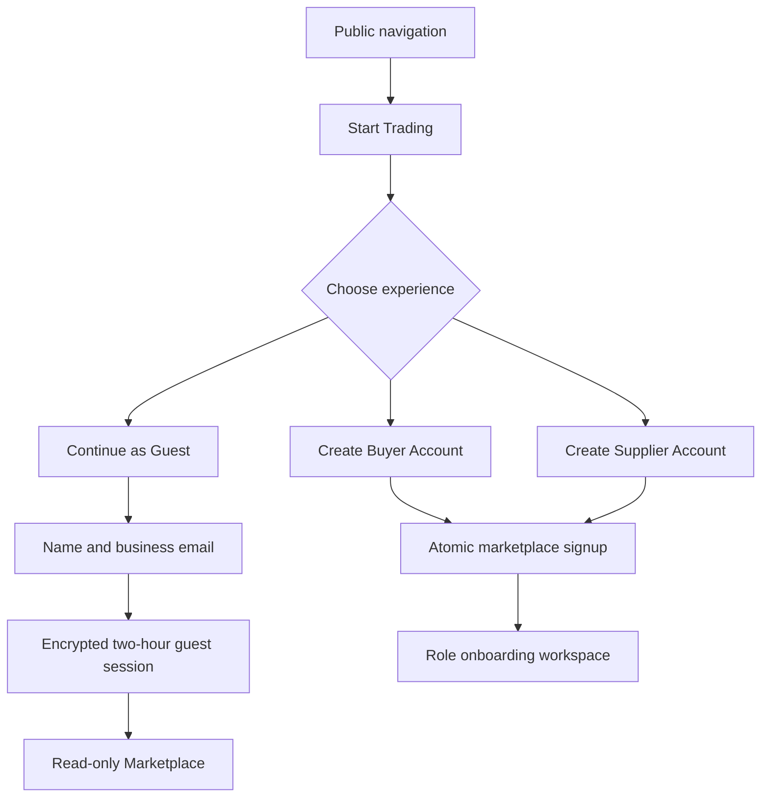
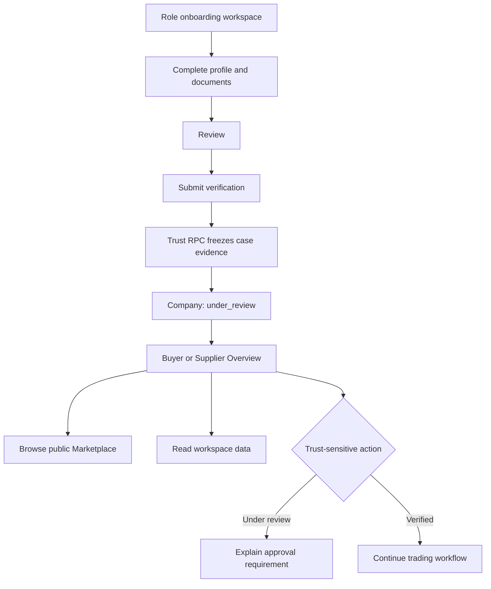

# Marketplace Experience

## Purpose

Marketplace Experience owns public entry, role choice, guest browsing, and
Buyer/Supplier workspace navigation. It does not own authentication,
marketplace company identity, or verification transitions.

A guest is a temporary acquisition context, not a `profile`, `company`, or
Trust subject. Guest sessions therefore use an authenticated-encrypted,
two-hour HttpOnly cookie and never create database records.

## Public entry flow

## Verification-to-workspace flow

## Access policy

| Context      | Public marketplace | Role workspace | Private drafts | Publish/submit/award |
| ------------ | ------------------ | -------------- | -------------- | -------------------- |
| Anonymous    | Yes                | No             | No             | No                   |
| Guest        | Yes, read-only     | No             | No             | No                   |
| Pending      | Yes                | Yes            | Yes            | No                   |
| Under review | Yes                | Yes            | Yes            | No                   |
| Verified     | Yes                | Yes            | Yes            | Yes                  |
| Rejected     | Yes                | Yes            | Yes            | No; resubmit first   |

The UI gate is clear guidance, not a replacement for Supabase RLS or trusted
RPC validation. Existing database authorization remains authoritative.
Phase 1 does not change commercial RPC or RLS policy. Where an existing RPC
does not yet require `verified`, this UI gate is not a security boundary; a
future governed capability migration must enforce that policy server-side.

## Workspace model

- Overview is the default post-login destination.
- One shared workspace shell and header frame Buyer, Supplier, and Admin pages.
- Header summaries are current read projections over existing RLS-filtered
  domain records; they are not persisted Analytics or Company fields.
- Buyer/Supplier Overview combines verification, company health, recent
  activity, notifications, pending tasks, and quick actions.
- Onboarding is one role-configured, single-active-section workspace.
- Verification Status reads canonical `companies.verification_status`.
- Analytics is a navigation placeholder only; no data pipeline or metric schema
  exists in Phase 1.
- Document management remains owned by the shared onboarding document manager.

## Public company profiles

- The directory and `/company/{name--companyId}` pages read only the existing
  `public_suppliers` and `public_products` views.
- The normalized name supports readable, indexable URLs. The immutable UUID
  resolves identity and prevents collisions; non-canonical names redirect.
- Public descriptions are factual compositions of fields in the safe
  projection. Product certifications are aggregated only from published
  products.
- Owner-only fields, private markets, documents, risk scores, transaction
  history, and inferred performance claims are never exposed.
- Guests see a disabled Contact action and an account-creation explanation.
  Authenticated users continue through the existing contact surface.
- Recent Activity is future-ready presentation only; no activity or Analytics
  schema was introduced.

## Marketplace Foundation freeze — M1.1

Marketplace Foundation presentation is frozen after M1.1. Future work may
extend domain services behind these interfaces, but must preserve:

1. the existing public-view disclosure boundary;
2. canonical Profile/Company/Trust ownership;
3. one shared workspace shell;
4. Overview as the post-login landing page;
5. Analytics as a placeholder until metric lineage and tenant isolation are
   approved.

## Related decisions

- [AD-ME-001 through AD-ME-004](../architecture/ARCHITECTURE_DECISIONS.md#index--marketplace-experience)
- [Security model](../architecture/SECURITY_MODEL.md#guest-access)
- [Data flow](../architecture/DATA_FLOW.md)
